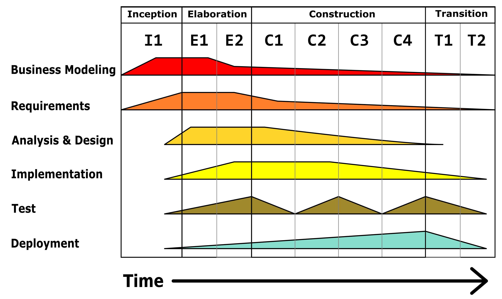

Chapter 1. Historical Background
---
The evolution of software development has been a journey marked by significant milestones, paradigm shifts, and continuous advancements. From the early days when computers and software were scarcely connected, to the modern era of pervasive computing, the landscape has transformed in ways that have redefined technology and its role in society.

My dear reader, my fellow software engineer, this is where your journey began. These are your humble roots. To truly understand the present, we must reflect on the past, and that is exactly what this chapter will explore.

# The advent of software
Computers and software were not always connected in a way that seems natural and intuitive to most people today. Computing devices emerged long before the concept of software; in fact, devices have been used for calculations for thousands of years. But those machines were little more than aids to their human operators and were not programmable in the sense that they could not follow arbitrary instructions. One might say that they were configurable at best.

In modern history, the first known design of a general purpose computer is the Analytical Engine, described in 1837 by Charles Babbage. It demonstrated the concept of structured and stateful execution, featuring an arithmetic logic unit, integrated memory, and support for conditional branching and looping. Above all, both the instructions and the input data were fed to the Analytical Engine using punched cards. The programming language was akin to modern day assembly languages. Since loops and conditional branching were possible, the language as conceived would have been Turing-complete. And therein, we have our first known form of software. The first program written for the Analytical Engine was an algorithm for computing Bernoulli numbers, developed by the world's first programmer, Ada Lovelace.

_Two types of punched cards used to program the machine. Foreground: "operational cards", for inputting instructions; background: "variable cards", for inputting data._ (Source: [Wikipedia.org](https://en.wikipedia.org/wiki/Analytical_engine))

Babbage was never able to complete construction of the Analytical Engine due to conflicts with his chief engineer and the withdrawal of funding by the British government. It was not until 1941, more than a century later, that Konrad Zuse completed the first general-purpose computer, the Z3. Unlike its mechanical predecessor, the Z3 was fully digital and featured floating-point arithmetic. It accepted instructions by reading punched film, making it the world's first programmable _digital_ computer. The original Z3 was destroyed in 1943 during an Allied bombardment of Berlin.

# The post-war era
By the conclusion of World War II, it was becoming obvious that much focus should be turned towards computation and communications. The first generation of computers were developed within the field of electrical engineering with guidance from theoretical mathematics (Mahoney, 1990). They used vacuum tubes for the circuitry and magnetic drums for memory. These machines were complicated, large, and expensive. They mostly relied on batch operating systems and punched cards. In some ways they were little better than their mechanical forebears and just as finicky and cumbersome to operate and maintain.

_Computer operators program the ENIAC, a general-purpose computer, by plugging and unplugging cables and adjusting switches._ (Source: Getty / Historical)

Computing machines, futuristic, complex and fascinating, were widely perceived as the centerpiece of the rapidly involving industry. Hardware engineering commanded prestige. (In turn, salaries.) Programming, on the other hand, was seen as a menial, operational activity and frequently delegated to women. The distinct concepts of computers and software developers related in much the same way as typewriters related to typists — machine to operator.

Programming languages evolved slowly, transitioning from machine-level languages (first-generation, 1GL) to second-generation (2GL) assembly. 2GL represented an important step away from appeasing the machine to supporting the needs of the operator. Now machines were beginning to serve not only their customers but also their operators, a trend followed in all subsequent programming language generations. Despite this development, the machine-operator ideology survived well into the 1950s.

# The transistor era
The years 1957-1963 were marked by leaps in the hardware capabilities, owing to the introduction of transistors. Machines became smaller, faster, and more energy-efficient. But perhaps the most notable change was the introduction of third-general (3GL) languages, such as ALGOL, COBOL, and FORTRAN. For the first time, programming could be logically divorced from hardware; 3GLs allowed the computer to take care of nonessential details, while operators would focus on data types and control flow. Programming became an actual job category, recognised by IBM towards the late 1950s.

_The user interface of an IBM 7094, one of the first transistor-based computers. (Photography by Arnold Reinhold)_

# The software crisis
In 1965, Margaret Hamilton, the director of the Software Engineering Division of the MIT Instrumentation Laboratory, which developed on-board flight software for NASA's Apollo program, decided that programming is an engineering discipline after all, and ought to be differentiated from hardware and other forms of engineering. The name "software engineering" was minted.

The new term landed at the dawn of a difficult period — the two decades between 1965 and 1985 — commonly referred to as the _Software Crisis_. Computer hardware had transitioned from discrete transistors to integrated circuits and, eventually, to microprocessors. They had become orders of magnitude faster and more compact than those used by the first programmers. Things were going exceeding well for computer manufacturers, more so than for those now calling themselves software engineers.

The software crisis, in a nutshell, was the result of a rapid and entirely disproportionate increase in the complexity of software demands, on the back of rapidly evolving hardware capabilities, compared to advancements in the skills and techniques necessary to sustainably manufacture the software. Many projects struggled to meet budget and schedule constraints. Some projects caused property damage and even loss of life. Software engineering was meant to be a qualitative step up from programming of the 1960s, but it failed to deliver on the types of quality and repeatability expectations that its peer disciplines were routinely held to.

A large part of the software developed during this era was a result of government and military contracts. The highly constrained nature of these projects mandated clear and up-front definition of the deliverables and specific sign-off points. The infamous _Waterfall_ model supposedly invented by Winston Royce in 1970, was heavily guided by Department of Defense (DoD) standards of that era. In a hat tip gesture, the DoD published the DOD-STD-2167 standard for "Defense Systems Software Development" in 1985, which was biased towards the Waterfall model.

_The Waterfall model._ (Source: Royce, 1970)

>There is much misconception surrounding the Waterfall model. Even the name "waterfall" was not originally used by its alleged author; it's unclear where the name came from — it may have been named much later by the software community. The first documented use of the name "waterfall" appears in 1976 in a paper by Bell and Thayer. The basic model presented in the paper that is commonly referred to as "waterfall" was, in fact, discouraged by Royce. He specifically says, "I believe in this concept, but the implementation described above is risky and invites failure." The author goes on to criticise the relative position of the testing phase — at the end of the development cycle — outlining potential problems with this approach. In the worst case, the identification of a problem for which a substantial redesign is required, will result in "a 100 percent overrun in schedule and/or costs", as Royce put it.
>
>Royce offers a counterexample to his criticism, in which he demonstrates that the basic model is sound and applicable to complex software problems in very limited contexts. He cites from his experience a project involving "the analysis of orbit mechanics, spacecraft attitude determination, mathematical optimisation of payload activity and so forth". Much of the heavy lifting is performed by the various analytical departments involved in the project. The software part is, in relative terms, a straightforward realisation of the resulting algorithms and formulae. If a mistake is found during verification, the software changes required will be minimal.
>
>Several important refinements are presented throughout the paper, addressing the main shortcomings of the basic model. These are not optional: they "must be added to this basic approach to eliminate most of the development risks", according to the author. Firstly, a preliminary design phase is introduced to moderate the analysis process, so that the analyst is aware of the system constraints and senses the implications of his requests. Secondly, design documentation is the backbone of all subsequent work, also in part to support the testing and maintenance phases. Thirdly, using pilot models and prototypes to validate key hypotheses: the product delivered to the customer is, in the best case, a second iteration of the system. Fourthly, recognition that the test phase is the largest part of the project by effort. It thus requires proper planning. Royce recommends visual code inspections (à la peer reviews) and careful attention to branch coverage. And finally, the importance of involving the customer in a formal way _before_ final delivery. As Royce says, "To give the contractor free rein between requirement definition and operation is inviting trouble."
>
>The final model encourages prototyping, stakeholder engagement, and feedback. Royce was no closet Agileist, but he didn't get his model entirely wrong — the software engineering community did.

Not all software was built for the government and defense sectors however, and not all of the latter was based on Waterfall either, for that matter. Another family of plan-driven models had emerged to rival Waterfall — _Incremental and Iterative Delivery_ (IID). IID involves developing a software system incrementally, leveraging insights gained from previous iterations. Developers begin with a basic version that implements a subset of the requirements and enhance it through successive iterations until the full system is complete. Each iteration includes design adjustments and the addition of new functionalities, informed by both the development process and user feedback.

_Iterative and Incremental Development._ (Source: [Wikipedia.org](https://en.wikipedia.org/wiki/Iterative_and_incremental_development))

There is documented use of IID even in ultra-risky projects, such as NASA's Project Mercury in the 1960s (Larman & Basili, 2003). IBM and Motorola were also atop the IID bandwagon. IBM, in particular, used IID in the 1970s in its Federal Systems Division (FSD) for developing a life-critical system comprising over a million lines of code — the command and control system for the first US Trident submarine. Another mid-1970s FSD project — the Light Airborne Multipurpose System — was developed using IID. TRW (where Royce worked), a competitor to IBM, also applied IID to a ballistic missile defense project at around the same time. In 1975, Vic Basili and Joe Turner published a paper detailing successful application of IID to the development of extendable compilers on a variety of hardware architectures. The system was developed in 17 iterations over 20 months. But perhaps the most notable example of IID was the avionics software suite for NASA's space shuttle, developed by IBM's FSD in the period 1977–1980, taking 17 iterations over a 31-month period.

# Personal computing and the rise of the Internet
The proliferation of personal computing and the advent of the Internet meant that many applications were targeting very broad commercial and personal use. Prior to this era, little demand existed for personal software applications and most commercial-use software was concentrated in the banking and financial services sectors. Commercial software now included e-commerce platforms, search engines, email services, online communities, e-learning courseware, and the like. The type of software that dominated the 1985–2000 period didn't need conformance to onerous government and defense standards, and the impediments upon its development could in many cases be relaxed or removed altogether. 

Plan-driven methodology didn't stand still either. Waterfall was quickly falling out of favour, and the U.S. DoD had stated a preference against Waterfall-type methodologies. Starting with MIL-STD-498 released in 1994, the DoD began actively encouraging IID (Larman & Basili, 2003). IID methods were becoming better defined and more formalised. 

One such method was the _Unified Process_, described in 1999 by Ivar Jacobson, Grady Booch and James Rumbaugh. It comprises a cyclic sequence of phases divided into a series of time-boxed iterations. Each iteration results in an increment — a release of the system featuring added or improved functionality. The Unified Process is heavily risk-focused, requiring the project team to prioritise the most critical risks early in the project life cycle. It promotes the use of the Unified Modelling Language (UML) during both requirement elicitation and design activities — unsurprisingly — as one of the authors of the Unified Process, Grady Booch, was also the inventor of UML during his time at Rational Software.

_The Unified Process model. Business value is delivered incrementally in time-boxed cross-discipline iterations._ (Source: Adapted from Jacobson, Booch, & Rumbaugh, 1999)

The Unified Process is use-case driven and architecture-centric:

* **Use cases define the overall function** of the system, taking a user-centric perspective. Here, "user" refers to both human users and other systems. The complete collection of use cases makes up the use-case model, which replaced the traditional requirements specification. Use cases also serve as the basis for subsequent verification — ensuring that the delivered system meets its requirements. 
* **Architecture defines the overall form**, acting as the endoskeleton upon which functionality is gradually fleshed out. It embodies the most significant static and dynamic aspects of the system. The architecture is influenced not only by the use-case model, but also by the environmental constraints within which the system is set to operate. (Hardware platform, technology infrastructure, networking, and so forth.) 

The Unified Process is sequential within a given cycle. Iterations occur within each phase of the process model, but phases occur in strict succession until the cycle terminates. For example, the Elaboration phase — where requirements are gathered and refined — may take several iterations to complete, resulting in the delivery of several increments of a requirements specification. Likewise, the Construction phase may also require several iterations before the system is deemed complete. However, the Construction phase will not officially commence until the Elaboration phase has met its objectives, the acceptance of which is largely determined by the level of residual risk. In other words, the Unified Process requires the system is mostly understood before the bulk of development may begin, insofar as the "risky" bits have been dispatched. Some blurring between phases is nonetheless permitted and in practice useful: minor requirements work may bleed through to the Construction phase; similarly, some preliminary build activities may occur within the Elaboration phase. The Unified Process repeats over a series of cycles making up the life of a system.

The _Rational Unified Process_ (RUP) was a commercial alternative to the Unified Process, marketed by Rational Software. RUP features the same basic phases as the Unified Process: Inception, Elaboration, Construction, and Transition, and is also heavily UML-based. One of the main differentiators of RUP over the Unified Process is the integration of the process framework with computer-aided software engineering (CASE) tools to guide and assist RUP adopters.

Many flavours of the Unified Process have since been proposed, almost all of them in the 2000s. They add little to the original model. We will not cover them here.

An alternative to the Unified Process (and its variants) was the Spiral model, documented by Barry Boehm in 1988, more than a decade before the publication of the Unified Process. The Spiral model is much more lightweight in comparison and does not require any specific modelling language. The more material difference between the Spiral model and the Unified Process, however, is that the former is based on a monolithic phase structure and does not prescribe time-boxed iterations at the sub-phase level. It almost feels Waterfall-like at the cycle level, which may have accounted for its mixed reception. (On one hand it's familiar and offers a straightforward transition path from Waterfall; on the other hand, it's painted with the same connotations.) The Spiral model delivers the system iteratively by instantiating a new revolution of the spiral at each iteration. It is risk-centric, encouraging the team to prioritise only those aspects of the requirements analysis and system design that may materially affect the delivery outcomes. In this regard, the Spiral model was the spiritual predecessors to many iterative and risk-centric (but still plan-driven at their core) methods that followed. In turn, the latter may have been precursors to Agile.

_Spiral model._ (Source: Boehm, 2000)

Software development on the whole was becoming less taxing. Hardware platforms and processor instruction set architectures (ISAs) were becoming standardised, with the Intel Corporation and the Apple-IBM-Motorola alliance leading the charge with their x86 and PowerPC ISAs, respectively. 

Operating system vendors were also beginning to take standardisation seriously: application software could now be portable (more or less) thanks to the POSIX/IEEE 1003.1 standard. Bytecode-based programming languages with just-in-time compilation were gaining traction, the most promising of which was Java with its "write once run anywhere"1 slogan. One now could, at least in theory, write software on desktop PC to power their smart toaster. More so, one could then use their smart toaster to order a newer and smarter toaster over the Internet.

>1 Where a Java Virtual Machine is available, that is.

Interoperability between technology stacks saw significant improvement with the advent of implementation-agnostic object brokering standards like CORBA, introduced in 1991, followed by XML and SOAP in the late 1990s. Software could now be written with far fewer constraints: one didn't have to worry about the underlying hardware, network protocol stacks, and interoperability. One could now build highly distributed, heterogeneous systems without an honours degree in mathematics or electrical engineering. As the marketing boffins of Sun Microsystems articulated so eloquently, the network was becoming the computer.

Software engineers needed no invitations to take advantage of the powerful abstractions at their disposal. Their life had evolved from first-principles engineering to mostly gluing together off-the-shelf components. The significant reduction in the degree of technical risk and uncertainty alleviated, in some people's minds, the need for careful planning and nuanced design. Software did not reduce in complexity — it merely transformed from some amount of low-level code to a much larger amount of high-level code. An average developer was now leaps and bounds ahead in productivity compared to what they would have been ten–fifteen years prior.

In the meantime, the 1990s had laid the foundations for many of the Agile methods that we find in common use today: the Crystal Method, Extreme Programming (XP), Feature-Driven Development (FDD), Scrum, and Adaptive Software Development (ASD). These methods were sympathetic to the need for a pragmatic alternative to documentation-heavy, plan-driven software development processes. Like IID, Agile encouraged iterative and incremental delivery; however, unlike IID, each iteration wasn't comprehensively planned and was bounded by time rather than scope. (In many ways resembling the Unified Process but without the sequential phases.) Documentation was mostly displaced by interpersonal communication and contracts were swapped for stakeholder collaboration and tight feedback loops. Comprehensive requirements analysis, design and planning were deemed unnecessary when the team had the luxury of highly engaged stakeholders by their side.

_Scrum process flow — a highly representative example of Agile._ (Source: ControlChaos.com)

Agile methods were incubated and trialed in relatively isolated communities, sustained largely by the passion of their founders. They needed a concerted voice and a platform for expansion and eventual takeover of the software community, and they would soon get both.

# The age of mobility
The period from 2001 to the present day was marked by further improvements to computing hardware. Computers were not only inexpensive and accessible as before, but were now shrinking to the point of fitting in a trouser pocket or purse. Computing become a pervasive concept, no longer bound to server racks and desktops. Personal digital assistants become commonplace, which of course eventually morphed into smartphones. Intelligent sensor networks, edge computing and the Internet of Things were now possible thanks to the advancements in low-power computing and networking. In the business-end of things, Cloud computing was gaining traction. Open-source software was being incorporated into just about every software project, and Linux was cementing itself as the new undisputed champ of server operating systems.

Computing wasn't just smaller, it was a lot more powerful and commoditised. Intel had won the ISA war and, together with AMD (who developed the 64-bit extensions — x86-64), were dominating the server landscape. Commoditisation became a major enabler for Cloud providers — engineering managers could now provision top-tier compute, network and I/O capacity in a matter of minutes, with a little help from the corporate credit card.

The software landscape was evolving accordingly. The volume of "contractual" defense and government1 software being developed paled into insignificance compared to that of software targeting everyday consumer use. Almost nothing needed to be built from scratch: an abundance of open-source libraries and highly opinionated application frameworks (Java Enterprise Edition, Spring, Ruby on Rails, etc.) meant that developers could focus exclusively on business logic and, as a consequence, build a lot more of it. 

>1 Not all contractual software is for the defense and government sectors, but the stereotype is still useful.

Multi-core processors with large caches and non-uniform memory access enabled programmers to parallelise workloads more effectively and squeeze more performance out of a single compute node. The increased use of solid-state flash in nonvolatile storage increased random read and write speeds by several orders of magnitude. 

The innumerable improvements to the power of computers meant that the problems haunting the previous generation of programmers had become irrelevant and were mostly consigned to history. Programmers no longer had to worry about disk access patterns or optimise for sequential I/O. They could scale up with more processor cores, or scale out using Cloud-based compute instances and an "elastic" load-balancer. They didn't have to deal with the notorious "640K ought to be enough" memory problem. People got on with their jobs and when software inevitably became bloated and resource-hungry, more "iron" could be thrown at the problem. 

The way software requirements were being gathered and analysed also evolved as a result of the "great hardware leap" of the 21st century, with a greater emphasis placed on functional specification. Previously, requirements analysis during the late 20th century was not strongly biased towards either functional or nonfunctional specification. Whether requirements were done holistically in a Waterfall fashion or piecemeal in IID, they would specify both the necessary functional and nonfunctional characteristics of the system being developed (Waterfall) or its increment (IID), and in ways that could be independently verified. In the new world, the definition of the system was almost always incremental; each increment representing a set of prioritised functional objectives that the system should meet. Nonfunctional requirements (NFRs) were typically left towards the later stages of the project and communicated at a "headline" level — in marketing terms that could not be measured unambiguously. For example, "a system should support 100,000 concurrent users across three continents" means a lot and very little at the same time, depending on whether one is looking from the perspective of those setting the requirements or those implementing and testing them. How are these users distributed? What are the operations invoked by these users and in what proportion? What are the tolerances on the performance of each of these operations? What are the tolerances on the availability of the system or its critical parts?

In the meantime, a landmark conference of seventeen software method experts in Utah in 2001, and the resulting Agile Manifesto, had unified the Agile community and gave it the much-needed voice and platform with which it would totally rewrite software development practices. The emphasis had shifted from analysis and planning to involving the customer and seeking feedback. Constant requirements changes were now considered normal and being embraced. Documentation was sidelined in favour of more direct and interpersonal communication.

>The impact of the convention cannot be understated, insofar as the level of unification it brought. Before the historical meeting of February 2001, the term "agile" did not exist as such. There had been an attempt at the convening of "lightweight" software methods before that, in 2000, but nothing substantial came from it. The term "lightweight" didn't catch on either. The founder of the Crystal Method, Alistair Cockburn, weighed in against the term in 2001 (according to Jim Highsmith's account) by saying that he didn't want to be seen as a "lightweight attending a lightweight methodologists meeting", so Martin Fowler's suggestion — "agile" — was adopted instead. The keystone artifact produced by the 2001 convention — The Agile Manifesto — was later cited by just about every Agile method and framework, and anecdotally, many Agileists can recite one or two of its principles by heart. We will briefly examine the Agile Manifesto later in this book.

# Chalk outlines
This book is, quite deliberately, a collection of bombshells. Some chapters will hence include a special "chalk outlines" section, in which I go over the most extraordinary statements, curious points, or unorthodox views.

The first such point is the confusion over Waterfall, and it concerns readers whose career had unfolded over the last decade or two. There is a good chance that you have come to perceive Waterfall as the sole antithesis to Agile. If much of your professional knowledge has been sourced from blogs, podcasts, meetups, conferences, and various "manifestos", then this will be doubly relevant.

Waterfall wasn't endorsed by the active proponents of plan-driven methods, much less invented by them. It was concocted by the U.S. Department of Defense and later abandoned. This is historical fact, supported by documentary evidence. Waterfall was, perhaps, the single greatest misunderstanding in the history of computing. I believe that the Waterfall debacle was later taken advantage of. This was done for the purpose of fabricating a plausible and singularly abominable enemy to many of the software development methods we use today and take for granted, so as to help justify their existence. I revisit this issue again in Chapter 2, in the "False Dilemma" section.

The second point is that many of the commonly-accepted software engineering practices that most people associate with the turn of the millennium had, indisputably, originated much earlier. Records from the 1960s (Larman & Basili, 2003) show that many large and critical software projects were delivered incrementally. They had only partial planning and requirements analysis, and involved stakeholders throughout the process.

# Summary
Computing devices, used for calculations for thousands of years, were initially mechanical aids without programmability. It wasn't until the mid-19th century that Charles Babbage conceptualised the Analytical Engine, a design that laid the groundwork for modern computing with features like arithmetical logic, conditional branching, and looping. The concept of software as we know it began with Ada Lovelace's program for Babbage's magnum opus.

The post-war era saw the birth of the first generation of digital computers, which, although revolutionary, were complex, large, and expensive. This period marked the dominance of hardware over software, with programming seen as a secondary, often menial task. The introduction of second-generation programming languages began to shift this perception by making programming slightly more accessible and ergonomic.

The transistor era brought about significant improvements in hardware capabilities and the rise of third-generation languages, allowing programmers to abstract away from hardware details. This period marked the recognition of programming as a distinct profession, leading to more structured approaches in software development.

The software crisis of the mid-1960s to mid-1980s highlighted the growing pains of the industry as it struggled with the rapid increase in software complexity. The crisis spurred the formalisation of software engineering as a discipline, largely due to the efforts of Margaret Hamilton. This was also the era of the much maligned Waterfall model.

Incremental and iterative delivery models began to emerge as alternatives to the rigid Waterfall approach, focusing on developing software in manageable increments. Notable examples of successful iterative development during this period include NASA's Project Mercury, IBM's work on the Trident submarine, and the Space Shuttle's avionics suite.

The rise of personal computing and the Internet in the late 20th century shifted the focus towards consumer and commercial applications. Plan-driven methodologies evolved, with the Unified Process and the Spiral model offering more flexible, iterative, and risk-centric approaches to software development.

The new millennium ushered in an era of mobility and pervasive computing, with powerful, commoditised hardware enabling previously unseen levels of software complexity and connectivity. It was also more sympathetic to software engineers: more complex software could be built without considering performance implications. The Agile movement, formalised with the Agile Manifesto in 2001, provided an alternative approach to software development, prioritising collaboration, customer involvement, and adaptability over rigid planning and extensive documentation.

# Concluding remarks
This chapter will close with two propositions that I would like to confer upon the reader.

The first proposition is that, insofar as engineering is the application of theoretical sciences to the solving of practical problems, **programming a computer cannot be unconditionally considered engineering**, in the general sense. Certain kinds of software are truly engineered; for example, avionics, digital signal processors, real-time control systems — they all involve mathematics or physics. 

The counterargument to this claim is that a much broader range of programming may be admissible to software engineering if the programmers rely on the application of computer science. In other words, computer science is what makes computer programming an engineering discipline.

There is still debate as to whether computer science is a discipline of theoretical science. It is a commonly held opinion that computer science is almost entirely an empirical discipline, akin to an experimental science. Allen Newell and Herbert A. Simon — both Alan Turing award winners — argued in 1975 that the building of each new piece of software is an experiment, which is observable and measurable.

Theoretical science involves developing models and theories to explain natural phenomena based on existing data and knowledge. By comparison, experimental science is the search for cause-and-effect relationships in nature. While computer science can discover from observation, on the large it does not create any laws or theorems. In truth, anyone can arbitrarily invent a branch of experimental science by empirically studying some phenomena.

As usual, the best examples are the most extreme ones. If one was to submit to the idea that most programming is, in fact, software engineering because of its strong relationship with computer science, that person would also be exposed to many other suggestions forged by the same argument. For example, I could posit that janitors ought to be called sanitation engineers. How so? All that'd be required from me is to create a new branch of science called sanitation science, which could be entirely experimental. Equivalently, pâtissiers are hereby pastry engineers — practitioners of a niche subbranch of food science. Diehard proponents of calling any creative discipline "engineering" based on experimental science are welcome to fall on their swords.

So does that mean that only the development of programs that strongly relate to physics or mathematics may be classed as software engineering? I'm confident that we may safely broaden the definition to other theoretical scientific branches, including a narrow, theoretical subset of computer science. We could start with the subset that derives from discrete mathematics. This includes propositional, predicate and higher-order logic, theory of computation, concurrency control, formal verification methods, (some) data structures, adversarial modelling and distributed consensus, (some) algorithms and computational complexity theory, compression, and cryptography. These topics have a strongly developed theoretical base with laws and theorems. They are mostly extensions of discrete mathematics.

Consider a lifelike example. Building a complex transaction processing back-end for a financial services platform is not necessarily software engineering if one simply hacked away at the problem until the system appeared to function and pleased the stakeholders. However, if one was to prove the correctness of the critical transaction commitment protocols using formal verification methods (based entirely on set theory and logical calculus), then they would genuinely be _engineering_ software. They would be solving a practical problem using a theoretical science.

I'm very far from resolving the widely but erroneously accepted equivalence of programming and software engineering. For the sake of universality and in consideration of the prevailing canon, we'll continue using these terms interchangeably. If a computer programmer takes pride in their craft, works tirelessly on self-improvement, and refers to themselves as a software engineer, who am I to convince them otherwise?!2 

>2 Although I may suggest that they brush up on some maths.

The second proposition is that **the software crisis never ended**, it subtly transformed from one existential form to another. Putting it another way, software engineering is not advancing bilaterally: while certain aspects, such as developer productivity, are advancing to our benefit, we are regressing in the critical areas of quality and predictability.

Empirical studies have not revealed that a particular software methodology is inherently better; in fact, expert opinion argues the contrary. In his seminal paper "No Silver Bullet — Essence and Accident in Software Engineering", Brooks (1986) posits that "there is no single development, in either technology or management technique, which by itself promises even one order of magnitude \[tenfold\] improvement within a decade in productivity, in reliability, in simplicity."

Agile does not address the complete set of problems faced by a software organisation. An analysis of 34 primary studies published in the period 2001-2013 (Chagas et al., 2014), focusing primarily on Scrum and XP, has highlighted the lack of detail in how to perform software development activities and deal with important issues without affecting agility:

* Estimations do not follow a repeatable method and do not appear to accurately reflect size and complexity;
* The tools provided are insufficient for budget and schedule planning; and
* Identification of risk does not occur in a systematic way. 

Others have highlighted similar issues with Agile projects:

* Dingsøyr, Nerur, Balijepally, and Moe (2012) point out that while Agile methods work well in small teams, scaling them to larger projects or entire organisations can be challenging. The lack of formal structure and documentation can hinder coordination and consistency across larger teams.
* Fitzgerald, Hartnett, and Conboy (2006) indicate that Agile's emphasis on working software over comprehensive documentation can lead to insufficient documentation, making it harder to scale Agile teams and maintain the software in the long run.
* Mann and Maurer (2005) caution that Agile methodologies require constant customer involvement, which can be difficult to maintain. A method that initially sets out with emphasis on customer satisfaction may inadvertently achieve the opposite.
* Dikert, Paasivaara, and Lassenius (2016) found that the fast-paced and dynamic nature of Agile can lead to burnout among team members, as the continuous cycle of development and delivery can create a high-pressure environment. This was corroborated by Laanti et al. (2011).
* Gregory, Barroca, Sharp, Deshpande, and Taylor (2016) noted that there is often inconsistency in the application of Agile practices within organisations, leading to mixed results and a lack of standardised processes.
* Laanti, Salo, and Abrahamsson (2011), in their survey of software development sentiments at Nokia, identified planning as a key challenge area, citing respondents' concerns that major decisions were made reactively, at the whim of the project manager. Although many participants of their survey acknowledged the flexibility of using Agile in software projects, they lacked confidence in predictable and consistent delivery dates.
* Sutherland, Viktorov, Blount, and Puntikov (2007) highlight the management and coordination issues that can arise in Agile projects, especially in distributed teams. The study found that coordination costs can increase significantly due to the need for constant communication and synchronisation across different locations.

Many have also cautioned on the uncontrolled accumulation of technical debt in Agile projects:

* Kruchten, Nord, and Ozkaya (2012) note that Agile's focus on rapid delivery can lead to the accumulation of technical debt: teams might prioritise short-term deliverables over long-term code quality, leading to maintenance challenges. The emphasis on rapid delivery and frequent releases can result in rushed code, insufficient documentation, and neglected refactoring. Their findings were corroborated by Tom, Aurum, and Vidgen (2013), and later by Ramasubbu and Kemerer (2016), and by Alves, Mendes, de Mendonça, Spinola, and Shull (2016).
* Kamei, Maldonado, Conte, and Figueiredo (2013) offer a qualitative analysis, finding that Agile practices can lead to immediate improvements in functionality and user satisfaction, but at the expense of technical debt and long-term maintenance challenges.

Numerous studies have focused on contrasting Agile with Waterfall specifically, rather than the general class of plan-driven methods. I find these efforts to be largely irrelevant, and in the worst case, misleading. Waterfall (equivalently, DOD-STD-2167) is a niche model that has been all but erased from mainstream practice over the past four decades. Proponents of plan-driven methods discourage its use, and even its purported creator exhibited the model as an example of what _not_ to do. Even the U.S. Department of Defense — a bastion for plan-driven methods — had disavowed Waterfall-like practices since the introduction of its MIL-STD-498 standard in 1994. While these sorts of studies may have been legitimately used in support of the Agile movement in the mid-late '90s, their citing in the present to bolster the case for Agile should be taken with great skepticism.

>Of the empirical studies that has influenced industry trends and perceptions, perhaps the most widely cited is the CHAOS Report, published annually by the Standish Group since 1994. It analyses software project success and failure rates. It has, for the past three decades, fixated on the differences between Agile and Waterfall models. The report has routinely concluded that Agile outperforms Waterfall in term of project success rates, sometimes by a factor of three to one.
>
>Ironically, the Standish Group started their publication in the same year as the U.S. DoD turned its back on Waterfall. There were few remaining Waterfall supporters as of its first edition, much less today. Imagine if a report came out today that concluded that smoking increases risk of cancer or that high levels of cholesterol increase the risk of heart disease. What informational value would it serve today, given how long this knowledge has existed in the public domain?

>I have consulted numerous papers on software development throughout my journey and, more recently, in preparation for this book. The conclusion I have formed is that too many researchers develop a highly disproportionate understanding of Agile compared to plan-driven methods. Many erroneously believe Waterfall to be the quintessential manifestation of plan-driven methodology and have no awareness of IID methods or the Unified Process. They separate the wheat from the chaff and keep the chaff. The fact that the overwhelming majority of these papers had undergone peer review is even more worrying. Academia on the whole seems to have a firm grasp of the Agile methodology but appears to be suffering from collective amnesia in regard to anything useful practiced more than two–three decades ago.
>
>Not all is lost, however. While scholarly literature leaves much to be desired, there are numerous books that offer a highly informed and objective perspective on software engineering. I highly recommend the works of Fredrick Brooks, Craig Larman, Barry Boehm, Richard Turner, Victor Basili and Grady Brooch. I have cited them throughout this book.

And yet despite the shortcomings above, there have been numerous successful applications of Agile (Laanti et. al, 2011, and Kamei et al., 2013). They are clearly effective to a limited extent and in specific contexts, as are their plan-driven counterparts in their respective contexts. However, neither method generalises to universal application, nor is any method necessarily optimal in its ideal environment or problem context. In other words, if you apply Agile to its preferred environment — small, colocated teams working within high levels of requirements uncertainty — Agile methods will routinely outperform their plan-driven analogues. However, they will still suffer from the sorts of problems that are unique to them: lack of documentation, propensity for the accumulation of technical debt, and long-term maintenance challenges.

I have not seen any evidence — empirical or anecdotal — that the predictability of the software development process and/or the quality of the resulting software (measured by customer satisfaction) has been improving. I have, therefore, no reason to believe that the software crisis is over. If asked whether it will ever end, my answer would be "not anytime soon". My reasons are as follows.

* Software developer productivity has been steadily rising, and this trend will continue with more abstractions, open-source libraries and frameworks, and better tooling. The recent incorporation of Artificial Intelligence and coding assistants into the development process will further relieve software engineers from having to think. (Perhaps the role of software engineers will transition from analysis and programming to managing hordes of artificial "programmers".) More software and less thinking is not a recipe to end the crisis.
* Continued improvements in hardware will further alleviate the need to define and plan for nonfunctional requirements up-front. The prevailing trend is to address nonfunctional requirements in the later stages of the project, a phenomena that is conveniently represented as technical debt. What happens when the magnitude of the debt exceeds the developers' ability to repay it? As the system evolves and takes on more capabilities, the cost of adding a new capability rises due to the drag caused by technical debt debt. Specifically, the amount of productive time that is left for feature delivery shrinks, displaced by the time required to maintain the system. Imagine a singularity within this continuum wherein the entirety of a team's effort is expended on maintenance. No new features may be added, and cost of maintaining status quo becomes unsustainable, leaving little choice but to deprecate the system entirely while building its generational successor. This happens today as it did three decades ago — every system reaches end-of-life at some point. The question is one of _when_, not _if_. And we are moving in the direction of condensing the _when_. Are we to accept that future systems will essentially be "disposables" with shelf-life measured in months rather than years or decades?
* Communication will always be the weakest link in any engineering process, not just software engineering. Any nontrivial system is too complex to fit into one head; it cannot be developed and maintained by an individual. Once a problem is split into sub-problems to be handled by a team and, eventually, multiple teams, communication begins to take its toll, setting a natural constraint over complexity.

I raise this point not because I know the answer but to encourage others to debate it continuously. My objective is to evoke thought. Intuition, however, tells me that the two propositions are related. Starting at Chapter 3, this book will focus on both — a more disciplined approach to software engineering and effective ways of curbing software complexity.
