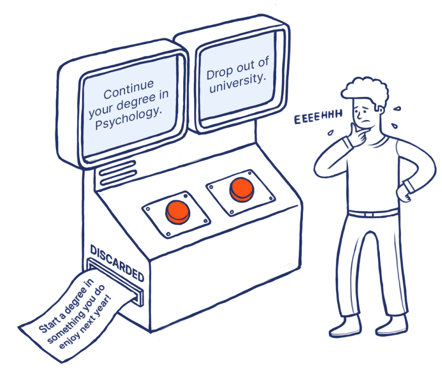

Chapter 2. Status Quo
---
//TODO intro

# The carnage
Cue the next bombshell.

The Church of Agile Methodists is hereby charged with the steady poisoning of the software engineering discipline over the past two decades. Here is a summary of the allegations:

* Planning and up-front design is purged in favour of work delivered in tiny increments until some milestone is eventually reached. The date and costs are almost never what the stakeholders anticipated.
* Decomposing problems into bite-sized chunks spoonfeeds work to engineers and results in the erasure of valuable context. The blinkers are on, and everyone is vacuously working on a tiny piece of the jigsaw puzzle without seeing the bigger picture.
* Simplistic acceptance criteria means that every piece is technically "perfect," but the integrated system is rarely fit for purpose. Much rework is needed, while no single engineer or their manager, or anyone else for that matter, is held to account.
* Agile emphasises the team over individuals, making it difficult to spot mediocrity and underperformance. The ones who eventually leave are almost always not the ones you'd have wished for.
* Team obsession means that hiring and career growth prioritises team/culture fit rather than individual skill. The wrong people are promoted to critical roles, while everyone high-fives each other. 
* Lack of conceptual integrity, as software is designed and built by a committee (of people hired to get along).
* Agile embraces change. Lack of a formal requirements sign-off means that features and scope may change arbitrarily with little pushback from engineering and product team. Change is good!
* Nonfunctional requirements are almost always an afterthought. The team is focused on functional delivery to get early feedback. 
* Nonfunctional capabilities typically trail functional delivery and are bundled with technical debt that invariably accumulates with time. Test coverage suffers in the same vein.
* Documentation... What documentation? If the code was hard to write, it should also be hard to read. "Working software over comprehensive documentation" is our motto.
* The lines of accountability are blurred. The project can fail despite every member having done their job. There is no single throat to choke and anyone can legitimately blame everyone else:
  - Our delivery went over time because the business kept changing their mind.
  - Our parts were done right but didn't quite fit the whole.
  - Our emergent architecture is a mess despite the pragmatic decisions made along the way by skilled people.

The proliferation of Agile is largely owned to a successful marketing campaign, borderlining on a cult. It has **misled the product and engineering community in believing that the business needs constantly change**, discrediting the traditional requirements analysis and sign-off phases. As a consequence, plan-driven approaches were also written off because they hinged on the stability of requirements. Planning and sign-off were quickly replaced with feedback loops and early delivery. The sooner something is delivered, the sooner the feedback is gathered.

In a world where requirements change, organisations cannot plan — they must either embrace Agile or fail miserably.

In reality, the **business needs rarely change**. (There are exceptions1, of course.) What changes is their _perception_ of needs. Requirements sign-off forces stakeholders to think earlier and more intensely about their true needs, and lock them in. This act alone makes them accountable. Conversely, foregoing this lock-in, Agile leads to fluffy requirements, which invariably change, feeding its own narrative. "See," they'd say, "the requirements changed as we said they would."

>1 There is ample room for iterative elaboration in startups or where the product cannot be accurately defined up-front. Tight feedback loops are indeed useful. But make no mistake, the vast majority of systems being built today are just a rehash of some existing, well-understood concept. At least some of their parts, if not the whole, can be clearly articulated and planned for.

Distilling the above, **Agile erases accountability through fragmentation**, resulting in an expensive and slow way of building software. It is therefore time to erase Agile.

>Leftists often argue that communism isn't bad because real communism has never been practiced. Likewise, Agileists will claim that Agile is really a mindset shift and is simply not being practiced right, not fully embraced, confused with Lean, or some other weaseling. In truth, none of it matters; if a methodology is so vague that no one seems to it get right, then it's about as useful as a hog roast at a bar mitzvah.

# Agile, take two
The previous section was intentionally laced with dramatic overtones and heroic generalisations to encourage the reader to think and to challenge. It may not have been entirely objective, however.

Agile methods are presumably familiar to the reader, as is the famous Agile Manifesto formulated during the meeting of its seventeen founding signatories at a ski resort in the Wasatch mountains of Utah, in February of 2001. As we exist in the land of metaphors, the aforementioned document is the sacred religious scripture whose diligent practice offers salvation. Or, for the time being, a better way of building software. Our brief and dispassionate analysis thus begins with this particular document.

We begin by highlighting that some of the principles listed in the Agile Manifesto (Beck et al., 2001) are not unique to Agile and thus cannot be used to compare it with other methodologies. Specifically, "Deliver working software frequently; Working software is the primary measure of progress;" and "Simplicity — the art of maximising the amount of work not done — is essential," can be also argued as being trivial consequences of the Spiral model (Boehm, 1988) — a member of the plan-driven family of methods. Specifically, frequent delivery and measure of progress are embodied in the iterative nature of the model, while simplicity or effort minimisation is embodied in the risk-based approach to analysis. To quote Boehm, "the project team must decide how much detail is enough." _Is this not an advocacy for simplicity_, some thirteen years before the landmark conference of Agileists in Utah?

Jim Highsmith's account of the conference at Utah (Beck et al., 2001) has helped in debunking more misconceptions around the Agile methodology, namely that Agile methods have an inherent disdain for architectural modelling, documentation, and planning in general. Quoting Highsmith: "We embrace modeling, but not in order to file some diagram in a dusty corporate repository. We embrace documentation, but not hundreds of pages of never-maintained and rarely-used tomes. We plan, but recognise the limits of planning in a turbulent environment." This suggests that the Agile movement from the outset wanted to strike a balance between planning and utility — again, repeating similar aspirations of Boehm.

The two principles "The most efficient and effective method of conveying information to and within a development team is face-to-face conversation" and "Build projects around motivated individuals," are not uniquely attributable to Agile methodology. While plan-driven methods do not explicitly advocate these principles, they do not conflict with or contradict these principles in any way. Also, whether face-to-face communication is the most efficient method, is a matter of opinion.

Some of the stated principles are conjectures, namely "Agile processes promote sustainable development" and "Continuous attention to technical excellence and good design enhances agility". They cannot be construed as principles as they offer no practical guidance. The Agile Manifesto defines sustainability as _the ability to maintain a constant pace indefinitely_. To say that this objective is highly aspirational is to say nothing. It is practically unattainable: pace cannot be constant as any system will invariably become more resistant to change as it expands.

Finally, the remaining principles listed in the Agile Manifesto are uniquely attributable to this methodology. Specifically, "Our highest priority is to satisfy the customer through early and continuous delivery of valuable software; Welcome changing requirements, even late in development; Business people and developers must work together daily throughout the project; The best architectures, requirements, and designs emerge from self-organising teams;" and "At regular intervals, the team reflects on how to become more effective, then adjusts its behavior accordingly." These principles clearly describe how Agile copes in environments of high uncertainty. It does so by increasing the intensity of interactions between delivery and stakeholder cohorts, encouraging tight feedback loops, permitting limited autonomy through self-organisation, and including a self-regulation mechanism. Of the twelve principles agreed on by the founding signatories of the Agile Manifesto, objectively, only five are characteristic of Agile. The remaining seven are mostly red herrings; they are not distinctly Agile but are often misassociated with it.

The concepts underpinning this methodology are sound in a bounded context. Indeed, software engineering is a broad discipline and Agile has a very specific place within it. Software projects with high degree of uncertainty of both the inputs (e.g., requirements, constraints) and outputs (e.g., working system, documentation) are ideally suited for Agile, provided the delivery team has access to highly engaged stakeholders. When one is entirely unsure of what they are building, detailed planning will likely going be futile and counterproductive. One can still benefit from shorter, time-boxed plans, combined with their execution, which is precisely what Agile advocates. Similarly, when the fitness of the product can only be verified by empirical trials — by customers, for instance — then the delivery method needs a mechanism for continuously and reliably measuring fitness. The tight feedback loop advocated by Agile is a perfectly suitable fitness gauge.

Many of the founding signatories of the Agile Manifesto had their own methods developed during the preceding decade. For example, Alistair Cockburn had developed the Crystal Method in 1991. Kent Beck launched Extreme Programming (XP) in the mid '90s. Ken Schwaber co-developed the Scrum framework with Jeff Sutherland in the early '90s. Jim Highsmith presented Adaptive Software Development (ASD) in 1999. The other signatories were also heavily involved in pioneering software development methods and were generally sympathetic to the need for a practical alternative to process-heavy methods. There were no passengers in that convention and everyone's heart was in the right place.

If the methodology is sound (in a limited context) and its founders were indeed capable and experienced practitioners with the best intentions in mind, then what went wrong? Why is the methodology routinely misinterpreted and applied incorrectly?

I have come to the conclusion that there is no single answer. An assortment of factors contributes to the problem, and the degree of contribution of each of the factors varies with the context. We explore them here.

## Repeatability
The first factor is the degree to which a method is prescribed to its adopters and may be implemented repeatedly. Agile methods are intentionally underspecified — on one hand to underscore their adaptability (relative to their plan-driven counterparts) and, on the other, to broaden their appeal to diverse project contexts and team dynamics. This vagueness has led to much variability in the methods' implementations. Teams may occasionally adopt multiple methods concurrently to create unique, hybridised forms of Agile2. In many cases, these forms will generally conform to the principles stated in the Agile Manifesto.

>2 I have been involved with engineering organisations who ran mixtures of Scrum and Kanban, depending on whether the work items represented new features or maintenance work.

Adaptability is an overwhelmingly good thing in the hands of people who know what they are doing — precisely the audience that Agile targets. They are able to perform complex trade-off analysis and make highly informed decisions. The problem is that most people do not fall into this category, and most adjustments are made out of convenience, more so than rational calculation. 

A good example of a "tunable" parameter is the sprint duration of Scrum, which is frequently dialed down to one week. (XP, on the other hand, defaults to one-week cycles.) Many managers naturally assume that shorter sprints are better. Unquestionably, shorter sprints lead to shorter feedback cycles and more responsive course correction. On the other hand, they assume that something tangible can be delivered in those sprints, as well as the availability of stakeholders capable of continuously evaluating the system and providing actionable feedback. Oftentimes, stakeholders simply cannot commit to that level of involvement, and the weekly showcases are run with a small turnout. In their book "Balancing Agility and Discipline", Barry Boehm and Richard Turner (2004) raise another concern: if the delivery team insists on an available stakeholder to fit an unreasonably condensed cycle, they may instead be supplied with the most expendable individual. These issues can create the opposite effect to what was intended, owing to a false sense of security. Feedback can become a glass crutch that is heavily leaned on to provide timely and instructive correction. Instead of gracefully negotiating the fairway of requirements uncertainty, the project winds up with all the drawbacks of plan-driven methods but with none of the advantages.

The underspecification of Agile methods extends to the makeup of the engineering teams, namely, the key roles driving delivery. Depending on the method, they may be defined vaguely or not at all. They rarely comment on career progression and team growth, for example. They do not clearly delineate accountabilities in the delivery organisation. In reality, the skills makeup of the delivery teams has at least an equal, if not larger contribution to the likelihood of success than the peculiarities of the process model or changes to some of the tunable parameters. In fairness, traditional, plan-driven methods may also suffer in the same vein and are bundled with their own problems. However, they at least prescribe critical decision points and the relevant signatories, creating some accountability for outcomes.

## Misapplication
The second factor is the correspondence between the problem space and the chosen solution methodology. There is an anecdote in the Agile community attributed to Alistair Cockburn, in which he claims that only as little as 30 percent of a method's applications follow the author's original intent. Boehm and Turner (2004) recite this in their book, but the specifics of the claim cannot be established.

Agile methods were designed from the outset to solve a very specific set of problems. Namely, they are ideally suited to small teams navigating turbulent, highly uncertain environments, with the support of a highly engaged and available (and, ideally, collocated) stakeholder community.

### Turbulence versus serenity
Uncertainty of inputs and outputs is not a binary variable. To assume that a software project's certainty is either complete or nonexistent is a grave mistake on any manager's behalf, but a mistake that I fear happens more frequently than most people realise. This naturally invites an overly conservative stance that, since the project does not operate under absolutely certainty (i.e., _some_ requirements _may_ change at _some_ point, or that _some_ outcomes may not be defined _fully_ in advance), it must therefore be treated as entirely uncertain.

Misclassifying projects increases the risk of applying Agile to problem domains outside of its competence. Few software projects are so turbulent that planning cannot be applied at any level. The majority of software projects exhibit enough stability of assumptions to permit some degree of analysis and planning, often far more than one sprint's worth. As the old adage goes, weeks of coding can save hours of planning. An engineering organisation that willfully forfeits its opportunity to plan is, in actuality, introducing more uncertainty into the process and hampering its chances of success.

Experience, as we know, is a double-edged sword. It can form strong biases and lead to overconfidence. An engineering manager fortunate enough to have experienced a successful Agile project sometime in their career, may mistakenly generalise it to a broader range of problems. This is the rare case where a less experience manager may have chosen a more appropriate method. Alternatively, an organisation may have enjoyed success with a particular Agile method in the past, when it was much smaller, exploring various product ideas, and fighting for initial market traction. As it expanded, the realisation that the problem space has shifted may have lagged behind reality; decisions could have been made on basis of what has worked in the past, assuming that the past and the present are alike. Of course, the same is true for every method. The difference is that Agile has lower barriers to adoption, and generally requires less justification. 

Groupthink is another, often overlooked source of bias: when selecting a methodology as a group, there may be a tendency to reach consensus early due to time pressure — while the geniuses are deliberating over "trifles", no one is writing the code. The most underspecified methods are the easiest to adopt: "Start with Scrum and tweak it as we go. What can possibly go wrong?" Any dissenters in the group who may attempt to introduce a rational argument may be pressured to come around to the consensus.

>With regard to groupthink, I fear that the problem is worse than most might imagine. It so happens that almost all of my clients had adopted Agile in some form, and when inquiring as to the reasons behind their decisions, the frequent responses were along the lines of "we don't know," or "what else is there?" or "surely, not Waterfall!" Perhaps _groupthink_ is not the right term because it assumes there's a "think" somewhere.

A fallacy that was previously remarked on is that reducing the delivery increment leads to reduced feedback time. We can easily spot this fallacy from an unjustified reliance on engaged and available stakeholders. That aside, the delivery increments can be only be made so finite before they lose their conceptual significance. When a team is building a highly interactive product, even small increments may produce profound changes in the Customer Experience (CX). "Last week we lacked this awesome UI feature, but this week — boom — infinite scrolling!" The same is rarely true of complex, data-intensive applications, or well-established, legacy systems, where measurable progress takes time and frequent glimpses into the state of a system's development are not particularly useful or informative. It doesn't mean they cannot benefit from Agile principles, just that "agility" aligns to a different time scale. When the time scale is overly condensed, stakeholders may be unable to distinguish material changes from the immaterial ones, and may fail to provide instructive feedback in a timely manner. 

>I cannot tell you how many times I've attended stakeholder-packed product showcases where the agenda was mostly REST APIs demoed with the aid of Postman and Swagger. By their own admission, developers would spend hours rehearsing the demos, making sure they'd go off without a hitch. Maybe they wanted to make the right impression on their audience. Maybe they were just proud of their hard work. Or maybe they've not heard of the _Law of Demos_, which states that when _X_ is being demonstrated, _X_ will likely fail. Whatever the reason that engineers feel compelled to showcase technical nuance in product demos, I'm convinced that no one ever cares about it, and _a fortiori_ the business and product people.

### Blown out of proportion
Another important consideration in the fitness of Agile methods is the scale of the engineering problem and the size of the delivery team. Agile is, by the admission of its founders, mostly suitable for small, colocated teams. In "Extreme Programming Explained", Kent Beck writes, "Size clearly matters. You probably couldn't run an XP project with a hundred programmers. Not fifty. Nor twenty, probably. Ten is definitely doable." Other industry experts have suggested a hard upper bound of forty people (Constantine, 2001, and McBreen, 2003). 

These numbers are not arbitrary. There are fundamental limitations on the size of a delivery team that strongly relies on _intepersonal communication_ and _tacit knowledge_. 

Agilists posit that face-to-face interaction is the most efficient and effective method of communication. It says as much in the Agile Manifest. While face-to-face interaction is undoubtedly effective, can it be considered efficient? What is _efficiency_ anyway?

Dropping a 200 kg Chubb safe on an unsuspecting fly is an effective way of solving a pest problem, although a whacking it with a fly swat is equally effective and a lot more efficient; that is, if we take efficiency to mean the ratio of useful work performed to the effort expended.

>The above is the _technically correct_ description of efficiency — the best kind of _correct_. Not the kind that conflates efficiency with effectiveness.

Interpersonal communication is among the least efficient forms, by any objective measure. Consider its implications:

* Each instance of the interaction takes requires effort from both parties. 
* The communication is synchronous — both parties must be present simultaneously.
* Synchronous communication cannot be effectively applied in distributed teams working across minimally overlapping time zones.
* The number of pair-wise interactions grows quadratically with the number of communicating parties. For a team with _M_ members, there are _M_(_M_–1)/2 unique communication paths. Three workers require three times as much pairwise interactions as two; four require six times as much as two.
* If a question has been asked and answered once, who's to say it won't be asked again, perhaps by a different team member? Interpersonal communication requires the instantiation of a new interaction each and every time. The cost of asking and answering cannot be amortised over the length of the project.

Tacit knowledge is also not without its problems:

* Individuals are not always available to share knowledge; they presumably have other things to do. 
* While the identity of knowledge-holders may be apparent in a small team, as the team expands, new members will not know who the knowledgeable individual is for any given area. They will be forced to ask around or make do with incomplete knowledge.
* Senior team members will tend to be more knowledgeable; their seniority may make them _appear_ less approachable to newer and more junior members. The emphasis is on "appear"; whether the individual in question is genuinely unapproachable or not may have little bearing on the situation, as it is the perception that matters. This is particularly felt when knowledge-holders are highly outspoken characters with plenty of presence. 
* Knowledge concentration is said to follow the Pareto distribution. That is, some high fraction of knowledge is contained in some small fraction of individuals. One one hand, it may make it easier to identify the knowledgeable individuals — start with the people with the smallest number on their employee ID badge. On the other hand, it creates a key personnel risk — the ratio of the total number of employees to the number of indispensable employees — growing linearly with the team size. In small teams, knowledge is more likely to be duplicated because people are generally more conscious of each other's works. But in large teams, when a key member leaves, knowledge walks out with them.

>Asking around for missing knowledge resembles gossip protocols in peer-to-peer networking, where no single node may have the complete information, and nodes query each other to locate and resolve information gaps. This is feasible in computer networking because computers are fast and tireless, can ingest and dispatch huge numbers of messages per unit of time, and networks have sufficient capacity. What works for them doesn't work for us.

>I've personally experienced the problem of unapproachability, and more than once. I'm often among the senior-most members of my clients' delivery organisations and I generally operate outside the Scrum teams. I tend to float about. I know of times when juniors didn't ask me important questions when they probably should have. Most of the times I'd learn of this through their managers: "Hey Emil," they'd tip me off, "Stanislav was trying to figure out X and I pointed him in your direction. Did he end up reaching out?"
>
>This will happen to you, and when it does, the first thing to do is reach out to them and introduce yourself. The best thing is that you don't have to ask or suggest anything. Once you've made contact, they'll almost always follow with "hey, while I've got you..."
>
>But in truth, I wasn't overly bothered. I tend to document things that I find remotely important, even if it's a one-pager. Mainly because I only put so much faith into my own memory. I could always point their manager to the documentation, not because the employee in question didn't know, but because their manager didn't. And that I find more concerning.

Since the popularity of Agile had quickly taken to larger organisation, next-generation Agile frameworks had focused on scale as a primary differentiator. Examples such as the Scaled Agile Framework (SAFe), Scrum of Scrums (SoS), Nexus, Large-Scale Scrum (LeSS), and Disciplined Agile (DA), have incorporated concepts such as integrated delivery and multiple teams, while aspiring to preserve agility at the team level. We will touch on them briefly.

SAFe is an "enterprise-grade" hybridisation of existing concepts, designed for compatibility with organisations comprising many employees, teams, and departments. Engineering teams may be Scrum or Kanban based, provided they contribute to the higher-level Agile Release Train (ART) in an orderly way. (Scrum is clearly preferred, however.) ART acts as a delivery backbone and the prime measure of progress observed by stakeholders, and multiple concurrent ARTs may coexist, each feeding off a dedicated product backlog. SAFe recognises certain key roles — Architects and Product Managers — who participate in ART activities and ensure that value is realised for the business. The coordination responsibility for an ART lies with a Release Train Engineer — acting as a servant-leader in the facilitation of ART events and processes. SAFe is a comparatively broad framework, advising on many dimensions of the delivery organisation and process, without being overly prescriptive in most of them. Distilling it to simple terms, SAFe focuses on two main aspects: the interactions between ART and the teams, ensuring that their cadences are synchronised, and the interactions between ART and the stakeholders, ensuring optimal value creation. 

>SAFe is anti-Agile in some ways, due to the sheer amount of content on offer. Despite this, SAFe is also the most adopted of scaled agile frameworks, primarily due its interoperability with large organisations: it does not require major changes to organisational structure and roles. 

SoS was developed in 2004 by Jeff Sutherland and Ken Schwaber, the co-creators of the Scrum framework, out of a need to coordinate multiple Scrum teams in large projects. It is a straightforward layering of Scrum teams formed around _delegates_ — designated representatives from each Scrum team that partake in a virtual SoS team. By sharing updates, progress, and challenges in the SoS meetings, SoS promotes transparency and visibility across the entire project. In essence, SoS is little more than augmentation of traditional Scrum with an out-of-band standup, designed to support escalation and cross-team alignment.

DA is mostly a loose collection of tools — mainly principles, tactics and guidelines — that make Agile's use more palatable in large organisations. DA loosely defines key roles at both the team and organisational level. Additionally, it suggests Communities of Practice (CoPs) and Centres of Excellence (CoEs) as ways of collaborating across teams. (The CoP concept is shared with SAFe.) DA also outlines the interactions between CoPs and existing specialty areas, such as Enterprise Architecture (EA), Data Management and Portfolio Management. In essence, DA provides Agile teams with more awareness of the broader enterprise context. It also helps them to be more connected and work more cohesively.

Nexus is an extension of Scrum, developed by one of its original co-creators, Ken Schwaber, in 2015. It preserves Scrum's key elements and values, and in Schwaber's words, extends Scrum "only where absolutely necessary." Where SoS was limited to the hierarchy of Scrum teams, Nexus adds a lightweight process model around the unified Product Backlog and the Integrated Increment concepts, which is not dissimilar to the ART concept in SAFe. In a rare move for the Agile community, Nexus outlines accountabilities of the key integration team members — the Product Owner and the Scrum Master, although these are defined very loosely and without a clear way of measuring, resembling responsibilities more so than accountabilities. (Still, a remarkable attempt for a card-carrying Agilist.) It employs the Cross-Team Refinement activity to decompose items of the product backlog to identify dependencies across Scrum teams and attribute work to specific teams. Nexus is similar to SAFe but where SAFe allows for multiple concurrent ARTs (hence product backlogs), Nexus works off a single product backlog.

LeSS emerged in 2015 from a pair of authors and seasoned Agilists, Craig Larman and Bas Vodde. LeSS comes in two flavours: LeSS and LeSS Huge. The former is analogous to Nexus: a single product backlog mapped onto multiple Scrum teams. The latter is an analogue of SAFe: multiple concurrent backlogs, targeting enterprise-grade customers. However, even the full-fat version has fewer key roles, a leaner structure, and is overall less verbose than SAFe. Also, LeSS (in both flavours) is decentralised; unlike SAFe, all coordination across teams is done by teams themselves, rather than a dedicated role. If SAFe were to go on a crash diet and adopt decentralised coordination, it would probably end up looking like an off-season LeSS Huge.

The "scaled" representations of Agile are incremental improvements over first-generation, single-team Agile methods. In engineering terms, they are not solutions — they are workarounds. While they can make Agile delivery feel more at home in larger organisations, and the latter more hospitable, scaled Agile methods do not address the main shortcomings of Agile: knowledge siloing and the synchronous flow of information.

By comparison, plan-driven methods advocate documentation and asynchronous communication, even if they might overdo it on occasion. The effort of writing good documentation is amortised across the entire project: written once, it will be read many times. The author needn't be present; they might no longer be in the company's employ, for that matter. And documentation needn't be voluminous to be effective. Even a one-pager is immeasurably more useful than a no-pager — much gain for comparatively little effort.

>The reduced reliance on interpersonal communication makes plan-driven methods well-suited to larger organisations and arguably many smaller ones too. _Well-suited_ and _appealing_ are not synonymous, however.

The above analysis does not conclude that Agile methods cannot scale. On the contrary, _in some contexts_, Agile can be made to scale by an order of magnitude over a single team. All of following elements must be present for Agile to scale:

* Individual teams are well-aligned to domain boundaries (minimising functional overlap and, therefore, communication);
* Items in the product backlog exhibit minimal cross-team dependencies (minimising the need for coordination-cum-communication);
* Effective coordination is exercised at the overarching level (for the residual cross-team dependencies that cannot be avoided); and
* Knowledge is localised to individual teams (alleviating the limitations of tacit knowledge).

The above predicates are addition to the usual constraints under which Agile is said to survive and thrive: small colocated individual teams operating under highly uncertain assumptions.

I'm not the first to report the large scale misapplication of Agile methods. Laanti, Salo, and Abrahamsson (2011) had also commented that many adopting organisations do not know what Agile really means. Dave Thomas, one of the founding signatories of the Agile Manifesto has expressed his concerns in a 2014 blog that "the word 'agile' has been subverted to the point where it is effectively meaningless."

## False dilemma
_The enemy of my enemy is my friend._ 

Some engineering managers have had bad experiences with the Waterfall method. Many more have heard horrible anecdotes. They can't quite recall the story's origin, nor the context imparted by the storyteller. But if there is one thing they are certain of, it is that Waterfall is unequivocally bad. So when a new method proclaims to be the antithesis to Waterfall, they take notice. And when it dawns on them that everyone else is also adopting it, they waste no time in following suit.

Herd mentality is certainly a contributing factor here but the main misstep is owed to the _False Dilemma_ logical fallacy. The age-old advice that one should seek alliances with all enemies of one's enemy, is perhaps the earliest known incarnation of this fallacy, and has likely contributed to more than its fair share of poor choices throughout human history. The crux of the fallacy is the misconception that there are exactly two choices: every person is either an enemy or a friend, or in our case, every method is either Waterfall or (some variation of) Agile. 

_A graphical illustration of the False Dilemma fallacy. (Source: [Scribbr.com](https://www.scribbr.com/fallacies/false-dilemma-fallacy))_

The benefit of understanding plan-driven methods, their distinct variations, benefits and drawbacks, and the sorts of problems they are ideally suited to, is dismissed the moment one falls into the False Dilemma trap. One mustn't dwell on Waterfall forever; there is a broad spectrum of methods beyond Waterfall that could be classified as plan-driven, and not all plan-driven methods are equally onerous and rigid. Some may actually be useful.

Falling the other way — Agile to plan-driven — is possible in theory. I believe this to be extremely unlikely in practice for two reasons:

1. Plan-driven methods require numerous and significant process changes and thus present more hurdles to adoption. Considerable buy-in would be required before the proposal of transitioning from a lightweight to a heavyweight method may gain traction.
2. It is an exceptionally unpopular move in the industry: dropping Agile for a plan-driven method would run contrary to the herd.

>I'd often ask my colleagues their thoughts on the suitability of Agile. I won't recount their responses here, as I feel that opinions would add little value to this text. I can however attest that the question, in and of itself, is often met with surprise, and the answer that follows is clearly an unprepared one. Whatever their inclination, people will take some time before stringing together their response. It's obviously been a long time since they've thought about it.

## Faith vs institution
I've left the most subjective part to last. I lack the literary sources and empirical evidence to back it up, only the wealth of my experience. And it is my experience that compels me to caution the reader.

When discussing Agile, we must separate the methodology (principles, processes, models, roles) from the people and organisations who relentlessly advocate it. Separating the faith from the religious institutions, if you like.

Individuals may hold personal beliefs and practice their faith without formal affiliation to a church or religious institution, and without influence thereof. When an individual, presumably in an authoritative role, decides that Agile is the best course for their team, on the preponderance of the evidence considered, I will hold some faith in their decision.

People are afraid of failing — it's in our nature: we are scared of the unknown, we don't want to embarrass ourselves, and we don't want to disappoint others. Managers are no different, so they frequently turn to others for advice. Paid advice, usually, from experts in the trade. They turn to management consultancies.

Observe the matter from the lens of a consultancy. To illustrate, let us turn to a contrived example starring a fictitious organisation, _Massachusetts Consulting Group_ (MCG)3, a well-established strategic management consultancy. Gerard, a Senior Methods Expert for MCG, is assigned to a new client, ZyzzySoft. They are a medium-size organisation, specialising in asset management and service provisioning software for 5G base stations and repeaters. It was a startup only a few years ago, but has grown quickly on the back of several successful software contracts for telecommunications service providers in Canada, the United States and Argentina. ZyzzySoft is about to up its game: take to market a SaaS offering — a heavily customisable, API-driven platform.

>3 Based on a story that may or may not be true. The companies, characters and events depicted here are entirely fictional and any similarity to names is purely coincidental.

Having met with the COO, CTO, the Head of Engineering, some SMEs, and several key techies, Gerard has his work cut out for him. ZizzySoft is no startup, not anymore. It has a mature Governance, Risk & Compliance department, and has recently attained ISO/IEC 27001:2022 compliance — an Information Security requirement that the COO believes will be essential in securing SaaS customers, since much of their data will be in the Cloud. 

Some of its engineers are based in the U.S. and others in Argentina. However, the existing maintenance contracts are so much of a burden on the existing teams that CTO has decided to outsource much of the maintenance work to a software outfit based in India, so as to not impede the development of the SaaS platform. They are doing well, and if they maintain their course, the Indian team will eventually augment the core engineering teams in building the SaaS platform. 

The new platform should take no more than 18 months before its public debut, otherwise it risks obsolescence. It will heavily leverage the experiences gained from its existing contracts. The existing customers will likely be the first transitioned to the new platform — many have expressed interest in the SaaS offering.

Engineering practices in ZyzzySoft are largely ad-hoc, and the engineering teams take care of their local software contracts, with little overlap between them. Several highly senior and experienced developers, with strong telco domain knowledge, are available in both offices. They'll need a more structure development method to take on the SaaS challenge.

What should Gerard advise? Consider the evidence:

* The delivery team is distributed, and one office will operate in a different time zone to the other two.
* The engineering teams will require coordination, as they are expected to collaborate on the new platform.
* Compliance is an important consideration, requiring process repeatability and documented evidence of outcomes.
* An MVP-style delivery is unviable: customers are migrating from an existing platform and expect like-for-like capabilities.
* The requirements for the new platform are largely understood, drawing from the requirements of the existing contracts.

If you have chosen some plan-based method, you are simply not cut out for management consulting. A real management consultant, especially a seasoned salesman like Gerard, would have advised the following:

* A strong recommendation to adopt _Large Solution SAFe_ — an intermediate, mid-scale version of SAFe that supports multiple concurrent ARTs.
* An externally sourced Product Manager role for the Solution Train Flow. A Solution Trains is an overarching concept in Large Solution SAFe, coordinating multiple ARTs. ZizzySoft lacks a mature product development capability and it is quicker to hire a fresh Product Manager with unquenchable thirst for success and, imperatively, a SAFe background, rather than to promote and upskill an existing SME.
* Product Owner roles for the existing SMEs, focusing on the product backlogs at the ART level.
* Use of Scrum at the engineering team level, with fortnightly sprints. Each sprint will culminate with a product showcase and a retrospective.
* A crack team of two consultants, present on-site in the U.S. office, to guide the transition to SAFe. They will offer SAFe coaching and assist in Agile ceremonies during the initial stages of delivery.

Why would Gerard have gone with this option?

Like many cutting edge consultancies, MCG has partnered with SAFe to enable their clients to remain productive at scale. SAFe is interoperable with most organisations and does not require significant changes. By not challenging the status quo, SAFe lubricates the sales pitch and greatly simplifies the work of consultants, like Gerard's crack team, tasked with its implementation. With some exceptions, like the ART model, SAFe adoption mostly boils down to a mapping exercise between what currently exists in the organisation and the equivalent elements (roles or activities) in the framework. A savvy SAFe consultancy like MCG can help any organisation become "Agile at Scale" with little effort on either party's behalf. 

Why would ZyzzySoft agree to this?

MCG's recommendation does not seem entirely unreasonable and isn't difficult to implement. No wholesale changes are needed: one or two new roles maybe, but otherwise a rehash of the existing structure. There is the compelling safety net of frequent delivery and tight feedback loops: if the development team wanders off course, the Product Manager and the business stakeholders will surely pick up on it and course-correct. Other industry players are also looking into scaled Agile; one of the engineers recently hired from a smaller competitor has revealed that her past employee had just upgraded to Nexus, having used SoS before that.

Above all else, the management of ZizzySoft will look like schmucks if they turn MCG's recommendations down, given the sunk capital and the prevailing industry trends. If they take an opposing stance, and the decision backfires later, they're back in schmuck territory. On the other hand, if they put their faith in MCG and the project misses its schedules, the management will point the finger at MCG. The phrase "nobody ever got fired for IBM," gained its prominence in the 1980s — fueled by the FUD (fear, uncertainty, and doubt) sales ethos. It is as true today as it has ever been.

Dave Thomas also cautions on the harm done to the Agile movement by unscrupulous consultancies. He notes that "what passes for an Agile community seems to be largely an arena for consultants and vendors to hawk services and products," and goes on to say that "the word Agile became a magnet for anyone with points to espouse, hours to bill, or products to sell. It became a marketing term, co-opted to improve sales in the same way that words such as 'eco' and 'natural' are." This is not an arbitrary person's opinion; Thomas was among the seventeen signatories of the Agile Manifesto.

>There is a deeper moral to this story than being wary of management consultancies, and it mightn't be immediately obvious. It is one of personal accountability. Specifically, it is that accountability mustn't be delegated or transferred. We discuss accountability in some detail in a later chapter.

The original distinction between the religion and the institution is important. Most religions preach forgiveness, mercy, compassion, mindfulness, despite occasional misconstructions. Religion has never hurt anyone, but religious institutions had instigated much carnage throughout history. Crusades, forced conversions, inquisitions, religious prosecutions... In much the same way, Agile, practiced right and in a suitably fitting context is efficacious. Agile, thrust upon a highly receptive and unsuspecting community by unscrupulous preachers transforms into a weapon of misinformation and corruption. The resulting doctrine undermines many of the principles and values that the founding fathers of the Agile movement stood for.

# Engineering elsewhere
The software engineering discipline functions at an infantile level. The other kinds of engineers are truly grown-ups by comparison. Consider electrical, mechanical or civil engineering. When was the last time you heard of a printed circuit board being rerouted after the product was shipped, or an elevator shaft being added after the skyscraper was built? Remember that time your car's gearbox rebooted thrice in one trip?

The reason these stuff-ups rarely occur (on a relative scale) is due to cost constraints and personal accountability, to say nothing of the numerous lessons learned over many decades, some of which have been written in blood. If an X-ray machine activates high-energy mode without an attenuating filter in place, the patient will likely die. Adding another lane to a finished bridge is theoretically possible but often prohibitively expensive. So, engineers have learned over time to avoid costly mistakes. They have robust training, certification and compliance. They have adopted standards. They follow rigorous processes that include numerous sign-offs. They don't invent a new front-end framework every two weeks or vacuously copy-paste from Stack Overflow. And crucially, they plan meticulously and acknowledge the consequences of their mistakes. _They accept accountability without fear._

>Prohibitively expensive ≠ impossible. The Westgate Bridge in Melbourne is a slender structure of 2.5 km in length and a height of 58 meters, which had to be expanded in 2010 — some 32 years after its opening. Adding two traffic lanes was a substantial undertaking, given that the original structure was fit for eight. It took more than 20 tonnes of carbon fibre plates, becoming the largest carbon reinforcement project in the world and one of the most complex, high-risk civil engineering projects undertaken in Australia in its time. It took $371 million of taxpayer funds to correct what essentially amounted to an underspecified requirement. (So, more of a requirements analysis problem than a purely engineering one.)

Software engineers are accustomed to working with malleable constructs that are relatively inexpensive to correct, to the point where complacency has settled in. People today refuse to accept hardware problems, as they should, but have been conditioned to live with buggy software. We are all complicit in this.

I maintain, the problems we see routinely do not generalise to engineering on the large. (Yet?) They are specific to the software engineering discipline.

# Revisiting the classics
I introduce the term Classical methodology here to distinguish planning-enabled methods in general from the plan-driven methods of the old. Planning is the backbone of Classical methods; they offer no safety net for when plans fail. Other methods may also employ planning to varying extents and at various points, without necessarily becoming beholden to plans. Some scaled Agile methods, for example, use minimal forms of planning in the refinement of the product backlog, identification of dependencies, and the coordination of integration activities. They are clearly enabled by planning, but to label them as plan-driven would be misleading.

In reading Agile's critique, the reader may be misled in thinking that any alternative will necessarily reincarnate the Classical methodology. Indeed, Classical methods are fundamentally plan-driven and exhibit elements of accountability (attributed to signatories). They treat software development as purely an industrial process, rather than a meticulously honed craft. They are also well-defined and repeatable. On the flip side, they are highly idealistic and unadaptable, which has ultimately led to their demise. But despite that, there are numerous documented successes of their use (Boehm, 2000 and Jacobson, 1999)4. So, we know there is a kernel of truth in their philosophy, even if it may be hard to determine precisely where it lies.

>4 These stores cluster predominantly in the pre-2000 era, making it easy to presume that Classical methodology had stopped working since. The Agile movement was already gathering steam during the '90s, and the '00s were marked by the rapid adoption of Agile methods and the displacement of Classical thinking as a consequence. Classical methodology was largely relegated to defense, industrial, transportation and healthcare industries; it soon became unfashionable to admit this practice unless it was mandated by industry you were in.

Classical methods also differ substantially among themselves, making them hard to generalise. We briefly recap on their commonalities, bearing in mind that not everything we say here applies to all methods equally. Some methods might be very well suited to certain kinds of systems and organisational constraints.

Classical methodology forces people to think carefully, when it is relatively cheap to do so, before carrying out the more expensive build and integration work. Thinking is an overwhelmingly good thing5, however, it does not always guarantee the desired outcome. Some aspects may not be known, and some known aspects may be missed, especially in the context of commercial product development. In the most extreme cases, such as the much maligned Waterfall model (Royce, 1970), creating up-front accountability over the entire project scope may lead to excesses in defensive behaviour. The product team might intentionally underspecify the system, to avoid waste and reduce technical risk. Conversely, they might overspecify it, fearing they'll never get the additional capabilities unless demanded up-front. Detailed analysis takes time by itself, and some requirements may legitimately change during that period.

>5 And sometimes an absolute necessity, especially in industrial, healthcare and transportation industries, where human life is at stake.

There is a common misconception that requirements must specified concretely and exhaustively — that every nuance must be meticulously captured and signed off for plan-driven methods to function. This is _not_ a general characteristic of Classical methodology, even if Waterfall famously requires it. Boehm (1998) addressed this explicitly in the Spiral model, by taking a risk-centric approach to elaboration: "For any project activity (e.g., requirements analysis, design, prototyping, testing), the project team must decide how much effort is enough. In authentic spiral process cycles, these decisions are made by minimising overall risk." There is a big difference in the level of rigour needed to specify a plant control algorithm versus a data entry form. So, this is one myth of plan-driven methods debunked.

Classical methodology advocates a rigid, sequential approach to delivering systems, based on approaches from mainstream engineering disciplines. While subtle differences exist, the methodology emphasises a steady progression from requirements analysis to design, then to implementation, and on to verification, before the system (or its iteration, depending on the model) is finally accepted. Because system testing is at the tail end of the project(/cycle), mistakes in analysis, design and development may not be identified until late in the delivery(/increment) (Maruping, Venkatesh & Agarwal, 2009).

Classical thinking focuses on the _system_ as the deliverable, and the iterative variations, such as the Spiral (Boehm, 1988) method, take a step-by-step, risk-centric approach at delivering the system. This relaxes the scope somewhat and alleviates defensive behaviour: one doesn't have to think of and commit to everything — just the items delivered in the next iteration, and only at some minimally acceptable level. The problem, however, is that the system deliverable does not fit the mental model of the product team. The business needs products to compete, likely many of them, of different shapes and sizes, and these products must evolve over time. For the business, the system is merely a vehicle for servicing the product, along with supplier arrangements, licensing deals, and operations staff. We are asking the business as a whole to specify the next iteration of the system from a product standpoint, but in practice the business may itself be fragmented into several units6, each with distinct roadmaps, budgets and planning horizons. Some business units may be ready with their requirements, while others may still be conceptualising. 

>6 Some have "solved" the _systems_ versus _products_ lemma by simply splitting the overall system into multiple unintegrated systems — Conway's Law in all of its glory. Anecdotally, this occurred at a certain telecommunications service provider, which was structured around 5 business units, sharing a common service delivery platform. Each felt somehow underrepresented in the overall delivery and took software development into their own hands, resulting in substantial capability duplication and a massive cost to the business.

At the opposite end of the spectrum, Agile methodology advocates the product-centric viewpoint remarkably well. In fairness, the product backlog, time-boxed increments and feedback loops fit the business mindset like a glove. Whether they deliver the promised outcome, when and at what cost, is a separate matter.

There is little benefit in examining the pluses and minuses of Classical methods in torturous detail, for they are largely reciprocals of their Agile coequals. A brief summary will have to suffice.

* Comprehensive documentation and asynchronous forms of communication:
    + **(+)** Reduces the need for physical presence;
    + **(+)** Allows for engineering teams to collaborate effectively across minimally overlapping time zones;
    + **(+)** Scales to large teams;
    + **(+)** Alleviates key personnel risks;
    + **(+)** Streamlines the on-boarding process; and
    + **(+)** Improves the long-term maintainability of the system.
    + ◦◦◦
    + **(–)** Wasteful when the system is evolving rapidly and the rate of software change exceeds the documentation's ability to keep up;
    + **(–)** Risks not being read or diverging from the implementation over time; and
    + **(–)** When future of the system is uncertain, documentation can be unhelpful and counterproductive.
* Planning, lots of it:
    + **(+)** Identifies risks early in the development and installing measures for their mitigation;
    + **(+)** Identifies cross-team dependencies and team resourcing requirements;
    + **(+)** Emphasises personal accountability in the definition of key system parameters;
    + **(+)** Interoperable with traditional project management disciplines (PRINCE2, PMBOK, etc.), and imperative where predictability is required; and
    + **(+)** Aids estimation and budgeting activities, and used to track progress and identify deviations.
    + ◦◦◦
    + **(-)** High-technical-risk items may not be estimatable with any reasonable certainty, forming an illusion of predictability;
    + **(–)** Can stifle innovation or foster a mechanical, checklist mentality;
    + **(-)** Small-scale projects with fluid budgets may not materially benefit from estimation; and
    + **(-)** In projects with highly unstable assumptions, excessive planning is counterproductive.
* Architecture as the backbone of development:
    + **(+)** The form of the system significantly precedes its function. The investment in up-front design can significantly reduce the need to rework it later;
    + **(+)** Can coordinate large, cross-departmental or cross-organisational software development where scores of precisely interoperating components are simultaneously developed by minimally cooperating parties;
    + **(+)** The engineering teams know their place in the broader landscape and respect each other's boundaries; and
    + **(+)** Guides the evolution of the system from its outset, avoiding surprises.
    + ◦◦◦
    + **(-)** A strong reliance of experienced architects with strong domain expertise and foresight;
    + **(-)** Increases likelihood of over-engineering if features later get de-scoped;
    + **(-)** Early and authoritative definitions of architecture may impede dialogues on ideas arising from the shop floor;
    + **(-)** Creates an unproductive time void during the start of the project and/or at the beginning of each increment; and
    + **(-)** Robs others of the opportunity to partake in design activities, inhibiting creativity and encouraging follower rather than leader mentality.
* An early attention to NFRs:
    + **(+)** Nonfunctional requirements are captured alongside functional requirements and are considered inseparable. A requirements review process ensures that the NFRs are measurable;
    + **(+)** NFRs are tested during development and assured in the verification phase; and
    + **(+)** NFRs influence and shape architecture from the very outset, further reducing the likelihood of rework.
    + ◦◦◦
    + **(-)** Not all software projects are heavily NFR-driven; and
    + **(-)** Startups and other early-stage organisations may defer NFR considerations until a later stage.
* Reduced reliance on stakeholder engagement:
    + **(+)** Works with time-poor stakeholders unable to babysit product development and provide timely and informative feedback;
    + **(+)** Ideally suited to contractual and offsite development.
    + ◦◦◦
    + **(-)** Fails to capitalise on domain knowledge available in the business; and
    + **(-)** Risks delivering a system (or a large increment) that is not fit for purpose or requires substantial rework prior to acceptance.
* Top-down organisation of product and engineering teams:
    + **(+)** Aids in the diffusion of accountability throughout the organisation. (Well-defined organisational structure is a necessary factor in accountability but not a sufficient one.) Helps team members understand what is expected of them; and
    + **(+)** Aids in the resource planning for _a priori_ organised teams. Ensures that those who are accountable have the means to deliver on their assignments.
    + ◦◦◦
    + **(-)** Risks unfittingly or suboptimally replicating similar structures prevalent within the larger organisation or the industry, imposing a one-size-fits-all approach; and
    + **(-)** May be perceived as authoritarian and potentially harmful to small, cohesive teams of highly skilled individuals; relaxed external coordination and elements of self-organisation may be more beneficial in this case. (However, this is not a fact.)

It must be noted that the pluses and minuses above represent the opposing extremes. A plus against an item is only impactful when the respective item applies to the delivery context and the related activities have been carried out diligently. Similarly, a minus is only impactful in the specific context to which its item applies. In reality, most organisations moor somewhere in the middle, with some (possibly strong) pull towards one shore or another. The few exceptions might be contractual software delivery, where the pluses are genuine pluses, and garage startups, where minuses are genuine minuses.

In concluding this brief recount of Classical methodology, it must be noted that Boehm's Spiral model is a real gem that got lost in the expedited transition to Agile. Systematic risk reduction is practiced in architectural analysis (Stoneburner et al., 2002, and Hope et al., 2005) but not frequently seen in software engineering on the whole. I have concluded that Boehm had partly himself to blame: the original paper stated that once material risks have been eliminated, the rest of the iteration would follow a Waterfall model. This statement was the smoking gun and perhaps the most misunderstood aspect of the Spiral model, one that Boehm had to clarify in 2000. By then, the Agile freight train was beyond stopping. Nonetheless, we should all be immensely grateful for his contribution.

Most people in the organisation see the system and its maintenance as a liability, and only some will recognise it as an asset. A modern and truly versatile methodology must emphasise value creation — supporting a product-centric view of the world while being efficient and sustainable. It must handle multiple concurrent delivery streams, cope with limited uncertainty in requirements, while simultaneously laying a long-term architecture. Plan-driven and risk-centric approaches, despite their shortcomings, were instrumental in solving some of the problems we continue to observe today. As Dr. Carl Sagan once famously said, "You have to know the past to understand the present." This brief historical detour will hopefully set us on the right path.

# Concluding remarks
I may have come off as being hash on Agile methodology compared to its Classical predecessor. I am no Classical apologist; my reasons are simple:

1. I'm not concerned that Classical methods may be adopted _en masse_, for the reasons outlined in the _False Dilemma_ section. 
2. The "religious institutions" that buttress the Classical movement are incomparable in scale and influence to their Agile counterparts.
3. The limitations of Classical methods have been outlined not only in my book but numerous other texts. To that point, I have no hesitation in recommending "Balancing Agility and Discipline: A Guide for the Perplexed", by Barry Boehm and Richard Turner, on the strength of their objectivity and completeness. I can only fault them for being conservative in their account: there is a subtle aura of political correctness.
4. Classical methods are dead (or on their deathbed, depending on one's measure), and it is extremely poor form to libel the dead. As per points 1 and 2, the prospect of their wholesale resurrection does not worry me, so the wooden stake will remain put.
5. The problems we are facing in software engineering I would classify as "extreme," and it is hard to imagine how a dispassionate effort may combat a problem of such scale. We are not out of the software crisis and method zealots will not get us out of it.

//TODO Venn diagram

**Agile**:

* Driven by feedback
* Small teams
* Engaged, highly available stakeholders
* Unstable assumptions
* Uncertainty
* Focus on product
* Emergent design
* Tacit knowledge and interpersonal communication
* Nonfunctional qualities lag functional delivery
* Thriving on chaos
* Self-organising teams

**Classical**:

* Driven by planning
* Medium to large teams
* Distant stakeholders, rarely available
* Stable assumptions
* Predictability
* Focus on the system
* Up-front design
* Nonfunctional qualities in sync with functional delivery
* Documented knowledge and asynchronous communication
* Thriving on order
* Pre-organised teams

**Both**:

* Teams of varying skills and experience
* Increments of varying granularity
* Reliance on knowledgeable stakeholders
* Clear ways of measuring success
* Known delivery constraints (time and budget)
* Reliance on estimation techniques

**Neither**:

* Accountability model
* Team growth and succession model

As it has been wisely said, "those who do not learn history are doomed to repeat it." The first two chapters have offered a historically underpinned perspective on the software crisis, an event that is very much ongoing. The reader is now equipped with the knowledge needed to navigate the vast landscape of the software development methods, from the luscious but hazardous jungles of Agile to the arid and featureless plains of Classical. The reader can now positively distinguish between different method categories, identify their benefits and drawbacks, and the environments where each may thrive. We have so far focused on the problems; the remainder of this book will turn to the solutions.
