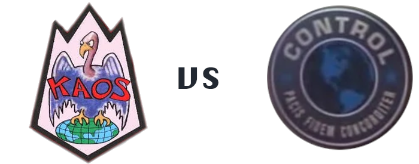
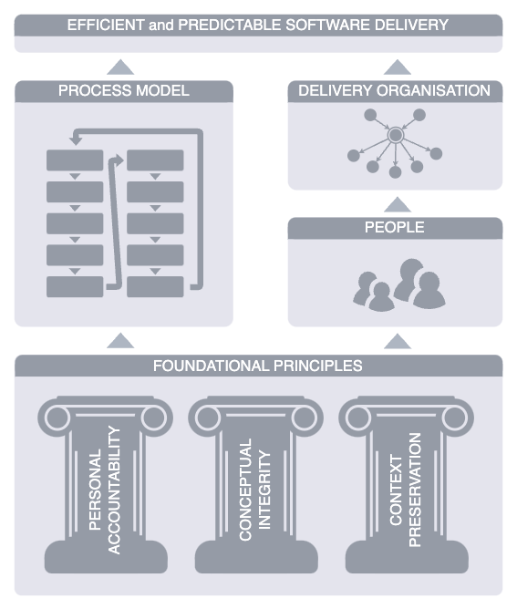

Chapter 3. Introducing CONTROL
---
If the present state of software engineering is a manifestation of chaos, then its antithesis is the aptly named1 CONTROL method. It does not refer to "control" in a managerial sense — à la dictatorial leadership and micromanagement, but "control" in a dynamical systems sense — ensuring that critical metrics are within optimal parameters.

>1 In memory of Don Adams, Agent 86.
>
>
>
>_The logos of fictional organisations from the American comedy series Get Smart. Left: KAOS — a fictitious international organisation of evil, bent on world domination; right: CONTROL — a counter-espionage organisation whose primary purpose is fighting KAOS._
>
>I'm leaving it to the reader to draw the parallels.

Agile and Classical methodologies are really process models. They describe a set of roles and responsibilities, and a protocol for determining what to do next. They are largely indifferent to the (product and engineering) organisational structure, skills makeup2, management practices, career progression, and team growth. Yet, these factors are critical to success! Often more so than deciding between Scrum and Kanban.

>2 Agile methodology likes to advocate for generalists so that anyone can work on anything. It suits the concept of a loosely ordered team backlog and estimation methods that assume that team capacity is a simple function of its size.

The software industry don't need another vacuous process model that renames some roles and shuffles a few process steps, while promising a radically different outcome. We shouldn't place our faith in motherhood values like commitment, focus, and courage3, or meaningless principles like "be awesome"4. Nor should we have to learn Japanese words to refer to rehashed concepts like "continuous improvement".

>3 These may or may not be among the values of Scrum.

>4 Taken verbatim from the Disciplined Agile framework.

CONTROL cuts through the rhetoric to offer a highly opinionated yet straightforward perspective on the delivery organisation and its evolution over time. It focuses on a small number of key people and builds a process tailored for them, not for their managers. It offers a complete formula for a high-performing delivery organisation.

> I worked as a Solution Architect for Australia's largest civil infrastructure project in the mid 2010s. The government owned enterprise that ran the project was hellbent on Agile transformation. The only problem was that everyone else in the industry was of the same mindset, and Agile Coaches were not an easy commodity to come by. So we ended up paying exorbitant sums of money for essentially junior project coordinators who have read a half dozen Scrum and SAFe blogs. How exorbitant? 20% above a Senior Software Engineer at the time.
>
> A came across an interesting Agile Coach during my tenure there. A man in his mid-forties, with a weathered look that could be mistaken for a retired field medic. He didn't care too much for the practice that he was hired to preach — he simply saw a way of getting his foot in the door and landing a decent wicket. He made it clear that all he cared about was that people knew exactly what was expected from them, which is an essential ingredient of accountability. Thanks in part to his efforts, our team was successful, despite not being particularly Agile.

At the process level, CONTROL emphasises:

1. Iterative and concurrent stage planning, with some design up front.
2. Risk-centric abstraction of requirements, with stakeholder engagement and formal sign-off.
3. Clear demarcation of responsibilities, at both people and systems level.
4. Centralised decision-making with the most experienced and qualified people leading delivery.
5. Personal accountability at all levels of the delivery organisation.
6. Preservation of problem context and conceptual integrity of solutions.
7. Meritocratic culture.

CONTROL is both _iterative_ and _concurrent_. It operates at the product _capability_ rather than system level. Aspirational and possibly ambiguous capabilities are broken down into multiple stages; the next stage may be planned while the current is being delivered. Capabilities may be designed and delivered concurrently, provided that certain constraints are satisfied.

CONTROL supports prototyping and rapid feedback. Provided the principles outlined herein are upheld, CONTROL can be applied equally to very large and very small projects, and small increments of large projects. Believe it or not, decision stability and personal accountability applies to prototypes too.

CONTROL is based upon decades of published research in behavioural science and economics. It considers the impact of individual and team behaviour and information flow in decision-making. CONTROL is prescriptive not only in process model but in the delivery organisation. This distinguishes it from methods that focus purely on process. And where others emphasise "individuals and interactions over processes" on paper, CONTROL puts the most skilled people at the helm and builds a process and a complete delivery organisation around them.

>Key elements of CONTROL were born out of an acute need to uplift the performance of engineering teams at a client that I consulted some time ago. The teams were reasonably skilled and followed Scrum principles. Nonetheless, they routinely committed to more than they were able to deliver, failed to push back on aspirational and unrealistic product demands, resulting in a string of failed expectations and loss of morale. Since then, this "bag of tricks" has been refined, sorted, organised into a repeatable process model and delivery structure, and given a name.

All engineering methodology I have been exposed to — from both Classical and Agile schools — focus on the fabrication of software systems. Making software is not an insurmountable challenge, provided you have the right people to do it for you. External recruitment is a very expensive way of accessing those people, but most organisations simply lack the choice. What is really needed is a method for fabricating skilled and motivated engineers. To be precise, organisations need a method for producing both the software and the people who can keep production going. CONTROL addresses this problem by entrusting the most experienced individuals with coaching roles, supporting an environment of skills assimilation and rapid personal development.

# What CONTROL is not
CONTROL is not all things to all people. There are specific areas of software engineering that CONTROL does not cater to:

* **Garage startups**: Organisation at that scale already have highly vested accountable members and should remain focused on gaining traction through rapid concept exploration.
* **Experimental or throw-away software**: Software that does not have a significant maintenance component in its lifecycle will not benefit significantly from robust development methodology that emphases long-term value creation.
* **Roles outside of delivery**: There are many important middle-management, specialist and supporting roles that may influence software delivery without partaking in it directly. While CONTROL identifies some of these roles and their relationships to the delivery organisation, it does not enumerate them exhaustively or define their responsibilities concretely.
* **Software architecture and design**: While CONTROL provides guidance on technical aspects like component ownership, context preservation, conceptual integrity and principled decision-making, it is not an architectural framework by any stretch.
* **Project management**: CONTROL coordinates some aspects of software projects, although it is not a substitute for a fully fledged project management framework.

# Terminology
We capitalise common terms when referring to their manifestations in the delivery organisation or the process model. For example, "engineering" refers to the engineering discipline or the action of solving problems using scientific principles, while "Engineering" refers to a specific department within an organisation. Similarly, "abstraction" might refer to the process of removing detail, while "Abstraction" refers to a specific phase within the CONTROL process model.

## BAU
Acronym for "business as usual." Covers software development and maintenance activities that do not require comprehensive analysis and planning, such as bugfixes, minor enhancements, library and infrastructure upgrades, and minor refactoring.

## Capability
A feature of the system or a desirable nonfunctional characteristic. For example, a 'wishlist' addendum to a shopping cart is a capability. The halving of response times is another capability.

Within capabilities we have a further subdivision:

* **Product capability**: An uplift of the system catering directly to user needs. (Users here may be customers, operational staff, third parties, etc.) The uplift may be both functional and nonfunctional in nature.
* **Technical capability**: An uplift of the system catering to Engineering needs. This work is not immediately attributable to product needs, but supports product delivery indirectly. A technical capability may, for example, be an activity aimed at making the system more maintainable. Another example: expanding the performance headroom in a core subsystem, such as transactional middleware, that intersects multiple product features.

## Component
A part of the overarching system that is maintained by one engineering team. A component may be a module, a µ-service, or an entire subsystem — depending on the architecture of the system. A team may 'own' multiple components; however, a component must be owned by exactly one team.

## Deliverable
A logical unit that composes a larger capability. For example, a single REST API endpoint within an authentication µ-service may be a deliverable in a 'password recovery' capability.

## Delivery organisation
A part of the overarching organisation that is responsible for capability delivery.

## Nonfunctional requirement (NFR)
Constraints characteristics of a system that do not immediately relate to functionality. Nonfunctional constraints include execution time, throughput, tolerance to failure, recovery point and time objectives, maximum resource utilisation, data retention, and so on.

## Organisation
Generically refers to any group of people with a well-defined structure (roles, reporting lines, etc.) and set of goals.

CONTROL is suited to a wide variety of organisations: businesses, non-profits and government institutions. An organisation may refer to a logically separate part of a larger organisation; for example, a department.

## Stage
A coarse-grained iteration wherein a _logically complete_ and fully functional set of deliverables is produced.

Many Agile methods flow in artificially time-boxed iterations, avoiding overly large work allotments. The delivery at the end of each iteration does not necessarily represent a logically complete capability, even if all tickets if the sprint backlog were fully burned down. (Some Classical methods do the same.)

By comparison, CONTROL ensures that an iteration ends with a usable capability, which is especially important if the capability is delivered in stages. CONTROL doesn't enforce sensible work ticket sizes at the process level, because the definition of "sensible" is open to interpretation. Instead, it defers to the PE and the engineering teams to adhere to sound engineering practices. If the team decides that two weeks is the longest any engineer ought to work on a problem, then the PE can break the work down further. In fact, CONTROL recommends that engineers maintain a catalogue of guidelines to assist with exactly this sort of stuff.

What defines "logically complete" may differ greatly based on the sort of capability being developed, the complexity of the system, and the appetite for longer stages. In a large system maintained by multiple engineering teams with complex interdependencies, a logically complete delivery may comprise a set of back-end APIs without a front-end. Perhaps the front-end team isn't in a position to begin work, while the back-end team has capacity to deliver. That may have to do for one iteration. However, those APIs will be complete insofar as they will function cohesively, come with a full set of unit and component tests, API schemas, development and maintenance documentation, and a performance test harness.

## Stakeholder
Someone who is materially impacted by the solution. They may be internal to the delivery organisation, internal to the business, or external — for example, a customer or end-user.

## System
The cohesive whole — an overarching system (or platform) that is collectively maintained by several engineering teams, each looking after their parts. The system is assumed to be servicing multiple products with different but possibly overlapping business stakeholders.

CONTROL builds a strong sense of ownership by enforcing sole custodianship. Every component within the broader system is owned and maintained by exactly one team.

## System Testing
The verification of the complete, fully-integrated system — ensuring that both the functional and nonfunctional requirements are met.

## Technical Roadmap
A strategic document containing a set of prioritised capabilities required to achieve a technical vision. The Technical Roadmap may be scoped to the entire system or an individual engineering team. It does not produce immediate business value; it ensures that business value may be produced in the longer term.

The Technical Roadmap may include such items as —

* changes to underlying technology, 
* refactoring initiatives, 
* increase in test coverage,
* adoption of certain patterns, 
* performance, stability and observability improvements, and
* deprecation of outdated components or technology.

# What's around the corner
The CONTROL method comprises four distinct but complementary areas:

1. **Foundational principles**: The "pillars", if you will, underpinning the entirety of the method. Every element of CONTROL is traceable to the foundational principles. Nothing in CONTROL may exist unless it is directly supported by at least one of the foundational principles and does not contradict the others. The foundational principles are discussed in Chapter 4.
2. **Process model**: A structured and progressive approach to problem-solving, comprising a series of distinct activities. The process model stipulates each activity, the people involved, their responsibilities, and the conditions for transitioning to the next activity. Practical examples are also given. The process model is discussed in Chapter 5.
3. **People**: The minimal set of roles essential to the success of software development. Each role is carefully defined with true purpose and to minimise overlap — allowing for the effective application of the accountability model. People in CONTROL are discussed in Chapter 6.
4. **The delivery organisation**: Places the people at the heart of CONTROL within a highly minimalist delivery organisation, clearly delineating how people relate and collaborate. CONTROL draws a clear boundary between those directly responsible for delivery and those supporting the delivery "from a distance". It offers insights on how a lightweight delivery organisation may interoperate effectively with a much larger enterprise. The delivery organisation is discussed in Chapter 7.

_An overview of CONTROL. The diagram illustrates how the foundational principles support other key aspects of CONTROL, which, in turn, promote efficient and predictable software delivery._

Chapters 8 and onwards offer practical guidance to support the core topics. They are useful to those implementing CONTROL and growing the delivery organisation.

So, grab your shoe phone, and let's go!

