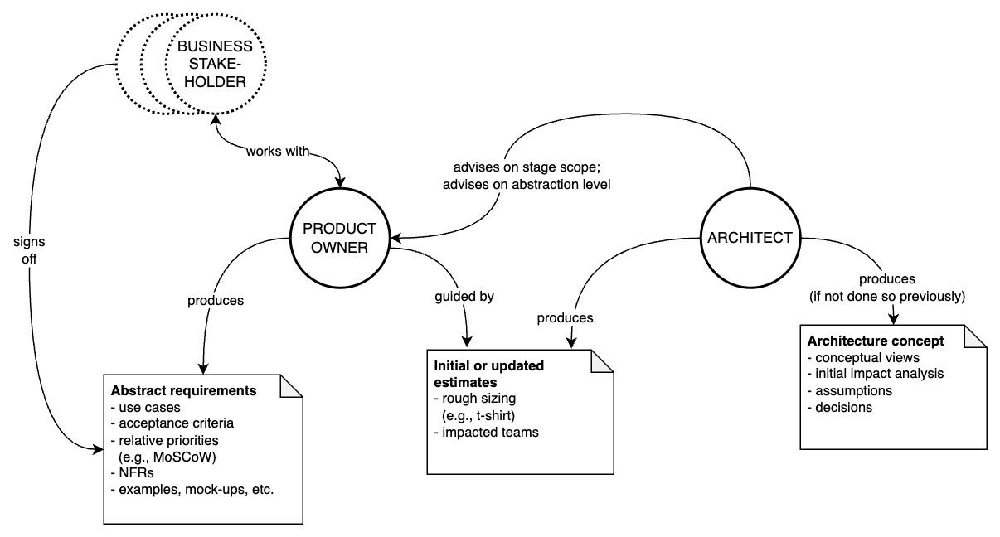
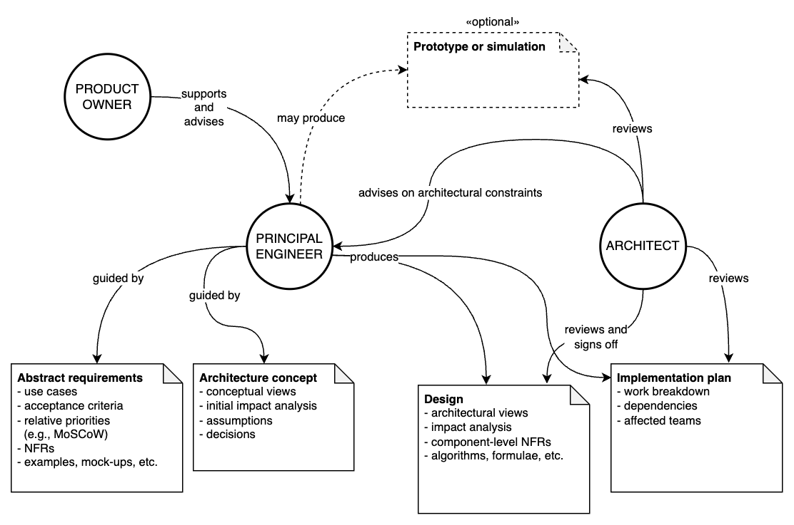

Chapter 5. Process Model
---
**CONTROL builds around Principal Engineers**. They are assumed to be among the most experienced, mature and skilled engineers in the delivery organisation. Everyone else either supports PEs or acts at their direction.

Delivery is concurrent across unrelated product _capabilities_, sponsored by the Product and Architecture teams, acting as internal stakeholders in the delivery organisation. Each capability is delivered in one or more successive _stages_. A stage is led by a Principal Engineer (PE) and comprises a loose sequence of distinct _phases_. The completion of a stage results in a _logically complete capability increment_. The diagram below illustrates the delivery process.

The CONTROL process model shares many structural elements with other methods from both the Classical and Agile schools. We urge the reader to pay careful attention, as many of the resemblances are superficial and the devil is, as usual, in the details.

_The Control Process Model._

# Delivery phases
## Ideation
The architecture and product teams join forces to explore and conceptualise capabilities well ahead of planned delivery. This gives both parties a long(er) planning horizon and time for analysis without necessarily committing to concrete deliverables.

+ The product team will initially consult with the business, organise focus groups, study the competitive landscape.
+ The product team will assemble rough mock-ups, user journeys, performance criteria, and other high-level artifacts.
+ Important questions are answered —
  - "what problem are we solving?"
  - "what value does it produce?"
  - "when does the business need this by?"
  - "is this even feasible?"
+ Depending on the capability, a rough definition of a Minimal Viable Product (MVP) may be drawn up, acting as a guide for scoping the next phase.
+ Architecture produces a conceptual architecture view that satisfies the requirements while aligning with the broader architectural strategy. 
+ The main aphorism of this phase is "no surprises!"

The Ideation phase is optional and may occur out-of-cycle; it does not act as a hard dependency for subsequent phases. CONTROL strongly encourages that a product capability undergoes Ideation at least once during its delivery life cycle. Ideation helps not only the strategists in the delivery organisation but also the business in obtaining early feedback on the viability of a product capability. It's a reality check of sorts.

_The Ideation phase._

## Abstraction
Prior to entering delivery, a nominated PO firms up an _abstract_ requirements specification, including nonfunctional concerns, which are ultimately signed off by the business.

+ For complex capabilities, delivery is subdivided into stages. 
+ Each stage is _abstractly_ specified: all critical aspects of the capability are stated with sufficient rigour without overspecifying the trivialities. 
  - By "critical," it is meant either "hard to change" or "impactful," depending on the industry.
  - Essential context is preserved so that subsequent decision-makers benefit from a more holistic understanding of the problem.
+ POs may not know which aspects of the system are hard to change. The Architects consult POs on aspects of the requirements that must be specified rigorously and point out those that may be relaxed.
+ Architects may advise on stage scope, using their knowledge of the system to estimate roughly how long things might take to build and which teams will be involved. 
  - Stage scope represents a logically complete capability iteration. Stages are not time boxed.
+ Critical stage requirements are locked-in before the build commences.
+ Delivery phases may be pipelined. The Ideation or Elaboration phases for the next stage may begin before the current stage is fully delivered.
+ This phase guarantees specification stability without overspecifying constraints, allowing for comfortable planning.
+ Architects may use this phase to produce conceptual designs if they weren't done earlier.

The Abstraction phase is among the chief risk mitigation activities in CONTROL. It creates a _stable set of assumptions_ around risky aspects of the specification that are carry significant implications or are difficult or costly to change, while preserving the relevant problem context. Foolproof models don't exist. We cannot entirely avoid mistakes in analysis, but we can do much to mitigate the consequences by prioritising risky ones.

CONTROL expands upon Boehm's original proposition (1988): "The project team must decide how much detail is enough." It does so with a carefully laid-out process and specific personal accountability. Architects are ideally suited to marshal abstraction and risk-reduction activities at the requirements level, as they practice similar activities routinely in their architectural analysis. To experienced architects, abstraction is their bread and risk-reduction is their butter.

Upon completing Abstraction, Architects and POs are presumed to be satisfied with the substance and the level of detail in the requirements specification. The end of Abstraction acts as the transition point between strategic and tactical leadership; the abstract requirements constitute both the problem and the context that are being passed on. 

_The Abstraction phase._

## Elaboration
One PE is chosen from a pool of available PEs to lead the delivery. They're in charge from here on. Strategic leadership maintains presence as internal stakeholders; PEs must ensure that designs are compliant with architectural principles.

+ PEs may work concurrently on capabilities if capacity permits. In practice, one PE might look after one large capability and maybe two smaller ones. Personal capacity management is left to their discretion — we trust our PEs.
+ There may be reasons why a PE cannot take on a new capability. Perhaps they are working on internal capabilities (e.g., addressing technical debt).
+ The PE pool and its capacity constraints act as a natural limiter of work in progress. Engineering cannot deliver more (large-ish) capabilities concurrently than they have PEs. (Bugfixes and minor enhancements take an alternate path.)

The PE refines an earlier conceptual design, if one exists, collaborating with Architecture, POs and the impacted EMs. Alternatively, the PE produces a fresh design. 

Designs produced by EMs are sufficiently detailed to remove material risks, but needn't unduly constrain the implementation. For example, they may intentionally underspecify many component-level decisions, except those deemed architecturally-significant. PEs strive to preserve the context of the original problem, while leaving ample room for further design refinements to be introduced by members of the delivery squad.

At this point, NFRs relating to the end-to-end solution must be decomposed to the level of individual components. This ensures that Engineering teams are able to independently assure the nonfunctional characteristics of their parts of the system.

+ Sometimes Architects will have designed the capability at a conceptual level before it is due to enter delivery, which may make things easier at this juncture.
+ Architects sign off on the elaborated design, comprising:
  - a catalogue of new and impacted components, including relevant details of the changes
  - various architectural views representing the static and dynamic properties of the system
  - system invariants
  - detailed algorithms and (semi-)formal specifications
  - component-level NFRs
+ Architects review the delivery plan, comprising:
  - the affected teams
  - sequences of deliverables
  - high-level work breakdown
  - high-level estimates
+ In high-risk systems, the PE may additionally produce proof-of-concept type software, simulations, etc.

It is a common misconception that architects, and only architects, should occupy their time drawing boxes and arrows. (Perhaps to keep them away from producing second rate code?) In CONTROL, Architects are mainly accountable for the alignment of the system architecture with long-term business objectives. A diagram is a tool that assists in communication, nothing more, nothing less. Anyone can do it, and almost everyone should do it! In a conventional world, architects hand over design artifacts to engineers and pray that they have been interpreted correctly, let alone read. On the receiving end, engineers will often nod and carry on building what suits them.

In the Elaboration phase, the PEs are largely responsible for solution design, so they've got to master communication. This means wielding all sorts of tools to help them model the problem and convince themselves and others that their solutions are optimal or at least viable. Their design will not be exhaustive; it will be further elaborated by the delivery squad in the course of implementing the solution. 

It must be stressed that _Architects are not solely responsible for producing solution designs_. Everyone is encouraged to design. Architects are accountable for the strategic suitability of those designs that end up getting delivered.

Complex capabilities delivered over several stages may undergo a change in delivery leadership. The PE leading the previous stage may be unavailable for any number of reasons. Because each stage is logically complete, stages may be treated independently.

_The Elaboration phase._

## Formation
During the Formation phase, PEs work with EMs to assemble a delivery squad from members of impacted teams, to ultimately furnish the capability end to end. 

+ Team members are recruited into a temporary group based on the unique needs of the delivery.
+ Skills are stipulated by the PE, with consultation from the EMs.
+ The context is fully imparted onto the delivery squad by PEs. 
+ Estimates are refined with the aid of squad Engineers.
+ Seconded squad members do not leave the larger team; they maintain the EM reporting line.
+ A Project Coordinator may assist in facilitating estimation activities and documenting outcomes.

The preservation of context is a central theme within CONTROL, made possible by the delivery squad model. Those involved in delivery understand the broader problem as well as the comparably smaller piece(s) they have been entrusted with. Furthermore, the strong conceptual integrity of the solution is made possible by the sole delivery lead who also happens to be the most senior and experienced person on the delivery team.

The Formation phase should be a relatively quick one. The impacted teams and the skills needed for delivery should be gauged midway through Elaboration, and _provided engineering capacity exists_, Formation needn't wait for Elaboration to complete. It can thus be largely attacked in parallel.

The capacity of PEs is distinct from that of the engineering teams, however. Independently of delivery activities, EMs will ensure that some capacity is reserved to deal with software maintenance and support. As a result, there may not be enough free engineers available to tackle the new capability. While it's possible to earmark people and onboard them in advance for future work, CONTROL strongly advises against this. A crucial part of Formation is to propagate context, which shouldn't be allowed to go stale. Formation should thus immediately precede Construction.

The refined estimates produced during the Formation phase will either crystalise stakeholder expectations or spark a negotiation process around scope. Either will go a long way towards protecting the delivery team from unreasonable deadlines. As Kent Beck said masterfully in _XP Explained_ (1999), "It's not my job to 'manage' someone else's expectations. It's their job to manage their own expectations. It's my job to do my best and to communicate clearly."

_The Formation phase._

## Construction
During the Construction phase, the PE maintains a lead role in building the capability and ensuring its conformance to stakeholder expectations. 

+ Their main responsibility is end-to-end delivery, with emphasis on engineering quality. This requires both functional and nonfunctional testing plans to be established.
+ They may choose to remain on the tools, and they typically will do so for foundational/ground-laying work.
  - PEs are not necessarily the only senior members on the delivery squad; they may delegate this work.
  - This is a risk-mitigation exercise: assessing technical risks early and assigning the most consequential risks to the most capable people. 
+ The maintenance of components is the responsibility of the larger team, so peer reviews and knowledge sharing are essential.
+ The PE acts as the main liaison between stakeholders and the delivery squad. 
  - Any anomalies in the delivery are communicated by the PE.
  - Basic project management or coordination skills are highly useful in this role.
  - A Project Coordinator may support and assist the PE in delivery management, and take on the responsibility for communications.

The Construction phase continues until the capability meets its functional and nonfunctional requirements.

One cannot reasonably expect that the highest level of care and commitment be accorded if there is a high likelihood that engineers will be reassigned to different teams. Accountability cannot exist without authority, and the prospect of relinquishing control, even in some indeterminate future, is enough to erode that commitment. There is little upside or downside in exercising care if software will be passed like a relay baton. Likewise, software components owned by two or more teams might as well be owned by neither. For that reason, the integrity and constitution of engineering teams is the cornerstone of sustainable systems engineering. 

CONTROL maintains long-term affinity between members and their teams, and insists that each software component is owned by exactly one team for life. The delivery squad is orthogonal to the long-lived engineering team structure; the two constructs intersect in scope. Squad members exclusively work on components belonging to their engineering teams. They can and should engage fellow teammates outside the squad to review their code, as ownership ultimately rests with the team.

_The Construction phase._

## Light or heavy — you pick
The sequencing of the delivery phases offers a structured and progressive approach to problem-solving, and identifies accountability at various points throughout the delivery. This ensures that the right people perform the right tasks at the right time.

Time has shown that (software) engineering is a creative process, more so than a manufacturing one. The prevalence of Agile over Classical is a testament to that. (Possibly owing to marketing more than execution.) No two software projects will be the same. The purpose of the process model is, therefore, not to constrain people's movements or inhibit creativity. Rather, it is to encourage a pragmatic, risk-centric approach to problem-solving: the time and effort expended in each phase is informed by the degree of technical risk. To quote Boehm for a second time, "the project team must decide how much detail is enough."

CONTROL phases can be as lightweight as the team needs them to be. Not all capabilities will need a separate Ideation phase. Most requirements may have been prepared and validated ahead of time, so the Abstraction phase may only take a few days or a week. The Elaboration phase for a straightforward capability could go for one hour — the time to get through a white-boarding session and a pack of donuts. The phases can heavily overlap: we may start elaborating the design while the requirements are still being abstracted, so long as we feel that there's enough meat on the bone to make good progress. Of course, these are best-cases, but a process model needs to be equally effective at scaling down as it is at scaling up.

## Some examples
The following is an illustration of the delivery of three hypothetical capabilities, named _X_, _Y_ and _Z_. The horizontal axis represents time; major tick marks represent weeks. 

_Examples of capability deliveries._

Capability _X_ is delivered over at least two stages. It requires a fair bit of analysis, which is suggested by the duration of the Abstraction and Elaboration phases. The first stage opens with a dedicated Ideation phase, which yields a product and architecture concept, as well as a feasibility report. The latter offers an indicative measure of the build duration and the cost to the business, and a recommendation to cease or continue based on the projections from the business case.

The Ideation phase is useful in its ability to conduct preliminary analysis without incurring significant costs or taking up valuable delivery resources. In this example, it took two weeks to complete, involving only two people from the delivery team: a PO and an Architect, and the latter could have been involved part-time.

The business dwells on the decision for four weeks, before sponsoring further analysis — triggering the Abstraction phase. This phase involves close collaboration between the PO and the Architect to produce a requirements specification to a suitable level of abstraction. The idea is not to overspecify the requirements — a delicate balance achieved with the help of an experienced Architect. Once the requirements have been refined, the are presented to business stakeholders for approval.

 and then proceeding to the Elaboration phase. Here, the PE has decided to start forming the delivery squad before the design was fully elaborated — there were some minor details left to iron out.

# Out-of-cycle verification
CONTROL does not define a formal verification phase within the process model, despite having well-defined roles for the System Tester and the System Testing Manager. Verification can be performed at any time that is convenient for the System Testing team to perform this activity. This may seem overly relaxed, especially compared to the rigid verification processes associated with plan-driven methods. There is little doubt that independent verification is required when a system reaches a certain level of complexity, but the timing of the activity may depend on the type of capability being delivered and resource constraints:

* If the stakeholders in the capability delivery require verification prior to delivery, then system testing will happen at the conclusion of the Construction phase, at minimum.
* Verification may happen out-of-cycle and sometime after delivery if the capability does not require urgent verification, perhaps due to a reduced level of criticality.
* Some capabilities may forego verification out of resource constraints: if the capacity of the Engineering team to produce software exceeds the capacity of the System Testing team to verify it, then certain noncritical verification activities will invariably be skipped.
* In the most critical of cases, verification may take place continuously throughout the Construction phase, provided the delivery squad can produce incremental releases. Final verification will be performed before handover.

During the Construction phase, Architects will work with the System Testing community to advise on upcoming changes to the system-level tests and acceptance criteria. System testing is discussed in more detail in Chapter 6.

# Project management and tooling
Project management tools (e.g., Jira) are used for tracking work at two levels —

* **Capability level** — the end-to-end capability being delivered. This acts as a container for tasks and provides progress visibility to project managers and external stakeholders. Mapping to a tool like Jira, this will likely be represented using an Epic. 
* **Task level** — an item that can be delivered on in isolation. A task is the smallest thing that can be delivered by an individual.

CONTROL does not formally define a Project (or Programme) Manager (PM) role since enough literature exists on this topic — PMBOK and PRINCE2, for instance. PMs play an important role in resource planning, monitoring delivery, and ensuring that projects operate within their defined parameters and don't spin out of control. If anything, CONTROL encourages an external governance layer if it increases the chance of success. The project management office may, therefore, oversee the software project as a whole.

We also acknowledge the breadth of responsibilities placed upon the PE role in taking charge of capability delivery. They must provide technical guidance, group management, and delivery oversight. A dedicated Project Coordinator role may operate across several capability delivery streams, allowing the PEs to focus on technical activities.

# Concluding remarks
Elsewhere, problems are solved by interspersing a handful of very capable people among mostly average ones; everyone then picks off bite-sized chunks from a backlog with little context and no regard for technical risk. CONTROL differs from democratised approaches by getting the most capable people to lead those who have much to learn, providing feedback and coaching along the way. The Principal Engineer role is the cornerstone of CONTROL. It is also key to sustainable growth, as we shall soon see.

CONTROL has no Senior Engineering Manager role: EMs and PEs collectively handle all team responsibilities among them. EMs focus on the health of their teams and the components in their custody, while PEs focus on the delivery of new capabilities. They are supported by Architects and POs. There are no Product Managers. Managers of managers (MoMs) do not have a direct seat in the CONTROL delivery organisation. (We elaborate on this later.)

CONTROL does not require mundane ceremonies or an elaborate support entourage. There is no scrum. There are no sprints. No Agile Leads, Scrum Masters or Agile Coaches. Work breakdown is handled by PEs. Delivery is plan-driven, risk-aware, context-rich, and accountability-based.
