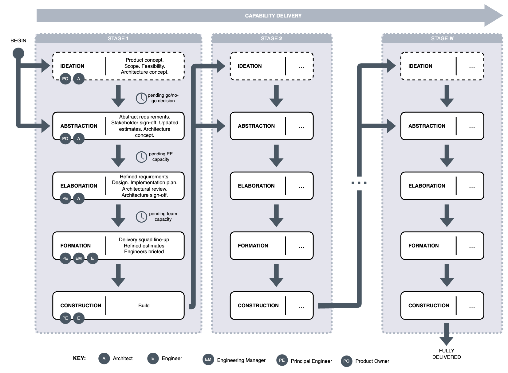
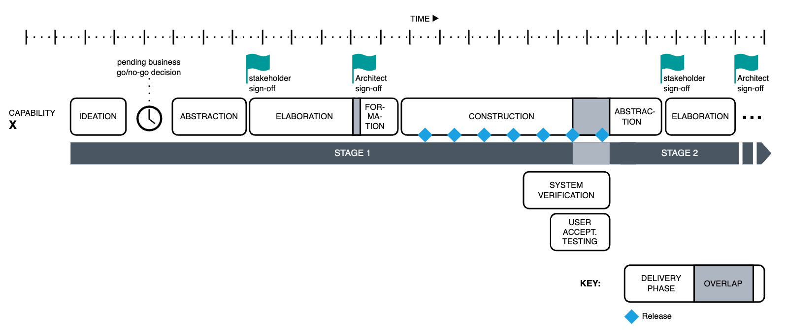

Chapter 5. Process Model
---
The delivery of high-quality software within challenging environmental constraints cannot be left to chance; it requires a disciplined and repeatable approach. This chapter delves into the intricacies of software project control, offering a structured and progressive approach to problem-solving, with accountability at all key points throughout the delivery.

# Key players
The CONTROL delivery roles are elaborated in Chapter 6, just around the corner. In the meantime, brief introductions are offered:

* **Principal Engineers (PEs)**: Top-tier Engineers; the cream of the crop. They design and deliver high-quality software while leading and coaching others around them.
* **Architects**: Provide strategic leadership within the technical domain, ensuring that the system architecture evolves in alignment with business needs.
* **Engineers**: Build software solutions. They write, test, document, and maintain software components, ensuring requirements are met.
* **Engineering Manager (EMs)**: Act as line managers to Engineers, overseeing the long-term interests of their teams and the health of software components under their remit.
* **Product Owners**: Provide strategic and tactical product leadership, ensuring that delivered products meet business needs.
* **System Testers**: Ensure that the system meets business requirements at the overarching level, acting as proxies for customers to verify end-to-end functionality. 
* **System Testing Manager (STMs)**: Act as line managers to System Testers, overseeing the long-term interests of their teams and testing assets within their remit.

# Overview
**CONTROL builds around Principal Engineers**. They are assumed to be among the most experienced, mature, and skilled software engineers in the delivery organisation. Everyone else either supports PEs or acts at their direction.

Delivery in CONTROL is concurrent across unrelated product _capabilities_, initiated by the Product and Architecture teams, acting as internal stakeholders in the delivery organisation. Each capability is delivered in one or more successive _stages_. A stage comprises a loose sequence of distinct _phases_. The completion of a stage results in a _logically complete capability increment_.

A stage is jointly bootstrapped by Product Owners and Architects. Once the requirements and high-level architecture reach a certain level of stability, the stage leadership is transferred to a PE, who is responsible for its subsequent delivery. The diagram below illustrates the delivery process.

The CONTROL process model shares some structural elements with other methods from both the Classical and Agile schools. We urge the reader to pay careful attention as many of the resemblances are superficial and the devil is, as usual, in the details.

_The Control Process Model._

# Delivery phases
The following section describes the phases that make up each delivery stage. This material will be entirely new to most readers; it may appear particularly foreign to those unaccustomed to structured or disciplined delivery methods. Don't worry if not everything makes sense in the beginning; lifelike examples are provided halfway through the chapter.

## Ideation
The Architecture and Product teams join forces to explore and conceptualise capabilities well ahead of planned delivery. This gives both parties a long(er) planning horizon and time for analysis without necessarily committing to concrete deliverables.

+ The PO will initially consult with the business, organise focus groups, and study the competitive landscape.
+ The PO will assemble rough mock-ups, user journeys, performance criteria, and other high-level artefacts.
+ Important questions are answered —
  - "What problem are we solving?"
  - "What value does it produce?"
  - "When does the business need this by?"
  - "Can we deliver it in parts?"
  - "Is this even feasible?"
+ The Architect can help with some of the above, particularly the points requiring (very rough) effort estimation and breakdown.
+ Depending on the capability, a rough definition of a Minimal Viable Product (MVP) may be drawn up, acting as a guide for scoping the next phase.
+ The Architect produces a conceptual architecture view that satisfies the requirements while aligning with the broader architectural strategy.
+ There is no expectation of getting things down perfectly; this phase evokes early thought and buys precious planning time.
+ The main aphorism of this phase is "no surprises!"

The Ideation phase is optional — it does not act as a hard dependency for subsequent phases. However, CONTROL strongly encourages that a product capability undergoes Ideation at least once during its delivery lifecycle. Ideation helps not only the strategists in the delivery organisation but also the business in obtaining early feedback on the viability of a product capability. It's a reality check of sorts.

_The Ideation phase._

## Abstraction
Before entering delivery, the nominated PO firms up an _abstract_ requirements specification, including nonfunctional concerns, which are reviewed and ultimately signed off by the business.

+ For complex capabilities, delivery is subdivided into stages. 
  - The Ideation phase may shed some light on prospective subdivisions.
+ Each stage is _abstractly_ specified: all critical aspects of the capability are stated with sufficient rigour without overspecifying the trivialities. 
  - By "critical", it is meant either "hard to change" or "impactful", depending on the industry.
  - Essential context is preserved so that subsequent decision-makers benefit from a more holistic understanding of the problem.
+ POs may not know which aspects of the system are hard to change. The Architects consult POs on aspects of the requirements that must be specified rigorously and point out those that may be relaxed.
+ Architects may advise on stage scope, using their knowledge of the system to estimate roughly how long things might take to build and which teams will be involved. 
  - Stage scope represents a logically complete capability iteration. Stages are not time-boxed.
  - Initial t-shirt estimates may have been produced in the Ideation phase; the Abstraction phase can be used to refresh the estimates based on the updated requirements.
+ Critical stage requirements are locked in before the build commences. This is done by having the business stakeholders review and sign off on the requirements.
+ Delivery phases may be pipelined. The Ideation or Elaboration phases for the next stage may begin before the current stage is fully delivered.
+ This phase guarantees specification stability without overspecifying constraints, allowing for comfortable planning.
+ Architects may use this phase to produce conceptual designs if they weren't done earlier.

The Abstraction phase is among the chief risk mitigation activities in CONTROL. It creates a _stable set of assumptions_ around risky aspects of the specification that carry significant implications or are difficult or costly to change while preserving the relevant problem context. Foolproof models don't exist. We cannot entirely avoid mistakes in analysis, but we can do much to mitigate the consequences by prioritising the riskiest areas.

>Why are early reviews important?
>
>It concerns the proliferation of defects and the subsequent cost of change. A 1981 proposal by the IBM Systems Sciences Institute described the concept of _defect amplification_ (IBM Corporation, 1981). It argues that a single defect introduced early in the engineering process (e.g., during requirements analysis) will precipitate multiple defects at the architecture level. The subsequent activities (e.g., component design) will multiply each defect, resulting in more defects flowing through to the implementation. This snowballing effect increases the extent of follow-up changes and the cost of rework.
>
>At first glance, the concept of early reviews (and sign-offs) appears to be a mechanism for satisfying stakeholder expectations — ensuring that the delivered software is fit for purpose. This is not entirely the case, however; software may be readily changed later and stakeholders will have their requirements met eventually. Rather, it is a cost-effective mechanism for reducing follow-up changes. By detecting defects when it is cheap to do so, one can avoid work that is magnitudes more expensive and time-consuming down the line.
>
>The effectiveness of early reviews holds irrespective of the development methodology. Agile methods, for instance, strive for stakeholder satisfaction through feedback-driven changes. These changes are still costly, although small delivery increments decrease their cost proportionately. As discussed in Chapter 2, uncertainty is not a binary state; it is rare for any software project to be entirely unspecifiable even those containing many uncertain elements. A requirements review may therefore substantially speed up the development process even in turbulent environments, where change is normally embraced.

CONTROL expands upon Boehm's original proposition (1988): "The project team must decide how much detail is enough". It does so with a carefully laid-out process and specific personal accountability. Architects are ideally suited to marshal abstraction and risk-reduction activities at the requirements level, as they practice similar activities routinely in their architectural analysis. To experienced architects, abstraction is their bread and risk-reduction is their butter.

Upon completing Abstraction, the Architect and the PO are presumed to be satisfied with the substance and the level of detail in the requirements specification. The end of Abstraction acts as the transition point between strategic and tactical leadership; the abstract requirements constitute both the problem and the context that are being passed on. 

_The Abstraction phase._

## Elaboration
One PE is chosen from a pool of available PEs to lead the delivery. They're in charge from here on. Strategic leadership maintains a presence as internal stakeholders; PEs must ensure that designs are compliant with architectural principles.

Capacity constraints may need consideration:

+ PEs may work concurrently on capabilities if capacity permits. In practice, one PE might look after one large capability and maybe two smaller ones. Personal capacity management is left to their discretion — we trust our PEs.
+ There may be reasons why a PE cannot take on a new capability. Perhaps they are working on other product or technical capabilities. (The latter is another term for addressing technical debt.)
+ The PE pool and its capacity constraints act as a natural limiter of work in progress. Engineering cannot deliver more (large-ish) capabilities concurrently than they have PEs. (Bugfixes and minor enhancements take alternate paths, considered in Chapter 9.) We remark on this issue later in the chapter.

The PE refines an earlier conceptual design, if one exists, collaborating with Architecture, POs and the impacted Engineering Managers. Alternatively, the PE produces a fresh design.

Designs produced by PEs are sufficiently detailed to remove material risks but needn't unduly constrain the implementation. For example, they may intentionally underspecify many component-level decisions, except those deemed architecturally significant. PEs strive to preserve the context of the original problem while leaving ample room for further design refinements to be introduced by members of the delivery squad. Creativity is not just the realm of Architects and PEs.

+ Sometimes Architects will have designed the capability at a conceptual level before it is due to enter delivery, which may make things easier at this juncture.
+ NFRs relating to the end-to-end solution must also be decomposed to the level of individual components. This ensures that Engineering teams can independently verify the nonfunctional characteristics of their parts of the system.
+ In an ideal world, the current state of the impacted components will have been documented. Failing that, PEs may consult EMs to learn the current state.
+ In high-risk systems, the PE may additionally produce proof-of-concept type software, simulations, etc. The Elaboration phase may take longer, but it will significantly reduce the risk of failure down the line.

>Why is design important?
>
>As Roger Pressman put it: "Design is the place where quality is fostered in software engineering. It provides you with representations of software that can be assessed for quality. Design is the only way that you can accurately translate stakeholders' requirements into a finished software product or system. Software design serves as the foundation for all the software engineering and software support activities that follow. Without design, you risk building an unstable system — one that will fail when small changes are made; one that may be difficult to test; one whose quality cannot be assessed until late in the software process."
>
>Design is one of the main points of distinction (and contention) between feedback-driven, Agile methodology and plan-driven, Classical methodology. CONTROL is neither entirely; it is _accountability-driven_ and planning-enabled with elements of feedback. And accountability compels us to place quality at the forefront of the software engineering process. Hence, a risk-centric approach to design (and other activities) is advocated throughout this book.

Upon conclusion —

+ Architects sign off on the elaborated design, comprising:
  - a catalogue of new and impacted components, including relevant details of the changes
  - various architectural views representing the static and dynamic properties of the system
  - system invariants
  - detailed algorithms and (semi-)formal specifications (if and where applicable)
  - component-level NFRs
+ Architects review the implementation plan, comprising:
  - the affected teams
  - sequences of deliverables
  - high-level work breakdown

It is a common misconception that architects, and only architects, should occupy their time drawing boxes and arrows. (Perhaps to keep them away from producing second-rate code?) In CONTROL, Architects are mainly accountable for the alignment of the system architecture with long-term business objectives. (Sounds ostentatious but someone has got to do it.) A diagram is a tool that assists in communication, nothing more, nothing less. Anyone can do it, and everyone should do it! In a conventional world, architects hand over design artefacts to engineers and pray that they have been read, let alone interpreted correctly. On the receiving end, engineers will often nod and carry on building what suits them.

In the Elaboration phase, the PEs are largely responsible for solution design, so they've got to master communication. This means wielding all sorts of tools to help them model the problem and convince themselves and others that their solutions are optimal or at least viable. Their design will not be exhaustive; it will be further elaborated by the delivery squad in the course of implementing the solution. 

It must be stressed that _Architects are not solely responsible for producing solution designs_. Everyone is encouraged to design. Architects are accountable for the strategic suitability of those designs that end up getting delivered.

Complex capabilities delivered over several stages may undergo a change in delivery leadership. The PE leading the previous stage may be unavailable for any number of reasons. Because each stage is logically complete, stages may be treated independently.

_The Elaboration phase._

## Formation
During the Formation phase, PEs work with EMs to assemble a delivery squad from members of impacted teams, to ultimately furnish the capability end to end. 

+ Team members are recruited into a temporary group based on the unique needs of the delivery.
+ Skills are stipulated by the PE, with consultation from the EMs.
+ The context is fully imparted to the delivery squad by PE. This is ideally done in face-to-face meetings.
    * The EMs, although not part of the delivery squad, sit in on the meetings. Like their reports, they absorb the problem context and analyse the solution. Since EMs are responsible for the quality of the deliverables, their involvement before the Construction phase begins is highly encouraged.
+ Estimates are refined with the aid of squad Engineers and EMs. The latter also ensure that any quality concerns are given due consideration.
+ Seconded squad members do not leave the larger team; they maintain the EM reporting line.
+ A Project Coordinator may assist in facilitating estimation activities and documenting outcomes.

The preservation of context is a central theme within CONTROL, made possible by the delivery squad model. Those involved in delivery understand the broader problem as well as the comparably smaller piece(s) they have been entrusted with. Furthermore, the strong conceptual integrity of the solution is made possible by the sole delivery lead — the Principal Engineer — who also happens to be the most senior and experienced person on the delivery team.

The Formation phase should be a relatively quick one. The impacted teams and the skills needed for delivery should be gauged midway through Elaboration, and _provided engineering capacity exists_, Formation needn't wait for Elaboration to complete, provided that the riskiest items have been considered and elaborated. To that extent, Formation can be attacked in parallel with Elaboration.

The capacity of PEs is distinct from that of the engineering teams, however. Independently of delivery activities, EMs will ensure that some capacity is reserved to deal with software maintenance and support. As a result, there may not be enough free engineers available to tackle the new capability. While it's possible to earmark people and onboard them in advance for future work, CONTROL strongly advises against this. A crucial part of Formation is to propagate context, which shouldn't be allowed to go stale. Formation should thus immediately precede Construction.

The refined estimates produced during the Formation phase will either crystalise stakeholder expectations or spark a negotiation process around scope. Either will go a long way towards protecting the delivery team from unreasonable deadlines and the business from surprises. As Kent Beck expressed masterfully in _XP Explained_ (1999), "It's not my job to 'manage' someone else's expectations. It's their job to manage their own expectations. It's my job to do my best and to communicate clearly."

With the delivery squad model, CONTROL tackles the main source of unpredictability in Agile - estimation. For instance, when a developer estimates that a ticket is a five-pointer, many stakeholders are unsure what it actually means in practice. Story points measure complexity, not effort estimates, and their interpretation requires knowledge of the team's velocity. Furthermore, the estimation assumes an _abstract_ developer will work on the ticket, as we do not know who that team member will be.

People cannot be abstracted this way, and there is no "average" developer. It's not even a matter of skill: people who are familiar with certain tasks will accomplish them quickly. In a delivery squad model, we can often tell exactly who that developer will be. Even in large delivery squads, only a few people will work on any given component. So, not only can we estimate with _a priori_ knowledge of these people, but it is them who will produce the estimates in the Formation phase. As a member of a delivery squad, you are almost always estimating on your behalf.

_The Formation phase._

## Construction
During the Construction phase, the PE maintains a lead role in building the capability and ensuring its conformance to stakeholder expectations. 

+ Their main responsibility is end-to-end delivery, with an emphasis on engineering quality. This requires both functional and nonfunctional testing plans to be established.
+ PEs may choose to remain on the tools, and they typically will do so for foundational/ground-laying work.
  - PEs are not necessarily the only senior members of the delivery squad; they may delegate this work.
  - PEs shouldn't count towards the capacity of the squad. A PE's job is, first and foremost, to solve problems and provide guidance. In this regard, programming is a means to an end, but not the only means.
  - Involvement of PEs is a risk-mitigation exercise: assessing technical risks early and assigning the most consequential risks to the most capable people. 
+ Construction may be divided into smaller internal increments, with releases published accordingly. 
  - Internal increments may be scope-bounded or time-boxed, at the discretion of the delivery squad or as per the established Engineering practices.
  - Releases may be deployed to the System Verification environment for regular functional and performance verification.
  - Releases may also be deployed to User Acceptance Testing (UAT) environments to obtain frequent stakeholder feedback.
  - Any detected verification anomalies or stakeholder feedback are incorporated directly into the squad backlog: they are delivered in the scope of the current stage. 
+ The maintenance of components is the responsibility of the larger team, so peer reviews and knowledge sharing are essential.
+ The PE acts as the main liaison between stakeholders and the delivery squad. 
  - Any anomalies in the delivery are communicated by the PE.
  - A Project Coordinator may support and assist the PE in delivery management and take on the responsibility for communications.
  - Basic project management or coordination skills are highly useful in this role, regardless of the Project Coordinator's involvement.

The Construction phase continues until the capability meets its functional and nonfunctional requirements.

One cannot reasonably expect that the highest level of care and commitment be accorded if there is a high likelihood that engineers will be reassigned to different teams. Accountability cannot exist without authority, and the prospect of relinquishing control, even in some indeterminate future, is enough to erode that commitment. There is little upside or downside in exercising care if the software will be passed like a relay baton. Likewise, software components owned by two or more teams might as well be owned by neither. For that reason, the integrity and constitution of engineering teams is the cornerstone of sustainable systems engineering. 

CONTROL maintains long-term affinity between members and their teams, and insists that each software component is owned by exactly one team for life. The delivery squad is orthogonal to the long-lived engineering team structure; the two constructs intersect in scope. Squad members exclusively work on components belonging to their engineering teams. They can and should engage fellow teammates outside the squad to review their code, as ownership ultimately rests with the team.

_The Construction phase._

# Out-of-cycle verification
CONTROL does not define a formal verification phase within the process model, despite having well-defined roles for the System Tester and the System Testing Manager. (Roles are defined in Chapter 6.) Verification can take place at any time that is convenient for the System Testing team to perform this activity. This may seem overly relaxed, especially compared to the rigid verification processes associated with plan-driven methods. There is little doubt that independent verification is required when a system reaches a certain level of complexity, but the timing of the activity may depend on the type of capability being delivered and resource constraints:

* If the stakeholders in the capability delivery require verification before acceptance, then system testing must happen after the conclusion of the Construction phase, at minimum.
* Verification may happen out-of-cycle and sometime after delivery if the capability does not require urgent verification, perhaps due to reduced criticality.
* Some capabilities may forego verification out of resource constraints: if the capacity of the Engineering team to produce software exceeds the capacity of the System Testing team to verify it, then certain noncritical verification activities will invariably be skipped.
* In the most critical of cases, verification may take place continuously throughout the Construction phase, provided the delivery squad can produce incremental releases. Final verification will be performed before handover.

During the Construction phase, Architects will work with the System Testing community to advise on upcoming changes to the system-level tests and acceptance criteria. System testing is discussed in more detail in Chapter 6.

# Light or heavy — you pick
The sequencing of the delivery phases offers a structured and progressive approach to problem solving and identifies accountability at all key points throughout the delivery. This ensures that the right people perform the right tasks at the right time.

Time has shown that (software) engineering is a creative process, more so than a manufacturing one. The prevalence of Agile over Classical is a testament to that. (Possibly owing to marketing more than execution.) No two software projects will be the same. The purpose of the process model is, therefore, not to constrain people's movements or inhibit creativity. Rather, it is to encourage a pragmatic, risk-centric approach to problem solving: the time and effort expended in each phase is informed by the degree of technical risk. To quote Boehm for a second time, "the project team must decide how much detail is enough".

CONTROL phases can be as lightweight as the team allows them to be. Not all capabilities will need a separate Ideation phase. Most requirements may have been prepared and validated ahead of time, so the Abstraction phase may only take a few days or a week. The Elaboration phase for a straightforward capability could go for one hour — the time to get through a white-boarding session and a pack of doughnuts. The phases can heavily overlap: we may start elaborating the design while the requirements are still being abstracted, so long as we feel that there's enough meat on the bone to sustain progress. Of course, these are best cases, but a process model needs to be equally effective at scaling down as it is at scaling up.

# Checksum estimation
Architects produce rough, t-shirt-sized estimates during the Ideation and Abstraction phases.

The modern-day software engineering community, particularly proponents of Agile methodology, is divided on whether off-the-tools stakeholders should partake in estimation activities. Some feel that adding more minds improves the overall estimation accuracy. Others argue against this practice, referring to the "chicken and pig" metaphor. Developers may be concerned about being inadvertently committed to arbitrary schedules by less informed stakeholders, especially if the early-stage estimates get mistaken for schedules by the executives.

>The chicken and the pig decide one day to open a restaurant but are unsure of the menu. The chicken suggests bacon and eggs. "No, thanks." the pig responds. "You'd be contributing while I'd be committed!"
>
>In the Agile world, pigs are those committed to work (cutting code, producing UX designs, testing, etc.), while chicks stand by and observe. When someone calls out "chicken" during a standup, it usually means they weren't committed to anything and wish to skip their turn.
>
>There are, of course, limitations to this metaphor. Some stakeholders may be materially involved in the outcome of the software project or are personally accountable for specific aspects. They may, in fact, be pigs in chicken feathers.

Architects estimate mainly to assist in feasibility assessment and to gauge how a large capability might be subdivided for stage-wise delivery. Without even a rough set of estimates, the business is essentially flying blind. They will be unable to prioritise among capabilities, manage budgets, or plan rollout schedules.

There is another, more subtle reason, why Architects may want to have a stab at estimation, even occasionally producing more fine-grained estimates. I call it "checksumming".

>Checksums are widely used in computer science to verify data integrity and detect errors. By storing an output of a hash function with the original data, the recipient can determine, with some fixed likelihood, whether the data contains an error. If the checksums do not match, the data contains an error. Otherwise, the data is likely to be uncorrupted. Checksums are fundamental in network communications and data storage, ensuring reliable and error-free operations.

Error detection through redundancy is a widespread technique in computing, but similar techniques can be used to reduce miscommunications among humans. When communicating a design, especially at a conceptual (and hence abstract) level, the recipient may unsuspectingly misunderstand certain aspects of it. They may consider certain aspects to be simpler than the Architect envisaged. Even more likely, the Architect could've underestimated the complexity of certain aspects by neglecting important edge cases.

A rough, holistic estimate acts as a weak checksum in the exchange between Architects and the Engineers responsible for implementation. When the Engineers' estimates vary wildly from the Architect's, it's a surefire sign of miscommunication. If the estimates roughly align, there is still a chance of an undetected miscommunication. A fine-grained, component-level estimate offers more redundancy, acting as a stronger checksum, and increasing the likelihood of a miscommunication being identified.

Dialogues involving estimation increase the Architects' sympathy for the system and its various intricacies. It makes them more aware of the as-built state, which will have invariably drifted over time from the designs. With time, it improves their ability to estimate accurately.

# Insightful examples
The following illustrates the delivery of three hypothetical product capabilities, named _X_, _Y_ and _Z_. Please read this section even if you think you know how the process model works; there are insights here that will enhance your understanding of it.

The horizontal axis represents time; major tick marks represent weeks.

_Capability delivery: Example X._

Capability _X_ is slated for delivery over at least two stages. It requires substantial analysis, which is suggested by the duration of the Abstraction and Elaboration phases. The first stage opens with a dedicated Ideation phase, which yields a product and architecture concept, as well as a feasibility report. The latter offers an indicative measure of the build duration and the cost to the business, and a recommendation to cease or continue based on the revenue projections from some initial business case. (Afterwards, the business case would be revised with the results of the feasibility study.)

The Ideation phase is useful in its ability to conduct preliminary analysis without incurring significant costs or taking up valuable delivery resources. In this example, it took two weeks to complete, involving only two people from the delivery organisation: a PO and an Architect, and the latter was involved part-time. 

If the business signs off on the revised business case, fantastic — the team will have useful work to do. If the initiative gets dropped, even better — the business will have saved time and money, and can focus on more worthwhile things!

Not every capability requires a feasibility study. Often, the business is willing to absorb substantial variability in costs and schedules — they just need it done. Alternatively, the capability may be required for compliance with some statute or regulation and is pinned to a deadline — it needs to be done all the same. Finally, technical capabilities may not require feasibility assessment — they are sponsored by the Architecture team who may have performed their due diligence ahead of time.

The Ideation phase can also identify the prospective stages — increments of a capability. The first stage might be an MVP-style deliverable. Subsequent stages will refine the product, provided that the business is happy with the way it is progressing. They may decide to change tack or drop the product altogether. There is a delicate balance in binding stage scope, especially for the first stage of a complex product capability. If the MVP is too large, valuable time might be wasted before gaining feedback; conversely, small MVPs may not find their market due to their inadequacy.

The business dwells on the decision for the whole of two weeks, as they do, before deciding to sponsor the first stage of _X_. The results of the Ideation phase, while useful as a basis for technical work, are insufficient to start smashing out code. The go-ahead decision triggers the Abstraction phase, during which the PO and the Architect collaborate1 to produce a requirements specification to a suitable level of abstraction. The idea is not to overspecify the requirements — a delicate balance achieved with the help of an experienced Architect. Some of the initial t-shirt estimates had to be updated. Once the requirements have been refined, they are presented to the business stakeholders for approval.

>1 The PO is chiefly responsible for the essential output of this phase: the set of abstract requirements. The Architect advises the PO on the suitable level of abstraction and ensures that the most critical items have been covered by the PO.

Once the scope has been refined and initial estimates updated, the business may in theory reject the capability — if the updated estimates invalidate feasibility assumptions. Not in this case; the business is pressing on.

In the Elaboration phase, a PE has been assigned to the capability delivery and is now working with the Architect to refine the conceptual design into _something that can be built_. The extent of the work varies from case to case. For starters, it depends on the level of detail inputted by the Architect. In large and/or complex initiatives, the detail in the conceptual views will probably be lacking. The output detail also depends on the skills and experience of the Engineering team. Junior team members will need more guard rails, while seniors should be accorded more latitude. The PE takes a fundamentally risk-centric view of the solution: refining it to the point where the level of residual risk is tolerable2. 

>2 Most of this is subjective. Outcomes improve with experience: the more we deal with technical risk, the better we get at handling it.

The Architect supports the PE in matters of design and takes accountability for ensuring that the resulting designs are conformant to the overarching system architecture and the principles guiding its evolution. The design sign-off comes from the Architect.

Once the PE feels that the essence of the design is in place, the Formation phase may commence.

Elaboration needn't be finished; the delivery squad may be formed regardless. For Stage 1 of _X_, the PE has decided to start recruiting the delivery squad before the design was fully elaborated. There were minor details left to iron out, which didn't appear to make a difference to the squad make-up. 

Where phases overlap, the sign-off of the current phase (if applicable) is required before the succeeding phase begins in earnest, although some initial groundwork can take place at the discretion of the person leading the current phase. In an overlapping Abstraction-Elaboration transition, business stakeholders should give their sign-off before we get too far into Elaboration. Similarly, when Elaboration and Formation overlap, the Architect is required to approve the design before we get too far into the briefing of the delivery squad. The definition of "too far" allows for some interpretation. Remember, CONTROL is risk-centric and we know that some risk is necessary to make progress. _How much risk, exactly?_ That is not a question that we may hope to answer precisely. And that is why we always put the most experienced people in charge of delivery.

>As a rule of thumb, one can defer sign-off for a phase _P_ until some constant fraction of the next phase, _P_ + 1, is complete. Let's say that fraction is one-third. This is not a hard and fast rule, but it's better to have some guidance in place than to have none. I feel that one-half is probably the limit, but even that is speculative. The more experienced the team, and the more honed their sense of risk, the further they will be able to push the limits. That said, _P_ + 2 certainly cannot start before _P_ has been signed off. This I am adamant about.

If the phase artefacts were signed off before the phase was formally completed, they may still change later. In many cases, the changes will be minimal. The person leading the phase should send revisions to their stakeholders (the business or Architecture, as the case may be) for final review with the changes clearly marked up.

>I've been able to convince several of my clients to store all design documentation in a Git repository. This streamlines the review process. Instead of emailing mark-ups to reviewers, one can simply raise a Pull Request and include the audience in the reviewers list. Changes are automatically highlighted in diffs. Reviewers' comments are inlined with the contentious text. When they have no further objections, they can merge the changes themselves. And conveniently, this process leaves a documented record of the review and its outcomes.

The sign-off-mostly-before model ensures that people don't waste time building things that mightn't be useful. There is a trade-off here, additional calendar time is consumed to avoid effort wastage so that the overall productivity remains optimal. In other words, CONTROL does not attempt to deliver any given capability within the shortest amount of time. Instead, the risk-centric nature of CONTROL allows it to deliver the aggregate of all capabilities in the shortest amount of time.

After a brief consultation with the impacted EMs, it was becoming clear which Engineers would ideally form the delivery squad for _X_. Most of them were busy with BAU tasks and the tail-ends of other initiatives, but they put some time aside to attend the Formation workshops ran by the PE. Some time was spent on imparting the context: making sure that people understood the crux of the problem and the reasons for certain design decisions. Some of them were challenged initially but a consensus eventually formed. The Architect and the PO were in and out of the workshops but were able to add some value nonetheless. 
 
The Formation workshops included some estimation activities, facilitated by a Project Coordinator. The delivery squad collectively broke the problem down into smaller chunks and produced a more refined set of estimates. The EMs were involved, making sure that quality concerns were given due consideration. People were estimating for themselves. And they had the complete problem context in front of them.

The squad members also agreed on critical dependencies. Most of them were in the infrastructure space but one was a minor change to a gRPC API supplied by another team. The API change hadn't been spotted during Elaboration. The refined estimates, along with any additional decisions, were documented by the Project Coordinator. A follow-up ticket was raised with the infrastructure team to provision two PostgreSQL databases ahead of time. A prudent move, considering the frequent resource shortages affecting the infrastructure team in the past.
 
Between workshops, the PE was refining the design, working through the minor edge cases that were left off. The delivery squad took a week and a half to fully form. It was now ready to deliver.

The Construction phase lasted seven weeks and the squad would strive to release on a weekly cadence into a low-assurance, system integration environment. After the first four weeks, the releases were also targeting a high-assurance, (performance and functional) System Verification environment, where they were tested by the System Testing team. The testers were briefed in advance by the Architect. 

Once verification passed, the System Testing team would progress the release through to the User Acceptance Testing (UAT) environment, where it was looked at by business people. Some feedback was provided, most of which got incorporated into the squad backlog. By the time the Construction phase wrapped up and the final verification was completed, the business already had a good understanding of the capability and the critical feedback items had been addressed. The final acceptance went off without a hitch.

Importantly, since the stakeholders had good visibility throughout the second half of the Construction phase, they grew confident in the product and the effectiveness of the delivery squad. So much so, that the business commissioned the second stage of the product's development before the first stage was formally delivered. This triggered a second Abstraction phase one week before the Construction phase ended, involving the same PO and Architect as before. The second Abstraction took a little longer than the first, although it actually had a smaller impact on timelines because of the overlap with the first Construction phase. The rest of the capability delivery proceeded in the same vein.

_Capability delivery: Example Y._

Capability _Y_ is of a similar size and complexity to _X_ but took a very different path to delivery. The overall scope of the product included several customer-facing interfaces — Web, iOS and Android. Android devices occupy the largest share of customers at 61%, followed by iOS at 30%, and the remaining 9% of customers use the website.

The Ideation phase took just two weeks. The PO and the Architect had sought to partition the overall scope into smaller deliverables, starting with an MPV on Android. However, upon presentation to the business stakeholders, their proposal was declined. The business was okay with the MVP concept in principle, but the company was planning a big advertising campaign prior to launch, so their response was "It's all or nothing."

Armed with the feedback, the Ideation team went back to the drawing board. Rather than sequencing the MVP part of the delivery over three stages, they had condensed it down to one, albeit large delivery stage. It would still be an MVP, but now an omnichannel one.

This time around, the business was eager to approve and sponsor the delivery. The Abstraction phase was relatively uneventful, but Elaboration couldn't start for three weeks as there were no free PEs available to lead the delivery. The project stalled temporarily, and our two protagonists got on with other matters. The PO was involved with other initiatives. The Architect, however, decided to dedicate a portion of her time to refining the conceptual design so that the PE could hit the ground running. She wanted to help the business deliver the product sooner.

It is worth pausing here to address the elephant in the room.

On one hand, this is a clear limitation of the CONTROL method: the strong reliance on skilled individuals means that capability delivery is inherently bottle-necked through a relatively small talent pool. A further drop in throughput occurs when PEs take leave or resign. Many Agile methods introduce artificial work-in-progress (WIP) limits that encourage teams to focus on a smaller set of tasks, avoid context switching, and promote the culture of "done". In CONTROL, the WIP is not artificial, it's a physical one!

On the other hand, having a low ratio of Principal Engineers to the totality of the Engineering staff is a symptom of a much larger problem. It is indicative of insufficient attention to people's skills and likely a result of poor hiring and performance improvement practices. In many ways, _CONTROL is a litmus test of an organisation's ability to sustainably deliver complex software systems_. When this ratio is low, the organisation may deliver reams of low-quality software if they were to embrace Agile, or smaller quantities of high-quality software should they opt for CONTROL.

CONTROL doesn't create the problem of underskilled staff, it only brings it into the foreground, where management is forced to confront it. They would have ended up in the same ditch without CONTROL, only it would have looked rosier and smelled nicer until the project was beyond salvation.

We discuss the challenges of adopting CONTROL and possible mitigation strategies in Chapter 12. For now, capability _Y_ is a lesson learned for the delivery organisation. While it must address its performance in the mid/long-term, in the short-term they may consider —

1. **Adopting CONTROL for critical capabilities only**, allowing the less consequential products to be delivered in more conventional ways. Some team members may work in more conventional, Agile practices, drawing down a team backlog, while others may be seconded into CONTROL delivery squads.
2. **Engaging more people in areas with low delivery risks**. For instance, instead of having Principal Engineers lead all deliveries, lower-risk capabilities within a single Engineering team can be managed by a Staff Engineer or a Senior Engineer. This approach not only reduces dependence on PEs but also fosters skill development for future leadership roles. 

The first option may be viable when the abovementioned ratio is at its extreme. When one has too many people, their best option may be to carve out a niche within Engineering and incubate skills within this walled garden. On the other hand, if there are enough people who might be entrusted with smaller initiatives, the second option is better. This relieves PEs to focus on the more complex initiatives. The second option is useful even when you _think_ you have enough PEs, because you can never really have enough of them.

Returning to the example, it took about a week and a half to elaborate on the design. Thanks to the Architect, in part, who had done stellar work on the conceptual views.

Delivery then hit another snag. The impact analysis showed that the delivery squad should intersect five engineering teams: a back-end C++ team, a team looking after the Go-based API layer, and three front-end teams. The back-end, API and iOS teams could arrange for capacity within two weeks. However, the Android team was booked for the following month and the Web team couldn't start for another seven weeks. The PE felt that he didn't have a choice but to wait it out. Comms went out to the stakeholders. He picked up another capability in the meantime — a long-overdue refactoring initiative.

The problem we see here isn't a CONTROL one. Every project manager knows that a large, coordinated, and resource-intensive activity is a dependency management problem in disguise. It is tackled by breaking down the problem, identifying interdependencies, and scheduling each subproblem accordingly.

The business didn't care whether the MVP would be delivered across one or three stages. All they cared about was that the public release across all three channels would be timed with the advertising campaign.

Did the Architect take the business's "all or nothing" remark too literally? There are, in fact, five distinct parts to the solution, and each may be delivered independently, provided there is a clear definition of cross-team interface contracts. Moreover, feature flags can be used to control when a feature is made available to customers. The iOS work could have been released before the other two front-ends in a "dark" state, then feature-toggled when the others were ready.

The error of the Architect was in the omission of feature flagging from the design. An experienced Architect should have realised that coordinated delivery is impractical at this scale. And while it takes more planning and more up-front interface design, it is better to decouple the component deliveries. This is a major architectural oversight.

The main mistake, however, rests with the PE. The Architect cannot predict which resources will be available and when. Neither can the PE, for that matter. But the PE is responsible for implementation planning. Having learned of the resource constraints, it would have been easy for the PE to break the MVP into three stages and maybe spend an extra week in Elaboration to firm up the interface definitions. Stage 1 of the MVP could have been delivered with the C++, Go, and iOS teams. Stage 2 would have involved the Android team. Stage 3 — Web. The second and third stages wouldn't need Abstraction and Elaboration phases, as they could largely reuse the Stage 1 artefacts3.

>3 Technically speaking, Stages 2 and 3 have zero-length Abstraction and Elaboration phases due to perfect artefact reuse and prior sign-offs from the business stakeholders and the Architect.

There is a bit more work doing it this way. For starters, the PE needs to run three Formation phases, albeit with fewer participants. But rather than running three separate delivery squads, the initial delivery squad can simply expand and contract over time as more engineers are recruited from the later teams and decruited from the earlier teams.

_Errare humanum est._ No one is immune from such missteps and the delivery of large software projects requires numerous safety nets. Given the issues above, CONTROL recommends that large or risky capabilities be backed by Project Coordinators who support PEs in planning activities. The final decision, however, always rests with the PE, as does accountability for the delivery.

The Construction phase for Stage 1 of _Y_ takes just over a month to complete. The delivered product did not find its market and did not see further sponsorship from the business.

_Capability delivery: Example Z._

Capability _Z_ is a different kind of beast compared to the other two. It doesn't have an Ideation phase, suggesting that it doesn't benefit from a concept-level study. Each of the phases is relatively short, indicating that the delivery proceeds in fine-grained increments. Every phase overlaps its successor, suggesting low to moderate levels of risk throughout the delivery. Finally, Stages 2 and 3 start before their predecessors complete, indicating that either the stages must be delivered unconditionally or there is ongoing oversight of the delivery by the capability's sponsor, promoting just-in-time next-stage authorisation. (The latter is akin to capability _X_.)

As it happens, capability _Z_ is a large-scale refactoring initiative used to boost the performance of the in-house transactional engine. It's broken into stages — bounded sets of changes aimed at incrementally raising the performance — sequenced in priority order. The first stage entails a rewrite of the concurrency model, forecast to yield the greatest relative improvement in the overall query throughput. The second stage requires schema remodelling. The third stage is a rewrite of the query planner, which will make some queries more efficient. The fourth stage might not go ahead, depending on the outcomes of the first three.

_Z_ is considered to be a _technical capability_ because it does not benefit any particular product in isolation. Instead, it is a strategic enabler that _extends the lifespan of the system_: it opens the door to the delivery of future product capabilities and gives existing products more headroom in handling business traffic.

The Architecture team is the sponsor of this capability, which resides on their Technical Roadmap. There are no business stakeholders involved and no Product Owners. Architects are both stakeholders and "product" owners, in as far as a technical capability may be considered a product of their remit.

Akin to this example, the engineering teams will have their own Technical Roadmaps, scoping capabilities that can be delivered locally, without involving other teams. Again, no business stakeholders or Product Owners are permitted within a mile of delivery.

In commercial organisations, product capabilities will generally focus on revenue generation while technical capabilities address revenue protection. The perennial question is, _how should these be relatively prioritised?_

CONTROL does not address this issue directly. (In this edition, at least; future editions may be more prescriptive.) Nonetheless, I must caution the reader about the conflict of interest that may arise if the decision is allowed to rest with a non-neutral party. Product people, by definition, please the customer or the business, as the case may be. The Head of Product will naturally lean towards revenue-generating initiatives and may occasionally give the nod to revenue-protecting initiatives that are "curative" in nature. In other words, those technical capabilities without which product delivery becomes stagnant or where the nonfunctional characteristics of the system perceptibly impact the customer experience. They are extremely unlikely to schedule technical capabilities of a "preventative" nature, as there is no impetus for them to do so.

I also advise against the use of "objective" economic measures to prioritise among product and technical capabilities. For example, requiring that every capability is associated with a business case that clearly shows the material gain to the business versus the cost of delivering the capability. This may (or may not) work for products, where material benefits can be estimated through competitor analysis, surveying customers to gauge product demand, and so forth. The material benefits of curative technical capabilities can also be estimated, as the costs of inaction are reasonably understood. To the best of my knowledge, there is no good way of estimating material benefits for preventative technical capabilities.

>Many distinguished economists are associated with specific theories, but only a few are honoured by having a law named after them. British economist Charles Goodhart highlighted a problematic theme in the monetary management of the Bank of England (1975), which later became an oft-quoted adage — _Goodhart's Law_. It states that when a measure becomes a target, it ceases to be a good measure.
>
>The central idea behind Goodhart's formulation may have been noticed earlier in India during British rule, later termed the _cobra effect_ by German economist Horst Siebert. In 1875, the British government, concerned with the number of cobras in Delhi, offered a bounty for every dead cobra. This was a successful strategy initially; large numbers of reptiles were killed. People soon realised that breeding cobras was easier than hunting them. The government eventually caught on and the reward program was scrapped. The breeders set their cobras free; the wild cobra population increased beyond the initial level.
>
>The Great Hanoi Rat Massacre of 1902, the U.S. Feral Pig Bounty at Fort Benning in 2007, the 2002 Poppy Farming Fiasco in Afghanistan, the U.S. Endangered Species Act of 1973... There are dozens of examples where metrics are gamed by savvy players for personal gain.
>
>When an organisation habitually relies on objective measures to judiciously prioritise the interests of varying interest groups, those groups adapt by manipulating the numbers to their advantage. Software companies are no different. In 2016, while working for Australia's third-largest corporate bookmaker, I observed this firsthand. The executive heading product development had mandated a minimum of 3:1 ratio on revenue versus cost. I.e., a product had to turn a revenue in its first 12 months exceeding its development cost by a factor of 3. Every initiative I came across as a Solution Architect was rated at 3+, some only just. Later, that same executive travelled to the U.S. for an upscale MBA summit. He was bragging about it upon his return, telling everyone how the U.S. was light years ahead of Australia in turning profits by focusing on the right areas. The "cool kids" had apparently been running a 7:1 ratio. Which is what we would now do. It led to the fudging of estimates in the same proportion; they had been entirely arbitrary during the 3:1 days and their inflation to meet the 7:1 cutoff didn't change the weather. It did, however, result in numerous disappointments within the business, as most of the new products failed to meet their projected revenues. The credibility of the product organisation was left in shatters.

I suggest that product and technical capabilities are largely orthogonal and therefore incomparable. Rather than attempting to devise a metric for prioritising among them — a metric whose effectiveness will be short-lived at best — it is best to assign a variable ratio that distributes Engineering capacity between them. That ratio might initially be 50%; i.e., half of Engineering time is spent on delivering product capabilities and half on technical capabilities. The ratio may be revised at fixed intervals, for example, every six months. The head of the delivery organisation can qualitatively gauge the health of the system, perhaps with consultation from his trusted advisors, and make _small_ adjustments to the ratio — slide it by 5% at most. There should be a cap on the ratio, say, a minimum of 30% spent in either area. I accept that this is a wholly subjective measure, but such measures are occasionally useful to keep equally subjective people at bay.

# Project management and tooling
Project management tools (e.g., Jira) are used for tracking work at two levels —

* **Capability level** — the end-to-end capability being delivered. This acts as a container for tasks and provides progress visibility to project managers and external stakeholders. Mapping to a tool like Jira, a capability will likely be represented using an Epic. 
* **Task level** — an item that can be delivered in isolation. A task is the smallest thing that can be delivered by an individual.

CONTROL does not formally define a Project (or Programme) Manager (PM) role since enough literature exists on this topic — PMBOK and PRINCE2, for instance. PMs play an important role in resource planning, monitoring delivery, and ensuring that projects operate within their defined parameters and don't spin out of control. If anything, CONTROL encourages an external governance layer if it increases the chance of success. The project management office may, therefore, oversee the software project as a whole.

We also acknowledge the breadth of responsibilities placed upon the PE role in taking charge of capability delivery. They must provide technical guidance, group management, and delivery oversight. A dedicated Project Coordinator role may operate across several capability delivery streams, allowing the PEs to focus on technical activities.

# Chalk outlines
There are several interesting points worth elaborating.

## Prescriptiveness vs. adaptability
The first point is the effect of prescriptiveness on adaptability. CONTROL emphasises iterative, phased delivery, fulfilled by well-defined roles. It is a minimalistic framework, focusing on specific aspects of software development, but the aspects that are specified are done so in detail. Might this be seen as rigid and unadaptable by some? 

I have argued in Chapter 2 that the underspecification of methods leads to many problems in their adoption and exploitation. Such methods are troubled by the lack of repeatability and propensity for misapplication. They may be sold by anyone as a remedy for anything. On the flip side, they are highly adaptable.

Adaptability is a false grail when it is used to bridge the shortfalls of a vague method. While method adaptability is often lauded as a desirable characteristic, it frequently comes at the costs outlined earlier.

Adaptability, as an optimisation measure, is unquestionably beneficial.

CONTROL's prescriptive nature is not an antithesis to adaptability but rather a conduit to channel it effectively. By providing a structured approach with clear roles and accountabilities, CONTROL enables effective decision-making at every level in the delivery organisation. People optimise within the latitudes accorded by the process. No two software projects are alike, but the method by which problems are solved need not vary in its fundamentals.

The outcomes of CONTROL's phases are influenced by technical risk. The degree of rigour, the amount of effort, and the time spent in each phase depend on the nature of the capability being delivered. Some phases may recycle the efforts of their predecessors from previous stages. Some phases may be skipped entirely. Some may overlap substantially and proceed in parallel. As we saw in the examples provided, CONTROL adapts to capabilities of different types and complexities.

The number of Engineering teams and their makeup is unconstrained, as are the means for their collaboration. Ceremonies, continuous improvement initiatives, knowledge-sharing activities, estimation approaches, and the precise amount of technical and project documentation — these are parameters of the method.

Even the notion of sign-off varies depending on the project and capability type. The needs of one project may demand rigorous requirements and design reviews, and formal sign-offs from multiple stakeholders. Another project may have just one stakeholder, also substituting for the Product Owner, who gives their nod implicitly by partaking in the Abstraction phase.

The iterative and phased nature of CONTROL allows for adaptability within a controlled environment. Moreover, the clear definition of roles in CONTROL provides a scaffold on which creativity can thrive. Principal Engineers, for instance, are empowered to make critical decisions and lead their teams with both strategic oversight and tactical precision. This dual focus enables teams to adapt to emerging challenges without deviating from the core principles of CONTROL.

Adaptability without structure often leads to chaos, whereas prescriptiveness without flexibility can result in rigidity. CONTROL strives to harmonise structure and adaptability, dispelling the myth that adaptability must come at the expense of methodical rigour. When adaptability is harnessed in a structured and disciplined manner, innovation and dependable delivery may coexist.

# The Principal—Architect duality
There is much commonality between the role of an Architect and that of a PE. They both solve technical problems, partake in estimation, create and refine designs, and communicate with stakeholders. Architects do not, in a manner of speaking, finish the job; they hand over their work over to PEs. Why not go all the way? Wouldn't it make more sense to have the Architect see the job through?

Unless we are dealing with resource-constrained startups (discussed in Chapter 12), it is better to keep Architects and PEs separate. Architects offer strategic direction, ensuring the alignment of the system architecture with long-term business objectives. PEs work at a tactical level, ensuring that specific capabilities meet stakeholder expectations. (Stakeholders here include Architects — a vital point to behold.) While there is clear overlap in their skill sets and the activities performed, there should be minimal overlap in the breadth and depth of the work. In other words, they differ in scope.

CONTROL is based on personal accountability. The separation of strategic and tactical direction ensures that both are addressed. Imagine, for the sake of argument, that one role was accountable for both end-to-end delivery and strategic alignment. Natural conflicts of interest arise from the intersection of the duties. Tactical delivery aims to optimise locally, which may be at the expense of global efficiency. For example, to introduce a new technology stack, which may bring small gains to the capability. The resulting increase in technical diversity may have larger implications at the system level. Conversely, excessive architectural restrictions in the spirit of simplicity and elegance may impede capability delivery. 

Conflating both aspects exerts a substantial cognitive load on the individual, which may subject them to undue stress and prevent them from working effectively. It also contradicts one of the core tenets of accountability, which states that duties must be within their ability. Given both sets of accountabilities, it is very likely that the individual will either develop a bias towards one or the other, or negligently act on both.

# Process vs. people
The next point is the juxtaposition of people and processes. Critics of methods involving elaborate process steps might argue their anti-Agile nature, citing "individuals and interactions over processes and tools".

A nuanced understanding of organisational dynamics reveals that processes and tools are not inherently at odds with valuing individuals and interactions. Instead, well-defined processes can serve to enhance and support these interactions, providing a clear framework within which people can collaborate more effectively:

* **Clarity and efficiency**: Structured processes provide clarity and efficiency, reducing the ambiguity that can hinder effective collaboration. When people understand the process, it frees up cognitive resources to focus on creative problem-solving. This clarity helps prevent misunderstandings and aligns team members towards common goals.
* **Support and enablement**: Elaborate processes do not replace human interaction but rather support and enable it. For example, regular check-ins, _a priori_ boundaries, and clearly defined roles ensure that team members can interact in a meaningful and productive manner.
* **Consistency and quality**: By establishing consistent processes, teams can ensure high-quality outcomes and repeatability.
* **Accountability through structure:** Processes can empower individuals by providing them with the tools needed to excel in their roles. For instance, a clear escalation path for issues ensures that individuals can focus on their work without being bogged down by blockers. This leads to greater decision autonomy and accountability, which are integral to CONTROL.

The dichotomy between people and processes is a false one. Effective processes enhance human interactions, providing the structure and support necessary for teams to thrive. CONTROL's structured approach is, in actuality, more people-centric than the vagueness tendered by Agile; by valuing both individuals and processes, we create an environment where innovation and structure coexist harmoniously, leading to better outcomes and more satisfied employees.

# Technical people in charge of delivery
Having one person in charge of highly related outcomes is a straightforward product of the accountability model. Project management, much like engineering, is a series of trade-offs. One must balance factors like schedule, cost, and scope in order to yield an outcome of some acceptable quality — the "iron triangle", as these are collectively referred to. The scope is mostly stable — defined at the agreement of a delivery stage. But even the scope may be amended through negotiations with the Product Owner and the stakeholders. Schedules and costs may be varied within limits, the former in particular. This is especially applicable to high-risk projects, where these parameters are inherently uncertain and speculative at the outset. There must, however, be one person who is fully informed and in control. This person is accountable. They will make recommendations for changes in project parameters, ensuring a smooth and predictable delivery.

There is, however, the question of stress and cognitive load. Chapter 6 discusses mitigations.

# Comparison with the Unified Process
Some of the CONTROL phase names are identical to those used in the Unified Process (UP). They are nonetheless quite different:

* UP's process model is instantiated at the system level. There is one (global) process instance that incrementally transitions the complete system from one implementation state to the next. CONTROL's process model is instantiated at the capability level. Multiple concurrent process instances transition a (product or technical) capability from one implementation state to the next.
* UP's process model does not strongly correspond to people and roles, unlike CONTROL's. UP is, therefore, less opinionated in the manner by which people execute its phases.
* UP emphasises the use of UML for modelling, while CONTROL is tool-agnostic. UP is also prescriptive in the views that are produced at various phases.
* UP's phases do not overlap in the manner of CONTROL's. In CONTROL, phases may overlap explicitly based on risk considerations. One phase may begin before its predecessor is completed. Phases may also overlap across stage boundaries. In UP, stages are sequential but have some activities in common. 
* UP does not prescribe the delivery organisation and has no concept of a delivery squad. CONTROL does, and therefore contains a dedicated Formation phase, wherein the delivery squad is recruited, the problem context is imparted, designs are validated, and refined estimates are produced.
* UP has a single Elaboration phase closing over all architecturally significant requirements analysis and design activities. CONTROL has a separate Abstraction phase for requirements analysis, leaving Elaboration for design. Different roles partake in these phases.
* UP has a dedicated Transition phase for verifying and productionising the outputs of the Construction phase, although iterations within Construction may be subject to system testing. In CONTROL, Construction may produce several software releases. Follow-up activities such as system verification, user acceptance testing, and productionisation occur out-of-cycle. They may overlap Construction in some cases — this is the preferred approach. They may also occur prior to formal acceptance. And in other cases, they may occur after acceptance. The scheduling of follow-up activities depends on the nature of the project and the resource constraints.
* UP has a mandatory, albeit short, Inception phase, while its CONTROL analogue — Ideation — is an optional phase. Ideation is often omitted when a capability delivery should proceed regardless of possible initial findings.

As for the similarities:

* UP's Inception phase is loosely equivalent to CONTROL's Ideation. Both methods advocate a short initiation phase for creating an initial vision for the product, building the business case, outlining the scope, and generating an approximate cost estimate and timeline. In both cases, excessive up-front specification is contrary to the spirit of the method.
* By the conclusion of the Elaboration phase, the design should be stabilised and must demonstrate consideration for key system functionalities and nonfunctional characteristics. Elaboration produces a detailed plan for the Construction phase, including estimation of project parameters. CONTROL additionally requires Architecture sign-off towards the conclusion of the Elaboration phase.
* The Construction phase is iterative and results in an executable release of the software. Both support time-boxing at the sub-phase level to encourage early evaluation and feedback.

# Perceived departure from long-lived teams
The final point is that delivery squads present a radically different working model compared to what most people are used to. Specifically, people are familiar with the idea of a unified team backlog for capability delivery. Work flows in bite-sized chunks to the team, where it is diffused randomly among the team members. This happens across multiple teams, while individual teams deliver on multiple initiatives concurrently.

The concept of a delivery squad is a product of the Context Preservation principle. It allows a relatively small group of people to form a strong affinity with an engineering problem, along with the relevant context that is deemed inseparable from it.

The delivery squad model does not, in practice, detach squad members from their long-lived teams. The usual team activities still apply. The intellectual assets produced by a squad member become the property of their team. Team members are responsible for completing code reviews and ensuring that all intellectual assets entering the team's possession comply with the team's quality requirements (e.g., minimum code coverage). The Engineering Manager takes accountability for this.

>The delivery squad concept is far from new. Similar concepts were used by NASA in the development of manned spacecraft. A 1964 paper entitled "Program Management in Design and Development" (Dempsey, et al.) used the term "tiger team" to refer to a temporary group of specialists assembled to "track down relentlessly every possible source of failure in a spacecraft subsystem or simulation".
>
>Perhaps the most exemplary tiger team was led by Gene Kranz in April 1970, working to prevent disaster during the Apollo 13 mission after an oxygen tank exploded in mid-flight (Kranz, 2009). While Kranz did not use the term "tiger team", the high stakes, intense time pressure, and Kranz's systematic, information-driven problem-solving approach have since become closely associated with this model.
>
>There are a couple of semantic differences between traditional tiger teams and the CONTROL delivery squad. Firstly, delivery squads are not associated with high-stakes situations but with orderly engineering activities. Secondly, the contributions of delivery squad members are subject to long-term maintenance obligations. These differences are hardly fundamental, however.

It may be more useful to think of delivery squads (a.k.a. tiger teams) as a collaboration model rather than an organisational one. A solution is directly mapped onto a (more or less) fixed-size group of people, who become responsible for its delivery. By working closely on a specific problem, squad members develop a stronger connection, fostering a sense of ownership and responsibility. The complexities associated with diffusing work across multiple teams are eliminated, leading to more efficient software delivery.

# Summary
We have explored CONTROL's iterative process model for software development, comprising five main phases:

1. **Ideation**: The capability's vision, goals, and scope are defined. It involves building a conceptual view of the product and the architecture supporting its delivery. Architects employ their knowledge of the system to estimate roughly (at the t-shirt level) how long things might take to build and which teams will be involved. Ideation can also be used to partition the overall capability into a series of iterative stages. The estimates and stage scopes may be used as input to a feasibility study, allowing the business to make an informed decision on whether the capability should progress to delivery. The Ideation phase is optional: some capabilities may be delivered without initial conceptualisation.
2. **Abstraction**: Focuses on the elicitation and specification of requirements — functional and nonfunctional — to a level of abstraction that is deemed acceptable by the Architect. CONTROL takes a risk-centric approach to requirements analysis, prioritising the risky aspects of the specification that carry significant implications or are difficult or costly to change, while preserving the relevant problem context. Abstraction requires sign-off from the stakeholders: the bulk of the delivery shouldn't begin until both the business and the delivery cohorts come to a consensus on what is being delivered in the current stage.
3. **Elaboration**: A major technical analysis phase, wherein the initial conceptual design is refined by the PE to the point that work can be broken down and planned. It is yet another risk-reduction activity in CONTROL: the items with the highest technical risk are prioritised to produce designs that are considered by the Architect to harbour acceptable levels of residual risk.
4. **Formation**: The PE establishes the delivery squad with support from the EMs. The delivery squad comprises members from the impacted Engineering teams who will collaborate daily to deliver the capability in its current stage. As part of Formation, the PE imparts the problem context to squad members and discussions are held between the PE and the Engineers to reach consensus on the design. Estimates produced during the Formation workshops are used to firm up the implementation plan.
5. **Construction**: The delivery squad, led by the PE, builds the software. A Project Coordinator may support and assist the PE in delivery management and take on the responsibility for communications. Construction may be divided into smaller internal increments, with releases occurring continuously. The incremental releases are used for continuous verification with the System Testing team and for obtaining rapid stakeholder feedback.

Recognising software engineering as a creative process, the process model encourages a pragmatic, risk-centric approach rather than a rigid or exhaustive one. Phases can be as brief as necessary, prioritising technical risks and focusing efforts accordingly. In other words, CONTROL phases may be lightweight or heavyweight, depending on the amount of risk and complexity.

The CONTROL process model is cyclic: once a stage is concluded, the stakeholders will reassess the viability of the ongoing capability delivery and commission the subsequent phase or terminate. Since phases are allowed to overlap, the Abstraction phase of the next stage can start during the Construction phase of the current stage. In general, any pair of consecutive phases may overlap to some degree. The extent of the overlap is limited by the amount of residual risk in the preceding phase: the lower the risk, the greater the admissible overlap.

The delivery squad concept lies at the heart of capability delivery. A small, dedicated group forms a deep understanding of the engineering problem and its context, leading to more informed and cohesive decision-making. Within a temporary group dedicated to a specific solution, members can concentrate their efforts, leading to improved collaboration and higher productivity. Each squad member's contributions are integrated into their long-lived team, maintaining high standards through peer reviews and team quality requirements. The EM is accountable for asset integration and maintainability. The team-centric ownership model facilitates knowledge transfer and reduces the risk of information silos.

Capabilities needn't be confined to product outcomes; we saw an example of a technical capability delivered with sponsorship from the Architecture team. Such capabilities do not involve the Product team or business stakeholders. Scheduling technical capabilities relative to product capabilities is a perennial challenge. While CONTROL does not prescribe a capacity-sharing model for the co-delivery of product and technical capabilities, one suggestion is to split Engineering capacity down the middle so that both aspects — which I believe to be equally important and not directly comparable — may be tackled in parallel.

CONTROL does not specify a formal verification phase, despite having defined System Tester and System Testing Manager roles. Verification can occur at any time. Independent verification is essential for complex systems, but timing varies based on delivery requirements and resource constraints. Verification may be required before acceptance in some cases, after delivery in others, or skipped entirely for noncritical tasks due to resource constraints. In the most critical deliveries, continuous verification throughout Construction with final verification before handover may be necessary.

# Concluding remarks
Elsewhere, problems are solved by interspersing a handful of very capable people among mostly average ones; everyone then picks off bite-sized chunks from a backlog with little context and no regard for technical risk. CONTROL differs from democratised approaches by getting the most capable people to lead those who have much to learn, providing valuable feedback and coaching along the way. The Principal Engineer role is the cornerstone of CONTROL. It is also key to sustainable growth, as we shall see in Chapter 8.

CONTROL has no Senior Engineering Manager role: EMs and PEs collectively handle all team responsibilities among them. EMs focus on the health of their teams and the components in their custody, while PEs focus on the delivery of new capabilities. They are supported by Architects and POs. There are no defined Product Managers. Managers of managers (MoMs) do not have a dedicated seat in the CONTROL delivery organisation. We elaborate on this in Chapter 7.

CONTROL does not require mundane ceremonies or an elaborate support entourage. There is no Scrum team. There are no sprints. No Agile Leads, Scrum Masters or Agile Coaches. Work breakdown is handled by PEs and supported by project specialists. Delivery is planning-enabled, risk-centric, context-rich, and, on the whole, accountability-driven.
