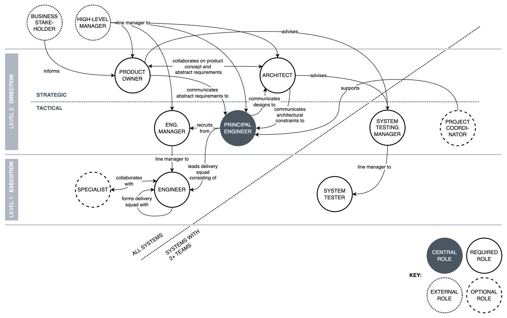

Chapter 7. Delivery Organisation
---
In the ever-evolving landscape of software engineering, the structure and efficiency of delivery organisations play a critical role in achieving project success. This chapter delves into the concept of a minimal hierarchy supporting the engineering process, particularly as it pertains to the CONTROL delivery organisation. We explore how minimising bureaucratic layers can enhance communication and drive more efficient product delivery.

# A minimal hierarchy
The specific roles and responsibilities within the delivery organisation have been discussed in Chapter 6. We now focus on the interactions between these roles and their relationship to roles external to the delivery organisation.

There can be at most two levels in the engineering hierarchy as it relates to delivery and support of product capabilities. A minimalist approach to the delivery organisation leads to improved efficiency, clearer communication, and reduced bureaucracy.

1. **Execution**: those who are _always on the tools_: Software Engineers and System Testers, in addition to specialist roles present within the engineering and testing teams.
2. **Direction**: those who provide direction to those on the tools. This level is further subdivided into two mezzanines:
    1. **Tactical**: those who offer _guidance and mentorship_, and assume responsibility for delivery and maintenance. (They may sometimes be on the tools, but it isn't their direct responsibility.) EMs and PEs fall in this category. Project Coordinators may also assist in this space.
    2. **Strategic**: those who provide _strategic planning_. This mainly comprises members of the Architecture and Product communities.

_The CONTROL delivery organisation._

The responsibilities of these roles are exhaustive — they build, test, maintain, manage, lead, mentor, plan and strategise. _What else do you need?_ 

Every accountability-driven method worth its salt should be emphasising quality over quantity at its core. CONTROL's role catalogue is deliberately minimalistic while being logically complete. It avoids unnecessary complexity while maximising resource utilisation. Any funds saved through judicious and conservative hiring may be invested into the delivery organisation; for instance, towards more competitive salary packages, enabling the organisation to recruit and retain a higher grade of engineering talent.

A minimalist stance on the delivery hierarchy goes beyond a mere cost cutting exercise. There is numerous research (Rosenblatt, 2012, Sapiro, 2024, and Gubko, 2008) indicating that the flattening of hierarchies can lead to improved outcomes:

* **Efficiency and streamlined decision-making**: Flatter organisational structures often result in faster decision-making processes. With fewer levels of hierarchy, information flows more quickly. This reduction in bureaucratic layers enhances overall efficiency.
* **Innovation and collaboration**: Reducing hierarchical layers fosters a more collaborative environment. When employees feel they have a more direct line of communication with leadership, they are more likely to share innovative ideas and solutions. This openness can lead to a more creative Engineering culture.
* **Employee satisfaction and engagement**: Flatter structures can lead to higher levels of employee satisfaction and engagement. Employees in less hierarchical organisations often experience a greater sense of autonomy and empowerment. This can improve job satisfaction and reduce turnover rates, as employees feel more valued and involved in the decision-making process.

A Head of Engineering (HoE) is ultimately responsible for the overall system, the engineering staff and the strategists, setting the overall purpose and bringing everyone together. Some might argue that a HoE hovers around level 3, or at least some quasi-extension to level 2. However, the HoE role is not directly involved in capability delivery and is, therefore, not among the two levels. CONTROL recognises a HoE role, or some equivalent, without prescribing it in any appreciable detail.

Take some time to digest the above. As stated earlier, CONTROL is prescriptive not only in process model but in the delivery organisation. This distinguishes CONTROL from methods that focus purely on process. At the same time, CONTROL must be applicable to large, multinational enterprises with fashionable "regional junior vice president" roles and unenumerable rungs in their ladders of corporate power1. It may be hard to imagine how CONTROL might gain traction in an organisation run largely by bureaucrats.

1 I don't endorse this form of organisational bloat but it is a reality that is difficult to ignore. It too can be helped in building better software, more predictably.

Middle management's detachment from the actual work can impede their ability to make optimal decisions. This phenomenon is often referred to as the _knowledge gap_ between managers and frontline workers, caused by _information asymmetry_. The latter is a foundational concept in organisational behaviour, suggesting that when one party (management) has a less detailed understanding of the problem than another (frontline workers), it can lead to inefficiencies and suboptimal decision-making. Those removed from the day-to-day operations may lack crucial insights into the nuances and challenges faced by workers on the ground (Akerlof, 1970). This behaviour has been independently explained by findings from economics (Stiglitz, 1986, and Spence, 1973) that laid the groundwork for understanding how information asymmetry affects market efficiency and resource allocation. Furthermore, and somewhat paradoxically, detached managers will tend to make suboptimal decisions even when subjected to more information overall than their subordinates — a concept known as _cognitive overload_ (Sweller, 1988).

CONTROL's sphere of influence is limited to the _delivery_ aspect of the overall organisational hierarchy. The delivery organisation must be large enough and sufficiently resourced to deliver nontrivial software systems and yet small enough to avoid corporate red tape and wheel-spin, and have a chance of succeeding. Middle management is clearly an unescapable phenomena in large organisations, which suggests they should either be put to good use or reassigned. Consider the purposes they may serve:

* Act as line managers to level two members, without directly partaking in delivery.
* Manage cross-team staffing and budgetary concerns.
* Mentor and develop the next generation of leaders.
* Assist in hiring, performance management, and team dynamics.
* Assist in conflict mediation. 
* Help shape principles and define good engineering practices. 
* Shield the team from difficult stakeholders.
* Facilitate continuous improvement initiatives, retrospectives, and follow up on actions.
* Scout technology and tooling that may assist Engineering in the longer term.
* Optimise BAU processes, focusing on system observability and supportability.

This assumes an _engineering_ manager-of-managers (or MoM, affectionately pronounced "mum"2). Some of these responsibilities will apply to MoMs from the product and architecture disciplines.

>2 The specific origin of the acronym "MoM" is unclear; it likely emerged organically within the business and management community, popularised through management literature. The pronunciation "mum" could be this author's contribution.

MoMs mustn't meddle in planning and work breakdown, as alluded to earlier — any manager that is more than an arms-length away from the coalface cannot be relied on to make informed technical decisions in the delivery process. You'll have heard the saying "work on the business not in the business", often used in the context of business management and entrepreneurship. It stresses the importance of the leadership team focusing on strategic, macro-level activities that grow and improve the business, rather than getting bogged down in day-to-day, micro-level decisions. In the same vein, middle and top management should nourish and support the delivery organisation, ensuring that it is operating as expected.

With the sole exception of "act as line managers to level two members", all of the MoM responsibilities above are already present in CONTROL's definition of the EM role. Middle management can therefore be seen as a way of scaling CONTROL, along with skilled specialists like Project Coordinators or Project/Programme Managers, allowing members of the delivery organisation to focus on product and technical aspects of delivery.

# Chalk outlines
The counterargument to a flat organisational structure is that it sacrifices scale for efficiency. In other words, it functions optimally to a certain point, after which it acts as a growth restraint.

It may be best to think of the delivery organisation as focused projection of a larger engineering organisation. It is an abstraction, to describe it mathematically. It hides the complexity of the larger organisation by specifying just the elements that matter for delivery.

Engineers and computer scientists will likely grasp intuitively the meaning of the above. For those struggling with abstractions, I will explain differently.

>But first an analogy.
>
>Your car is a prime example of abstraction. You can start it turning the key without having to know the details of how the engine starts or the components involved. The complex internal mechanisms are hidden from the user. Hidden but not absent! Without them, you'd have a shell, not a car.

Large software systems require extensive entourage. Middle managers, department heads, programme managers, practice leads, centres of excellence, process leads, legal and compliance, dedicated infrastructure and security teams, to name a few. The head count could quickly run into the hundreds or thousands. When a system is active development, each of these roles may be involved in the delivery in some way. Everyone is presumably important enough to justify their presence.

There is no attempt to challenge the size of engineering organisations or the importance of these roles. (Although a historically enlightened practitioner may argue that software organisations have become bloated.) Consider the types of roles in the entourage:

* **Governance and compliance**: Roles like legal and compliance, programme management, and information security, oversee certain aspects of software delivery without delving into the details of the product or technical capability in question. For example, they ensure that software is compliant with a particular standard or that some preventative activity (like a penetration test) has been conducted.
* **Continuous improvement**: Various internal practices, tribes (and chapters and guilds), and centres of excellence, challenge the status quo and come up with new ways of working, and drive change within Engineering. They do not partake in delivery directly. Done right, they may assist it greatly.
* **Supporting**: The infrastructure team, IT services, application support, and go-getter process leads, unblock Engineering in their day-to-day delivery activities. For example, they may provision access to a database so that Engineers may get on with their work. Or they may triage issues and handle level-two support, so that the unenvied Engineers on call may sleep for thirty minutes more.
* **Managerial**: Middle-management and department heads act as line managers, ensuring that general staffing concerns are addressed. While they may know little about the capabilities being delivered, they know enough about their reports and the sorts of challenges they face regularly. They offer mentoring, mediation, and ensure that their reports have everything they need to be successful.

Just because one cannot see these roles in the CONTROL delivery organisation, it doesn't mean they have been disregarded. They are still there but hidden from sight. Some of them are above the delivery organisation — these are the middle managers. Delivery people report to them. Some of them are below the delivery organisation — the supporting roles. Delivery people rely on them to get things done. Some are, in a manner of speaking, to the side — governance and compliance. They neither manage nor support but could be seen as stakeholders with dotted lines to delivery. Finally, there are the estranged others — roles that focus on continuous improvement and are great at getting in the way. They have a very loose relationship with the delivery organisation but still influence the outcomes (in mysterious ways).

When one accepts the delivery organisation purely as the abstraction that it purports to be, a two-layer hierarchy suffices. Scaling is largely straightforward. (In the abstract world, less so in the real.) When more Engineering teams are needed, grow the middle management layer, otherwise the reporting fan-out will become unwieldy. When the regulatory burden increases, expand the governance and compliance department. Too many databases to manage? More hires in the infrastructure team may help.

The above was one point — an organisational one. The second point is architectural. A system can only exist as an ad-hoc collection of cooperating components for so long. Eventually, it becomes unmaintainable: adding more components only contributes to more communication. There is little point in adding more people when the system itself acts as a growth restraint.

Large systems must be partitioned, not into modules or components but standalone (sub)systems. These are systems in their own right, with well defined boundaries, technical roadmaps, architectural principles and blueprints. The delivery organisation can then be split along system boundaries. Existing Engineering teams can be split, which will make it easier to grow them later. System boundaries should be drawn so as to minimise cross-system change impacts — acting as bulkheads and providing maximum autonomy to each system. Ideally, the majority of change requests should concern just one system. When an occasional change request involves two or more systems, it is treated as a cross-system capability.

Conversely, if the architecture team feels that they cannot partition the overarching system using a change-dampening model, then perhaps the system isn't at the size that permits subdivision. Or it needs to be refactored. Either way, the architecture of a system is as much an impediment to productivity growth as the organisational structure.

# Summary
The CONTROL model emphasises a clear distinction between those who execute tasks and those who provide direction, further breaking down the directional roles into tactical and strategic levels. This approach not only simplifies the organisational structure but also aligns responsibilities and accountabilities more closely with the actual work being done. CONTROL's flat delivery hierarchy streamlines decision-making and enhances employee satisfaction, ensuring effective delivery without bureaucratic hindrances.

CONTROL distinguishes the delivery organisation from the larger enterprise, focusing strictly on the former. This allows CONTROL to interoperate with organisations of varying shapes and sizes. It recognises middle managers (MoMs) and the important supporting roles they play, such as line management, team development, conflict resolution, and process improvement. However, their arms-length detachment from the shop floor means they lack the necessary context to make sound delivery-level decisions. They are hence deemed external to the CONTROL delivery organisation.

# Concluding remarks
People who chart the course, people who equip and manage, and people who do the actual work. These are the essential role groupings of an engineering organisation. Anyone who is telling you different is selling something.
