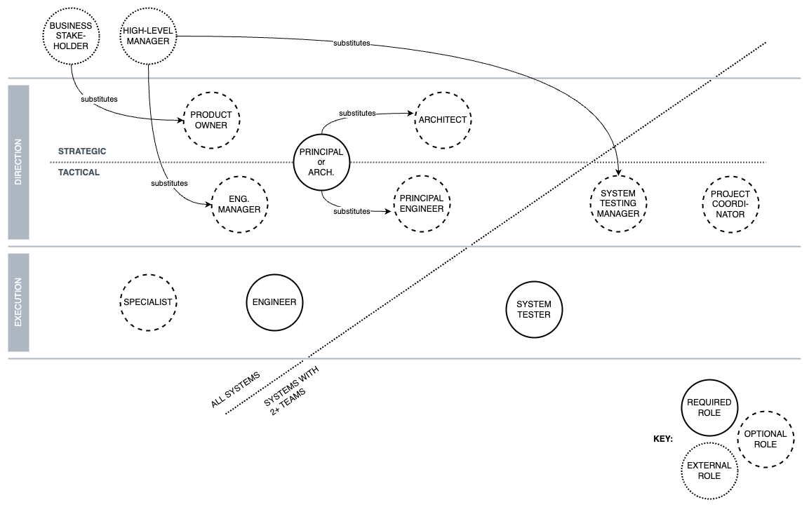

Chapter 11. Adoption
---
CONTROL is designed to be usable within a broad set of organisational contexts, catering from startups with ad-hoc software practices to established multinational corporations. It offers a structured approach to software delivery, emphasising accountability and clear role delineation. However, many of CONTROL's concepts may be foreign to most people and could be taken with some apprehension and distrust. This chapter outlines essential guidelines for successfully implementing and smoothly transitioning to CONTROL, ensuring alignment across all members of the delivery organisation and its stakeholders.

# General guidelines
The following is a general set of CONTROL adoption guidelines that applies to all organisations, ranging from startups with ad-hoc software practices to large multinationals with established delivery models. More specific guidelines, tailored for different organisation types, will be presented in the sections that follow.

**Guidelines**:

* **Ensure key personnel is on board**:
  + Frontline engineers are least impacted by CONTROL; the main impact on their daily lives is the delivery squad model and a firming up of personal accountabilities. They'll need to get used to having a delivery squad leader who differs from their line manager.
  + Tactical and strategic leadership are most impacted by CONTROL in the delivery organisation. They should be fully bought into the CONTROL method as they will be instrumental in championing the new ways of working. Because of their leadership standing, they will likely be involved in spurious discussions around expectations, processes, and the squad model. 
  + When people are confused or anxious, they will likely speak to their trusted colleagues or a mentor before approaching their line manager. It is, therefore, advantageous to have the most influential people brought into the vision before sharing it with the broader organisation.
  + Prepare the necessary roles, responsibilities, and accountabilities by either accepting CONTROL equivalents verbatim or adapting as necessary.
* **Discuss expectations**:
  + Sit down individually with each member of team to explain what their role entails, and what each of the responsibilities and accountabilities mean in practice.
  + Define the metrics for success: explain how they will be assessed on their performance for each of their accountabilities.
  + Outline the role of their manager and, specifically, the manager's accountabilities. This transparency ensures that employees understand how their manager will assist them in achieving optimal performance.
  + Ensure that people understand the accountability model in the broadest terms. In other words, not only the personal accountabilities that apply to them, but what it means to be accountable and how it benefits _them_ rather than the organisation.
  + Outline the feedback mechanisms that help their voice be heard. This may be via regular check-ins, periodic surveys, etc.
  + Highlight potential career paths within the organisation and the skills required to advance.
  + Gently and gradually familiarise staff with CONTROL.
* **Closely monitor initial deliveries**:
  + The first few deliveries will be rough sailing. A foreign process, a new set of expectations, a temporary squad, no familiar sprints... One can imagine how those accustomed to more traditional development methodology might take time to find their feet.
  + It could be useful to have someone on hand to guide the teams through the changes. This needn't be a separate role — just a familiar face from the delivery organisation who has a solid grasp of CONTROL principles and can act as a method champion. More importantly, someone the team trusts.
  + Do not measure performance too early, as the bedding-in process will likely produce unstable results. Refrain from giving early-stage performance-related feedback unless absolutely necessary. Monitor and observe.

In addition to the general guidelines, there are specific guidelines depending on whether CONTROL is being assembled from scratch or applied to a mature organisation.

# Implementing CONTROL from scratch
Building a green-field delivery organisation is the ideal opportunity to exercise CONTROL. Its minimalist set of roles allows a complete delivery organisation to form organically around a handful of key people.

We are not considering garage startups in this model. It is neither necessary nor desirable for any organisation at that scale to introduce an accountability-based methodology. They are not concerned with maintenance and long-term value creation at this stage. They have little waste and more intrinsic motivation and personal accountability than any method may hope to offer them.

We are considering sufficiently resourced, early-stage engineering organisations, possibly funded startups, that have reached a point of recognising that ad-hoc development will not suit their current or desired scale.

**Assumptions**:

* A largely unconstrained ability to influence the delivery culture and organisation.
* Presence of at least one key technologist able and willing to support delivery, such as an Architect and/or Principal Engineer. In a startup, this might be the founding CTO.
* A small, managed engineering team is in place.
* A strong business or product representation.

**Guidelines**:

* **Superimpose roles where necessary**:
  + If only an Architect or a PE are available, then one will be acting as both until the missing role is recruited. CONTROL distinguishes these roles mainly by their planning horizon and the points in the delivery process at which each takes charge. In many regards, one can temporarily fill in for the other's responsibilities.
  + If no delivery-side product representative is present, one should be hired as soon as possible. In the absence of a PO, a representative from the business will assume a pseudo-PO role during the Construction and Abstraction phases.
  + When starting with one team, a dedicated System Tester role is not strictly necessary; any verification performed locally within Engineering may be sufficient to verify end-to-end functionality. For cross-team delivery, a System Tester role should be sourced. (CONTROL cannot vouch for the quality of complex systems without the impartiality accorded by an independent system testing practice.) In a small system testing practice, a dedicated STM role may not be necessary. System Testers may report to someone from the senior leadership team: the Head of Engineering or CTO. However, their managers would have to take on the STM responsibilities in the interim.
  + In a small engineering team, the role of an EM may not be needed for some time. Their responsibilities may be carried out by someone from the senior leadership team.
* **Avoid zeal**:
  + Early-stage engineering organisations are unlikely to be suffering major performance issues, and may not perceive an immediate need for change. Avoid creating excessive burden of process and structure in areas that already function well.
  + Don't go overboard with measurement and performance-related feedback with small teams that already perform well.

_CONTROL delivery organisation implemented in a startup._

# Transitioning to CONTROL
It is one thing to adopt CONTROL for a new engineering outfit. Transitioning an existing, presumably Agile-ish organisation to an accountability-based delivery model is a different kettle of fish.

**Assumptions**:

* Minimal knowledge of CONTROL within the existing organisation.
* Existing organisation and processes revolve around the Agile methodology.
* Business stakeholders are accustomed to feedback-driven delivery.
* Significant constrains in the ability to influence the delivery culture and organisation.
* Weak or nonexistent accountability model.

**Guidelines**:

* **Plan well in advance**:
  + Unlike startups, large organisations have momentum and an innate resistance to change. They also have a comparatively high degree of specialisation: there may be existing roles filled for very specific needs, which might not generalise well outside of their intended use.
  + The entire plan must be drawn up (and ideally reviewed) before the transition may begin: 
    - Key representatives from the business and the technology organisation must be fully bought-in to the changes. This includes the CPO and CTO roles, at minimum.
    - Every key role in the delivery organisation must be filled.
    - Middle-management and supporting roles outside the delivery organisation must be identified and concretely specified. CONTROL does not formally define these roles due to their sheer number and variability. Their responsibilities and accountabilities should be defined ahead of time.
    - Surplus roles must be accounted for. It would be highly undesirable to get midway through the transition before realising that some existing roles have no future purpose. The resulting disruption would likely create uncertainty and unrest within the organisation.
* **Prepare the technology**:
  + The CONTROL ownership and accountability model assumes that every component in the system is owned by one Engineering team. If this is not the case, suitable measures must be taken before CONTROL can be fully effective.
  + The Engineering teams may be swarmed with technical debt, impacting their productivity. A plan should be put in place for its remediation.
  * This is an ideal time to begin working on the Technical Roadmaps for the Engineering teams and the overarching system. The Architects, EMs and PEs should be involved in this activity.
* **Identify key personnel**:
  + Identify prospective PEs and build support around them, remembering that this is a technical leadership role: 
    - Depending on the current Engineering structure, there may not be people in dedicated PE roles. However, there will likely be several Senior or Staff Engineers on hand who may suit the bill.
    - PEs must have both technical skills and distinguished credibility among peers. They should be able to interact comfortably and communicate complex concepts to a range of different stakeholders. A smart but inarticulate PE isn't going to be successful in leading Engineering squads.
    - The transition from a skilled Senior Engineer to a PE may not be as smooth as expected. Some engineers have trouble easing off the tools to lead delivery and invest time in coaching others.
  + Shortlist the management layer or promote as needed:
    - Remember that EMs were Engineers once too, meaning they may have been promoted above their ability. Titles do not always equate to skill. Not all EMs might have a seat in the new world, and a more wholesale reorganisation may be needed.
  + Ensure that people filling Architect roles come from a deep technical background:
    - It's not uncommon for a Business Analyst to transition to a Solution Architect role, for instance. Enterprise Architects are also to be treated with scepticism, unless proven otherwise.
    - Since Architects fulfil strategic responsibilities within the technology space, a mistake in their selection will be a costly one.
    - The best Architects are those who have been Principal Engineers at some point in their career. Think of it in these terms: could the Architect fill in for a PE if they were on leave?
* **Discuss expectations**:
  + Ensure that POs understand their new role and responsibilities: 
    - POs may be used to working directly with engineering teams on their individual backlogs. They should be realigned to think in terms of end-to-end products, essentially taking a black-box approach to product development. 
    - They will also become accountable for product requirements and working with Architects to specify the requirements at a suitable level of abstraction.
  + The biggest change for Engineers will be that of performance expectations and a growth trajectory based on merit.
* **Ring-fence the delivery organisation**:
  + Senior engineering, architecture and product managers must be moved out of the delivery organisation and appointed new responsibilities that don't overlap with delivery: 
    - This is an overwhelmingly good thing for them. Anyone having made it this far should be mature enough to recognise that their skills and experience should be applied at a more holistic level.
    - Don't assume that this will come naturally to most people. There may be a tendency to maintain an iron grip on the teams, which contradicts CONTROL principles. Accountability is at the heart of CONTROL; it cannot be assumed if one's old boss won't let go of the helm.
  + Prepare for mass reorganisation and reassignments: 
    - "Agile hangover" roles don't have a seat at the delivery table and must be addressed simultaneously with the transition. 
    - Similarly, middle managers who are incapable of relinquishing control will need addressing. Micromanaging stifles creativity, autonomy, and ownership, and contradicts the CONTROL accountability model.

What do we mean by "reassignment?" Take Agile roles, for example. Despite our discontent with Agile methodology, the people who currently support Agile processes will likely be capable of handling other challenges. It may be, for example, a project-related activity that they could help with. They could act in supporting roles to assist key members of the delivery organisation: a Project Coordinator to assist a PE, for example. You might also consider turning your best and most adaptable Agile Coach into a low-touch Process Lead who can help facilitate the transition to CONTROL. Alternatively, they could use their acquired domain knowledge in semi-technical activities, such as product documentation or manual system testing. There's always a role for the right person.

# Challenges
Engineering is a series of trade-offs. It should then come as no surprise that there is no perfect engineering method. Each method will make some compromise in order to achieve an objective and CONTROL is no different. The following outlines the challenges in adopting and operating a CONTROL organisation.

## Breadth of scope
CONTROL is rare in the extent of its sphere of influence: going beyond a process model and a handful of roles to formulate a complete recipe for software delivery. The greater the scope, the harder a method is to adopt. 

By comparison, methods like Scrum and Kanban are intentionally underspecified to broaden their application and ease adoption, while the Scaled Agile Framework (SAFe) and Disciplined Agile (DA)1 are somewhere in between.

>1 DA's scope is ocean-wide and puddle-deep. It suggests many things around lifecycle models, roles and responsibilities, governance and metrics, among others, but elaborates on relatively few. For example, each of the critical roles is presented at an outline level.

**Mitigation**: 

- For an uncompromising recipe of engineering quality and productivity, it is difficult to endorse piecemeal adoption of an already minimalistic approach, as anything less would be compromising on critical performance drivers. I'm unable to produce a more helpful suggestion than "anything worth doing and is worth doing right".
- If CONTROL cannot be adopted fully for whatever reason, then I would suggest rebasing the organisation's "untouchables" on top of some or all of CONTROL's foundational principles — personal accountability, preservation of context, and conceptual integrity.
- Hypothetical example: the business is fully invested in SAFe and is unwilling to part with its Agile Release Train (ART) model. The organisation could augment key roles with strong accountability, some of which may be sourced verbatim from CONTROL. It could also assign a single PE to each ART, ensuring conceptual integrity.
    
## Many foreign concepts
While the concepts that CONTROL is founded upon may be vaguely familiar to most practitioners, their detailed comprehension may prove elusive. And their combination may appear entirely foreign. The first-mover disadvantage of CONTROL will likely become apparent in the use of accountability to drive long-term performance. CONTROL is a pioneering example of the accountability-driven methodology, and while there is hope for others forming in the future, the reality is that an entire generation of engineers and managers have had little to do with accountability. They have been too busy delighting customers, embracing change, and generally being awesome.

**Mitigation**: 

- Education is key: many of the concepts can be taught and learned, and will become second nature once practiced. CONTROL already provides complete definitions of all the relevant fundamentals.
- Leading by example: management should begin by demonstrating transparency and commitment: sharing their accountabilities with key individuals in the delivery organisation and getting their buy-in.

## Capacity reservation model
CONTROL's Formation phase requires an upfront commitment to squad capacity simultaneously from all impacted teams. Delivery may stall if insufficient team capacity is available for squad recruitment.

By contrast, Agile methods rely on the unreserved capacity of team members to handle arbitrary work items from the team's backlog. Any item can be picked up when the team has spare capacity, unless the work item depends on specialist skills.

In this regard, CONTROL resembles traditional project management, with due consideration of resource contention, dependencies and critical paths.

**Mitigation**: If capabilities become blocked in the Formation phase, it is usually an indication that they are too bulky for the delivery organisation to handle at its present size:

- Large capabilities should be broken down into smaller stages that require fewer engineers and specialists from each team to deliver. 
- Delivery capacity should be provisioned in advance of targeting large deliverables. Spare engineering capacity will be used to address maintainability and supportability challenges.

## Reliance on relatively few highly critical roles
Where Agile methodologies spread technical decision-making across a large group of generalists, CONTROL concentrates this function within a relatively small group of like-minded experts. Agile has the distinct advantage of being less reliant on key personnel, although this comes at the cost of decision quality and conceptual integrity. CONTROL's orientation around key people presents a drawback: it limits the delivery throughput and increases key personnel risks.

**Mitigation**:

- Involve more people where the delivery risks are low. For example, instead of having PEs lead all capability deliveries, some low-risk capabilities that span multiple teams or challenging capabilities confined to a single team may be led by a Staff or Senior Engineer. Not only does this reduce the reliance on PEs, it also builds the necessary skills to transition people to higher-level roles. This is a sound strategy even when the organisation isn't starved of skilled PEs.
- In the more drastic cases, it may be necessary to divide Engineering capacity between CONTROL and other development methods. For example, some team members may work in more conventional, Agile practices, working off a team backlog, while others may be seconded into CONTROL delivery squads. Within this hybrid model, the PEs will focus on the CONTROL delivery organisation.
- Engineers get exposed to the broader context of the engineering problem, rather than being limited by a keyhole perspective. This ensures a more informed progression to key decision-making roles. The reduction in knowledge siloing also has a proportionate effect on the "bus factor".
- The meritocracy fostered by an accountability-centric culture ensures that the right people get the right roles.
- Exposure to more complete and therefore challenging technical problems can be stimulating and engaging. Solving such problems can lead to a sense of accomplishment and satisfaction, and reduces the likelihood of churn.

# Summary
The chapter offered tailored guidelines based on whether CONTROL is implemented from scratch or integrated into an existing, presumably Agile organisation. For green-field delivery organisations, starting afresh presents an opportunity to organically structure teams around CONTROL's minimalist roles, ensuring foundational principles are embedded early on. Conversely, transitioning established Agile practices to CONTROL requires meticulous planning, stakeholder buy-in, and strategic reassignments to align existing roles with CONTROL's accountability-driven model.

As organisations navigate the complexities of adopting CONTROL, adherence to these guidelines ensures a smooth transition and alignment with delivery objectives. Whether building from scratch or transitioning existing practices, the principles of accountability and strategic alignment underscore CONTROL's effectiveness in optimising software delivery across diverse organisational landscapes.

# Concluding remarks
It shouldn't come as a surprise that the formidable momentum of large organisations creates tremendous resistance to change. Sometimes the cost of change may not appear to be justified by the benefits unless one takes a long-term perspective. Sadly, the reward parameters motivating many executive and senior decision-makers may not align to this. Often, the perceived downsides of corporate risk-taking exceed the prospective upsides, and a keeping-the-lights-on mentality triumphs over innovation. "Nobody ever got fired for buying IBM."

I've come to accept this as a true account of our industry in its present form and all likely future forms. The guidelines in this chapter will ease CONTROL's adoption significantly but cannot eliminate this effort entirely. Methods like ours require a certain resolve on behalf of change-seekers, enough to overcome the challenges standing in their way.

I'm aware of the highly successful commercial tactics employed by scaled Agile methods like SAFe to win the hearts and minds of executives, and their chequebooks. I do not subscribe to their approach. A method requiring little effort on the adopter's behalf sounds like a miracle supplement. At best, it may have a placebo effect.

It is important for key decision-makers to soberly assess the appetite for change and their ability to drive it. If the ideal change cannot be implemented to some minimally viable level, then perhaps another change must occur first. It is better to address the cause than to settle on a method that asks for little and gives little in return.